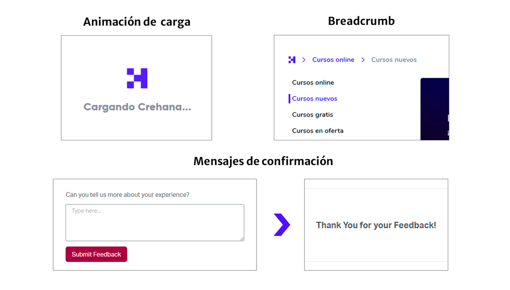
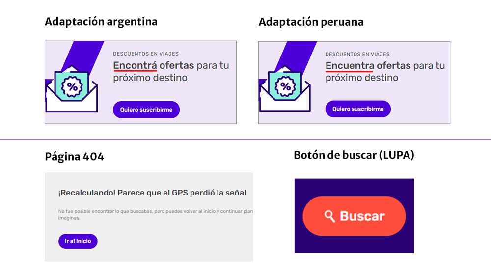
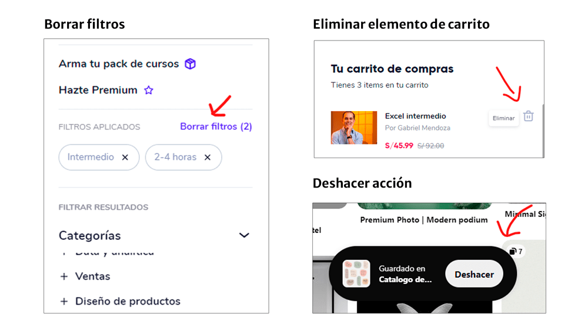
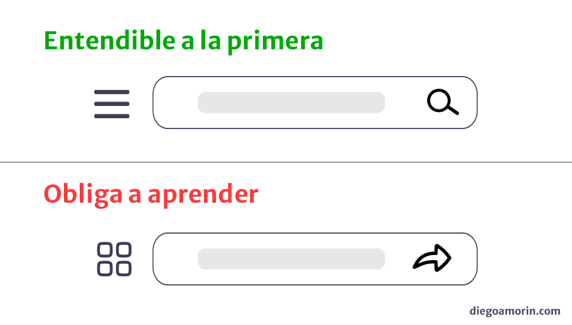
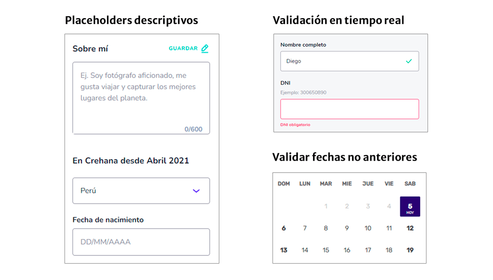
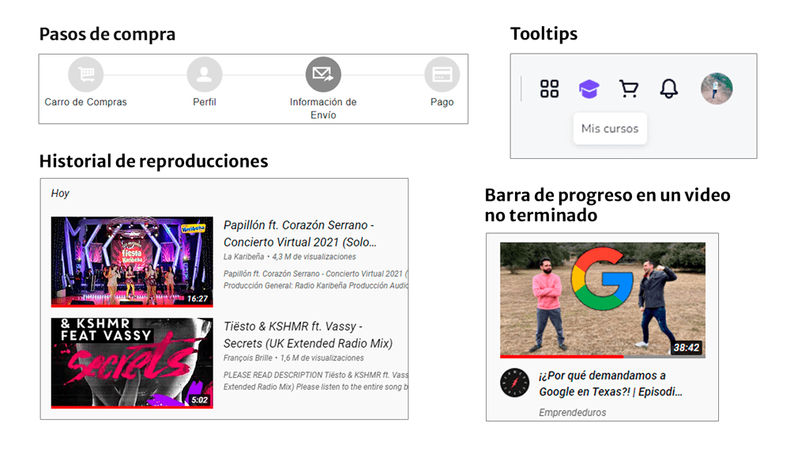
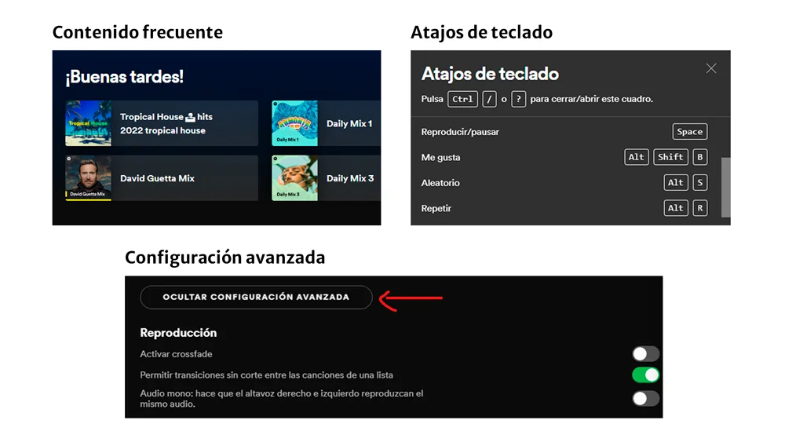
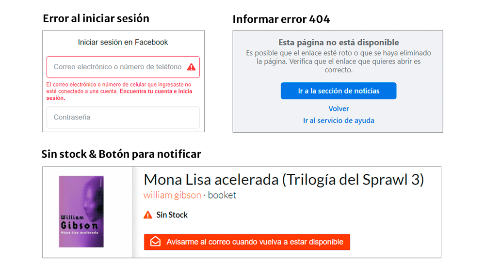
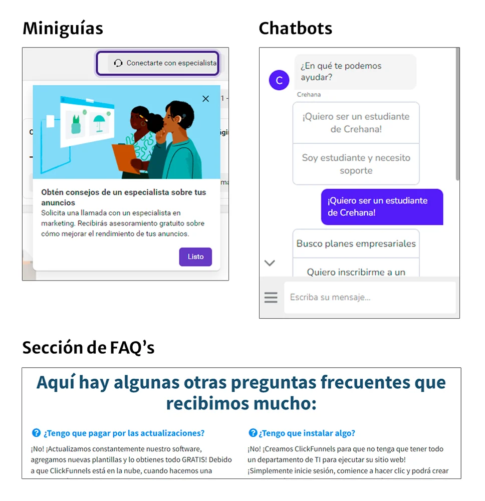

Las también denominadas «Heurísticas de Jakob Nielsen» son 10 reglas pre-existentes que sirven para resolver los problemas de usabilidad más comunes en las interfaces web. De esta manera, la interfaz puede ofrecer una mejor experiencia a los usuarios que la visiten.

> Si estas interesado en más principios para mejorar la usabilidad de tus interfaces, también te recomiendo las «[19 heurísticas de Bruce Tognazzini](/principios-usabilidad-tognazzini/)«

## Sobre Jakob

[Jakob Nielsen](https://es.wikipedia.org/wiki/Jakob_Nielsen) es una de las personas mas respetadas en el ámbito de la usabilidad web. Además, es cofundador de la firma Nielsen Norman Group que ofrece consultoría de interfaz y experiencia de usuario.

Según el propio Nielsen las [10 heurísticas](https://www.nngroup.com/articles/ten-usability-heuristics/) (que estamos a punto de ver), se han mantenido relevantes y sin cambios desde 1994 y es muy probable que sigan manteniéndose vigentes en las próximas generaciones.

A continuación, nombraré cada principio con sus respectivos ejemplos de uso…

## 1\. Visibilidad del estado del sistema

**El sistema debe mantener informado al usuario sobre lo que esta ocurriendo en la web a cada momento.**

Trata de no dejar a los usuarios pensando «¿Qué esta pasando ahora?»

Ejemplos:

-   Animaciones que muestran cuando un sitio se encuentra cargando.
-   Mensajes de confirmación al enviar un formulario.
-   [Breadcrumbs](https://es.wikipedia.org/wiki/Miga_de_pan_\(inform%C3%A1tica\)) que muestran al usuario en que parte del sitio se encuentra.

*Capturas extraídas del sitio web de [Crehana](https://www.crehana.com/) y [Elementor](https://elementor.com/).*

## 2\. Consistencia entre el sistema y el mundo real

**El sistema tiene que hablar el idioma del usuario. Se debe utilizar palabras, frases y conceptos que le sean familiares.**

Algunos de los términos, conceptos, íconos e imágenes que usa usted o su equipo pueden resultar confusos para los usuarios. Es recomendable que el diseño siga las convenciones del mundo real y se pueda intuir o comprender rápidamente como funciona la interfaz.

Ejemplos:

-   [Transcreación](https://es.wikipedia.org/wiki/Transcreaci%C3%B3n) o adaptación de un mensaje de un idioma a otro.
-   El botón de «buscar» representado con una «lupa».
-   El término 404 por un mensaje como «Página no encontrada».

*Capturas extraídas del sitio web de [Despegar](https://despegar.com/).*

## 3\. Control y libertad del usuario

**Los usuarios suelen realizar acciones por error. Siempre debe existir una «salida de emergencia» para revertir una acción no deseada.**

Ofrece al usuario el control de la plataforma para que se sienta seguro. Una forma sencilla es agregar la funcionalidad de «rehacer» y «deshacer»

Ejemplos:

-   Aplicar y borrar filtros al comprar productos.
-   Deshacer una acción de guardado en Pinterest.
-   Quitar elementos de un carrito de compras.

*Capturas extraídas del sitio web de Crehana y Pinterest*

## 4\. Consistencia y estándares

**Los usuarios no deben verse obligados si diferentes palabras, situaciones o acciones significan lo mismo. Se debe seguir las convenciones establecidas en la plataforma y la industria.**

Las personas ya tienen experiencia con otros productos, no solo con el nuestro. Cambiar ciertos elementos ya establecidos, obligará a los usuarios a aprender algo nuevo. Esto debe de evitarse.

Ejemplos que deben evitarse:

-   Botón con una forma y que luego se muestra con un nuevo diseño y funcionalidad. Obliga al usuario a discernir.
-   Cambiar las establecidas líneas horizontales o «menú hamburguesa», por una «carita feliz» en la navegación.

Recomendaciones:

-   Mantener las convenciones establecidas por la industria («X» para cerrar, «Lupa» para buscar, etc.)
-   Mantener la consistencia interna, gracias a Atomic Design.

## 5\. Prevención de errores

**Los buenos mensajes de error son importantes. Pero mejor aún, es crear un diseño que evite que los errores ocurran.**

No esperes que los usuarios se equivoquen, agrega elementos que lo ayuden a prevenir los errores.

Ejemplos:

-   Los placeholders en campos de texto, donde aclaran la acción que debemos realizar.
-   La comprobación de campos de un formulario en tiempo real.
-   Comprobar que la «Fecha de vuelta» sea después de la «Fecha de ida» al seleccionar un vuelo.

*Capturas extraídas de Crehana y Despegar*

## 6\. Reconocimiento en lugar de recuerdo

**Minimizar el uso de memoria del usuario haciendo visibles los elementos, las acciones y las opciones.**

Las interfaces deben promover el reconocimiento y evitar que los usuarios memoricen sus acciones o elementos al desplazarse por el sistema. Algunas preguntas que te pueden ayudar son: ¿Conoce el usuario de donde viene y a donde va? ¿El usuario tiene que recordar cosas para entender lo que esta pasando? y ¿cómo lo ayudamos a recodar?

Ejemplos:

-   Historial de reproducciones de YouTube.
-   Pasarela de pagos que te muestra en que paso de la compra te encuentras.
-   Barra de progreso que muestra en que parte de un video o lección de un curso te has quedado.
-   Mostrar información junto a los iconos o cuando se pasa sobre ellos ([tooltips](https://es.wikipedia.org/wiki/Informaci%C3%B3n_sobre_herramientas)).
-   Breadcrumbs que muestran al usuario en que parte del sitio se encuentra.

*Capturas extraídas de Buscalibre, Youtube y Crehana*

## 7\. Flexibilidad y eficiencia de uso

**Los usuarios más experimentados, deben poseer atajos y aceleradores para poder realizar sus operaciones mas habituales. De esta forma, tiene alternativas para personalizar sus acciones frecuentes.**

La clave es la personalización tanto del contenido como de la funcionalidad para cada usuario.

Ejemplos:

-   El reingreso a la app de Spotify te muestra las playlists que escuchas frecuentemente.
-   Play/Pause con la tecla «espacio» en reproductores de video o música.
-   Configuración avanzada de tu cuenta de Spotify.

*Capturas extraídas del sitio web y app de Spotify*

## 8\. Diseño estético y minimalista

**Las interfaces no deben contener información irrelevante o que rara vez se necesite. Se debe conocer que tipo de contenido necesita el usuario.**

Cada elemento extra compite con la información relevante y disminuye su visibilidad. Recuerda, menos es más. Responde a estas preguntas: ¿Qué necesita mi usuario? ¿Qué valor le aporta lo que le estoy mostrando?

Ejemplos:

-   La página principal de Apple muestra solo los productos que desean destacar.
-   El buscador de Google solo muestra un campo de texto y un par de botones, no todos sus servicios.

*Captura extraída del sitio web de Apple*

## 9\. Ayude a los usuarios a reconocer, diagnosticar y recuperarse de errores

**Los mensajes de error deben expresarse en un lenguaje entendible, sin códigos de error. Se debe describir con precisión el problema y sugerir constructivamente una solución.**

Gracias a los principios anteriores podemos evitar en gran medida que el usuario cometa un error, pero los errores son inevitables. Como solución, busquemos la manera de que estos mensajes sean visibles para que los usuarios puedan reconocerlos.

> Los peores mensajes de error son aquellos que no existen.
>
> Jakob Nielsen

Ejemplos:

-   Si inicias sesión en Facebook y colocas un dato erróneo, la app te explicará en que puedes estar fallando.
-   Camuflar el código 404 o complementarlo con información adicional.
-   Cuando existen productos agotados, la web muestra un mensaje de cuando se reabastecerá el producto y además tienes la opción de ser notificado cuando el producto este nuevamente disponible.

*Capturas extraídas del sitio web de Facebook y Buscalibre*

## 10\. Ayuda y documentación

**Lo ideal es que un sistema no necesite ninguna explicación adicional. Pero en algunos casos, se debe proporcionar una documentación para ayudar a los usuarios a entender cómo completar sus tareas.**

El contenido de ayuda y documentación deben ser fáciles de encontrar y tener pasos definidos de manera concisa (es decir, corto no extenso).

Ejemplos:

-   Sección de Preguntas frecuentes ([FAQs](https://es.wikipedia.org/wiki/Preguntas_frecuentes)).
-   Minitours en la primera visita del usuario a una interfaz.
-   Chats de ayuda o chatbots.
-   Tutorial o guías para herramientas web.
-   Mostrar información en los iconos cuando se pasa sobre ellos ([tooltips](https://es.wikipedia.org/wiki/Informaci%C3%B3n_sobre_herramientas))

*Capturas extraídas del sitio web de Facebook, Crehana y ClickFunnels*

## Para terminar…

Estos principios no se limitan a los sitios web, puedes extrapolar este conocimiento a otro tipo de interfaces como los móviles, videojuegos, interfaces IoT, etcétera.

Te recomiendo guardar este artículo, para que puedas consultarlo de tiempo en tiempo y ofrezcas una mejor experiencia a tus usuarios.

Espero que te haya gustado, me tomo mucho tiempo investigar, diseñar y redactar este artículo. Puedes apoyarme de muchas formas: Compartiéndolo, comentando tus dudas y suscribiéndote.
