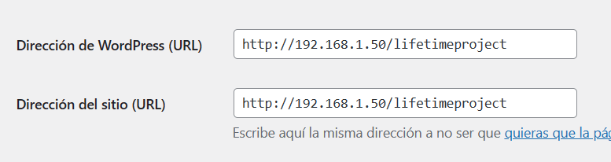

Cuando creamos un sitio web WordPress de forma local, a veces nos mata la curiosidad de saber como se vería en un celular o tablet real.

Y es normal, porque queremos estar seguros de que todo esta correcto antes de mostrar la web a todo el mundo.

Bueno, vamos a solucionar este problema.

## Paso #1: Verificar la red de los dispositivos

El dispositivo donde se ejecuta tu sitio web y el dispositivo con el que deseas ver (tablet, celular, etc). Deben estar en la misma red interna o red WiFi.

## Paso #2. Obtener la IP de tu ordenador

Ahora debemos identificar cual es la IP de nuestro ordenador. Escribe el comando `ipconfig` en la consola de Windows. Si estas en Linux usa el comando `ifconfig`.

```bash
Adaptador de LAN inalámbrica Wi-Fi:

   Sufijo DNS específico para la conexión. . :
   Vínculo: dirección IPv6 local. . . : ---
   Dirección IPv4. . . . . . . . . . . . . . : 192.168.1.50
   Máscara de subred . . . . . . . . . . . . : 255.255.255.0
   Puerta de enlace predeterminada . . . . . : 192.168.1.1
```

## Paso #3: Agregar IP al sitio WordPress

Dirígete a la sección «**Ajustes > General**» del panel de administración. Ubica los campos «Dirección de WordPress» y «Dirección del sitio» y reemplazas «localhost» por la IP de tu ordenador.

En mi caso sería así:



**Explicación:** Como ingresarás al sitio web en tu tablet o celular, WordPress querrá acceder a recursos desde «localhost», pero localhost pasará a ser ese dispositivo externo con el que deseas ver tu web. Entonces como WordPress no encuentra los recursos en tu dispositivo externo, tu web no cargará correctamente. Para solucionarlo, hay que darle explícitamente la IP para que entienda que debe recuperar los recursos desde la pc/laptop donde esta alojada la web.

## Paso #4. Accede a tu web desde otro dispositivo

Escribe la «Dirección de WordPress (URL)» en el navegador de tu celular o tablet, y podrás apreciar tu creación.


¡Y listo! Ya lo tienes.

Al momento de subirlo a internet solo deberías cambiar la «Dirección de WordPress» y «Dirección del sitio» con el dominio que compraste.
