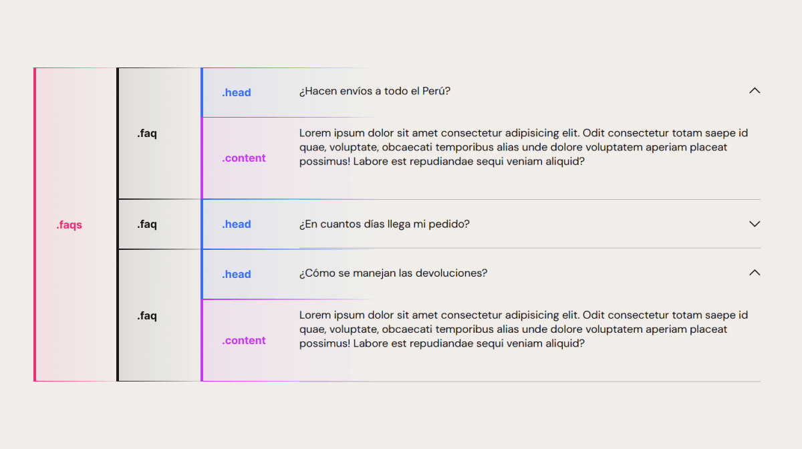

Aprende a crear un acordeón que se expande dinámicamente con el contenido.

Para este caso se realizará una sección «preguntas frecuentes». Puedes seguir esta guía también [en YouTube](https://www.youtube.com/watch?v=wPEb111ypbs).

<p class="codepen" data-height="550" data-pen-title="SHOT - Accordeon HTML, CSS y JS" data-default-tab="result" data-slug-hash="JjxmyXM" data-user="diegoamorin" style="height: 300px; box-sizing: border-box; display: flex; align-items: center; justify-content: center; border: 2px solid; margin: 1em 0; padding: 1em;">
  <span>See the Pen <a href="https://codepen.io/diegoamorin/pen/JjxmyXM">
  SHOT - Accordeon HTML, CSS y JS</a> by Diego Amorin (<a href="https://codepen.io/diegoamorin">@diegoamorin</a>)
  on <a href="https://codepen.io">CodePen</a>.</span>
</p>
<script async src="https://public.codepenassets.com/embed/index.js"></script>

## Estructura de acordeón

Tendremos un div con clase `.faqs` para contener todas las preguntas frecuentes. Cada pregunta frecuente será un div con clase `.faq` y este contendrá 2 divs, una con clase `.head` (titulo del acordeón) y otra con clase `.content` (contenido del acordeón).



*Estructura de acordeón para este ejemplo.*

En HTML se vería así. Cópialo y pégalo directamente en tu etiqueta `body`:

```xml
<div class="container">
  <h2>ACLAREMOS TUS DUDAS</h2>
  <div class="faqs">
    <div class="faq">
      <div class="head">
        <span>¿Hacen envíos a todo el Perú?</span>
        <svg width="18" height="19" viewBox="0 0 18 19" fill="none" xmlns="http://www.w3.org/2000/svg">
          <path d="M9 14.469L1 6.46897L1.96897 5.5L9 12.531L16.031 5.5L17 6.46897L9 14.469Z" fill="black"/>
        </svg>
      </div>
      <div class="content">
        <p>
          Lorem ipsum dolor sit amet consectetur adipisicing elit. Odit
          consectetur totam saepe id quae, voluptate, obcaecati temporibus
          alias unde dolore voluptatem aperiam placeat possimus! Labore est
          repudiandae sequi veniam aliquid?
        </p>
      </div>
    </div>
    <div class="faq">
      <div class="head">
        <span>¿En cuantos días llega mi pedido?</span>
        <svg width="18" height="19" viewBox="0 0 18 19" fill="none" xmlns="http://www.w3.org/2000/svg">
          <path d="M9 14.469L1 6.46897L1.96897 5.5L9 12.531L16.031 5.5L17 6.46897L9 14.469Z" fill="black"/>
        </svg>
      </div>
      <div class="content">
        <p>
          Lorem ipsum dolor sit amet consectetur adipisicing elit. Odit
          consectetur totam saepe id quae, voluptate, obcaecati temporibus
          alias unde dolore voluptatem aperiam placeat possimus! Labore est
          repudiandae sequi veniam aliquid?
        </p>
        <p>
          Lorem ipsum dolor sit amet consectetur adipisicing elit. Odit
          consectetur totam saepe id quae, voluptate, obcaecati temporibus
          alias unde dolore voluptatem aperiam placeat possimus! Labore est
          repudiandae sequi veniam aliquid?
        </p>
      </div>
    </div>
    <div class="faq">
      <div class="head">
        <span>¿Cómo se manejan las devoluciones?</span>
        <svg width="18" height="19" viewBox="0 0 18 19" fill="none" xmlns="http://www.w3.org/2000/svg">
          <path d="M9 14.469L1 6.46897L1.96897 5.5L9 12.531L16.031 5.5L17 6.46897L9 14.469Z" fill="black"/>
        </svg>
      </div>
      <div class="content">
        <p>
          Lorem ipsum dolor sit amet consectetur adipisicing elit. Odit
          consectetur totam saepe id quae, voluptate, obcaecati temporibus
          alias unde dolore voluptatem aperiam placeat possimus! Labore est
          repudiandae sequi veniam aliquid?
        </p>
      </div>
    </div>
  </div>
</div>
```

En este caso cada `.head` tiene un `span` para la pregunta frecuente y un `svg` que representa el icono de «arrow\_down».

## Aplicar estilos

Antes de darle la funcionalidad, agreguemos algunos estilos para que se vea bien.

Crea un archivo de estilos y vincúlalo a tu archivo HTML.

```css
/* Cargar Fahkwang: Bold(700) */
@import url("https://fonts.googleapis.com/css2?family=Fahkwang:wght@700&display=swap");
/* Cargar DMSans: Regular(400), Bold(700) */
@import url("https://fonts.googleapis.com/css2?family=DM+Sans:opsz,wght@9..40,400;9..40,700&display=swap");

body {
  background-color: #f1eeea;
  font-family: "DM Sans", sans-serif;
}

h2 {
  font-family: "Fahkwang", sans-serif;
}

.container {
  display: flex;
  flex-direction: column;
  align-items: center;
  gap: 60px;
  margin: auto;
  width: 80%;
  padding-top: 50px;
}

.faq .head {
  display: flex;
  padding: 25px 0px;
  justify-content: space-between;
  align-items: center;
  cursor: pointer;
}

.faq .content {
  border-bottom: 1px solid #afafaf;
}
```

En este punto tenemos nuestra sección «Preguntas Frecuentes» totalmente estructurada. Ahora, vamos a darle la funcionalidad de acordeón.

> Para fines didácticos estamos usando las fuentes de Google a través de CDN, pero recuerda que [estas incumplen con GDPR](https://www.cookieyes.com/documentation/features/integrations/google-fonts-and-gdpr/), así que en producción te recomiendo alojar las fuentes en tu hosting.

## Hacerlo funcionar

Primero ocultaremos el `.content`, porque no queremos que se muestre cuando se inicia el sitio web. Agrega lo siguiente para el `.content`:

```css
.faq .content {
  height: 0px;
  overflow-y: hidden;
  border-bottom: 1px solid #afafaf;
}
```

Ya lo ocultamos.

Ahora, para mostrar u ocultar el contenido de cada pregunta frecuente, nos apoyaremos de Javascript. Para conseguirlo, asignaremos o eliminaremos la clase «active» a cada `.faq` cada vez que se hace click en su `.head`, de esta forma sabremos si un `.faq` esta abierto o cerrado.

Antes de pasar al JS agrega lo siguiente a tu CSS, será para girar 180° el icono cuando el `.faq` este con la clase «active»:

```css
.faq.active .head svg {
  transform: rotate(180deg);
}
```

Crea un archivo de JS y vincúlalo a tu HTML, copia y pega el siguiente script:

```javascript
// Obtenemos todos los .head
const faqHeads = document.querySelectorAll(".faq .head");

faqHeads.forEach((faqHead) => {
    // Asignamos el evento click a cada .head
    faqHead.addEventListener("click", () => {
        // Obtenemos el nodo padre del .head, es decir .faq
        const faq = faqHead.parentNode;
        // Obtenemos el elemento contiguo al .head, es decir .content
        const faqContent = faqHead.nextElementSibling;

        // toggle() permite quitar o asignar la clase "active" al .faq
        faq.classList.toggle("active");

        // Si faq tiene la clase "active" entonces asignas al .content una altura
        // esta altura es el alto del contenido que esta oculto + 30px
        if (faq.classList.contains("active")) {
            faqContent.style.height = (faqContent.scrollHeight + 30) + "px";
        } else {
            // caso contrario, tendrá una altura de 0px
            faqContent.style.height = "0px";
        }
    });
});
```

¿Parece complicado no? Te recomiendo leer los comentarios que dejé en cada línea para entender lo que se esta haciendo. [Apóyate de la imagen](/#imagen-referencia) también.

Pruébalo, ya debe estar funcionando.

**Detalle sobre el if-else en el código (ignorar esta sección si se desea)**

¡Diego! Espera. En ese «if-else», ¿por qué asignaste el `height` manualmente al `.content`?, ¿no sería mejor asignarle en CSS un `height: auto` cuando el `.faq` este con la clase «active»? Así, mira:

```css
.faq.active .content {
  height: auto;
}
```

Y luego comentas el «if-else» y tendrías el mismo resultado.

Es cierto, puedes usar este método si no quieres realizar una transición en el `height`, pero en este caso si queremos hacerlo, y la transición necesita un tamaño definido, no puede realizarlo con el `height: auto`.

En caso de que no quieras suavizar la transición del acordeón, puedes dejar esta guía aquí, pero si deseas agregar transición al desplegar el acordeón, descomenta el if-else (si lo comentaste) y elimina ese último CSS con `height: auto` (si lo agregaste).

## Suavizar animación

El acordeón ya funciona, pero le falta esa suavidad, esa elegancia al desplegarse. Vamos a solucionarlo.

Agrega lo siguiente al CSS del `.content` para suavizar cuando su `height` cambie de valor:

```css
.faq .content {
  height: 0px;
  overflow-y: hidden;
  transition: height 0.25s ease-in;
  border-bottom: 1px solid #afafaf;
}
```

Agrega lo siguiente a tu archivo CSS, para suavizar la rotación del icono.

```css
.faq .head svg {
  transition: transform 0.25s ease-in;
}
```

Uff que bien se ve.

Ya tienes tu acordeón bonito y funcional. Puedes agregar más contenido a tu `.content` y su altura de adaptará.
