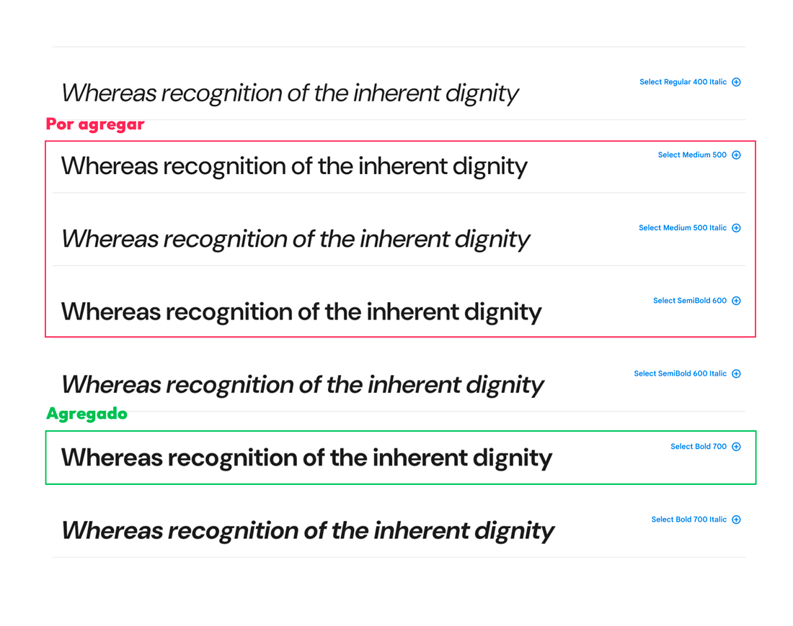

Cuando quieres cambiar la fuente tipográfica de tu sitio web, puedes utilizar todas las fuentes que están instaladas en tu PC. Pruébalo tu mismo, yo tengo instalado la familia de fuentes Poppins y puedo usarla en mi web:

```css
h1 {
    font-family: Poppins;
}
```

El problema ocurre cuando lo subes a un servidor, porque tu web le pedirá al dispositivo del usuario la fuente tipográfica, en caso de no tenerla instalada (lo que es más probable), la web no se mostrará correctamente.

Por este motivo, hoy usarás `@font-face` para acceder a las fuentes personalizadas que se encuentran en tu proyecto web o servidor. De esta forma, tu web no buscará las fuentes en el dispositivo del usuario porque ya sabrá donde hallarlas.

## Diferencia entre fuente tipográfica y familia de fuentes

La «familia tipográfica» es un conjunto amplio de fuentes relacionadas con características similares, mientras que la «fuente tipográfica» se refiere a una variante específica dentro de esa familia, como negrita o cursiva. Te doy un ejemplo:

La familia de fuentes es «Poppins» y las fuentes tipográficas son «Poppins Light», «Poppins Regular», «Poppins Bold», «Poppins Bold Italic», etc.

Si no te quedo tan claro, puedes leer el artículo [«Conceptos Tipográficos: Tipo, fuente y familia»](https://reydefine.com/conceptos-tipograficos/).

<AdInArticle />

## Agregar una fuente tipográfica

Primero descarga tu fuente en el formato que desees TTF, OTF, WOFF2, etc. En mi caso descargué la familia de fuentes [DM Sans](https://fonts.google.com/specimen/DM+Sans) (te recomiendo descargarla para esta guía), y coloqué solo las fuentes que usaré en la carpeta `assets/fonts/` de mi proyecto. Una de ellas es «DM Sans Bold».

Para especificar la fuente personalizada en CSS, usamos `@font-face`. Este suele ser agregado al inicio del archivo CSS antes de cualquier estilo:

```css
@font-face {
    font-family: 'DM Sans';
    src: url("assets/fonts/DMSans-Bold.ttf") format('truetype');
    font-style: normal;
    font-weight: 700;
}
```

Después puedo usarlo en mis textos de la siguiente forma:

```css
h1 {
    font-family: 'DM Sans';
    font-weight: 700;
}
```

Entendamos la sintaxis de `@font-face`:

-   `font-family`: Nombre de la familia de la fuente.
-   `src`: La ubicación de la fuente. Con `url()` definimos la ruta del archivo y con `format()` ayudas al navegador a reconocer el formato de este archivo.
-   `font-style`: El estilo de la fuente (normal, italic, oblique). [Ver documentación](https://developer.mozilla.org/en-US/docs/Web/CSS/font-style).
-   `font-weight`: El peso o grosor de la fuente. El 700 es equivalente a `bold`. [Ver documentación](https://developer.mozilla.org/en-US/docs/Web/CSS/font-weight).

Un error común es definir `font-style: bold`, ya que a veces pensamos que `bold` también es estilo, pero en este caso es incorrecto ya que el peso se define en `font-weight`.

## El formato de fuente ideal

Analicemos cada formato de fuente para ver cual será la mejor opción en nuestra web:

**OpenType Font (OTF) y TrueType Font (TTF)**: TrueType como OpenType son formatos de fuente escalables que han sido ampliamente utilizados en la industria de la impresión y la web. Aunque han sido eclipsados en la web por formatos más eficientes como WOFF y WOFF2, todavía juegan un papel importante, especialmente cuando se trabaja con aplicaciones de diseño gráfico y publicación. [Ver compatibilidad](https://caniuse.com/ttf).

```css
@font-face {
    font-family: 'MiFuente';
    src: url('ruta/a/mifuente.ttf') format('truetype');
}

@font-face {
    font-family: 'MiFuente';
    src: url('ruta/a/mifuente.otf') format('opentype');
}
```

**Web Open Font Format (WOFF)**: Es un formato usado para la web (no es un formato que puedas instalar en tu PC como el TTF). Tiene una mejor compresión que OTF y TTF, y lo soportan los navegadores modernos incluyendo IE9+. [Ver compatibilidad](https://caniuse.com/woff).

```css
@font-face {
  font-family: 'MiFuente';
  src: url('ruta/a/mifuente.woff') format('woff');
}
```

**Web Open Font Format 2 (WOFF2)**: Es una versión mejorada de WOFF que tiene una mayor compresión y lo soportan los navegadores modernos, pero no IE. [Ver compatibilidad](https://caniuse.com/woff2).

```css
@font-face {
  font-family: 'MiFuente';
  src: url('ruta/a/mifuente.woff2') format('woff2');
}
```

**Embedded OpenType (EOT)**: Este formato fue desarrollado por Microsoft y es compatible solo con Internet Explorer y con los años se fue al barranco, así que no se recomienda el uso de este formato, por este motivo, tampoco agregaré un ejemplo de como usarlo. Es por tu bien. [Ver compatibilidad](https://caniuse.com/eot).

Un dato útil es que también puedes agregar más de un formato en `@font-face` de la siguiente forma:

```css
@font-face {
  font-family: 'MiFuente';
  src: url('ruta/a/mifuente.woff2') format('woff2'),
       url('ruta/a/mifuente.woff') format('woff');
}
```

Así uno puede aumentar la compatibilidad de navegadores. En este caso queremos usar WOFF2, pero IE no es compatible con este formato, entonces agregamos una alternativa de la misma fuente en formato WOFF que si es compatible con IE9+. Te recomiendo ver compatibilidad de cada formato.

Gracias a su calidad de compresión, la web se esta moviendo hacia WOFF y WOFF2. Por ello en nuestro ejemplo inicial, lo que haré es usar un «**convertidor de TTF a WOFF2**«, obteniendo un archivo de menor tamaño que especificaré en mi `src`:

```css
@font-face {
    font-family: 'DM Sans';
    src: url("assets/fonts/DMSans-Bold.woff2") format('woff2');
    font-style: normal;
    font-weight: 700;
}
```

<AdInArticle />

## Agregar una familia de fuentes

La familia «DM Sans» tiene muchas fuentes. Estuvimos usando solo «DM Sans Bold», ahora agregaremos algunas más (DM Sans Medium, DM Sans Medium Italic y DM Sans SemiBold) por si tu web requiere usar más de una fuente.



*Captura extraída de la página de «DM Sans» en Google Fonts.*

Para agregar estas nuevas fuentes, debemos asignar la ruta donde se encuentran y cambiar el `font-style` y `font-weight`:

```css
@font-face {
    font-family: 'DM Sans';
    src: url("assets/fonts/DMSans-Medium.woff2") format("woff2");
    font-style: normal;
    font-weight: 500;
}
@font-face {
    font-family: 'DM Sans';
    src: url("assets/fonts/DMSans-MediumItalic.woff2") format("woff2");
    font-style: italic;
    font-weight: 500;
}
@font-face {
    font-family: 'DM Sans';
    src: url("assets/fonts/DMSans-SemiBold.woff2") format("woff2");
    font-style: normal;
    font-weight: 600;
}
@font-face {
    font-family: 'DM Sans';
    src: url("assets/fonts/DMSans-Bold.woff2") format("woff2");
    font-style: normal;
    font-weight: 700;
}
```

¡Y listo! Puedes usarlos en tu web de una forma similar a esta:

```css
.type1 {
    font-family: 'DM Sans';
    font-style: normal;
    font-weight: 500;
}
.type2 {
    font-family: 'DM Sans';
    font-style: italic;
    font-weight: 500;
}
.type3 {
    font-family: 'DM Sans';
    font-style: normal;
    font-weight: 600;
}
.type4 {
    font-family: 'DM Sans';
    font-style: normal;
    font-weight: 700;
}
```

Y si deseas agregar otra familia de fuentes, también tendrás que cambiar el `font-family`.

> Dato curioso. Si alguna vez usaste Google Fonts, verás que te da un enlace en el `@import`, y si lo visitas, verás que son solo definiciones `@font-face`.

## Beneficios de auto-hospedar las fuentes en nuestra web

Realizar el llamado self-hosting de tus fuentes tipográficas tiene 3 beneficios:

-   **No dependes de servicios externos:** Si el servicio de fuentes alguna vez no esta disponible, tu web funcionará correctamente.
-   **Mejorar la velocidad:** Algunos servicios no te permiten usar una determinada fuente sino que te cargan toda la familia completa. Por deducción, esto afecta la velocidad tu web.

Nota: Google Fonts si te permite elegir que fuentes deseas usar de una determinada familia tipográfica. Así que no abra tanta diferencia con respecto al rendimiento.

-   **Amigable con la privacidad:** No depender de las fuentes de servicios externos, te asegura a ti y a tus usuarios de que no se estén compartiendo datos a servicios externos.

Nota: [Google Fonts recopila datos de los usuarios](https://www.cookieyes.com/documentation/features/integrations/google-fonts-and-gdpr/), al usar este servicio en tu web estas infringiendo las directrices GDPR.

Por estos motivos, es mejor alojar nuestras fuentes y así nos evitamos de problemas.

## Referencias

-   [How to use @font-face in CSS | CSS-Tricks – CSS-Tricks](https://css-tricks.com/snippets/css/using-font-face-in-css/)
-   [@font-face – CSS | MDN (mozilla.org)](https://developer.mozilla.org/es/docs/Web/CSS/@font-face)
-   [Incluir fuentes en CSS con @font-face | Kodetop](https://www.kodetop.com/incluir-fuentes-en-css-con-font-face/)
