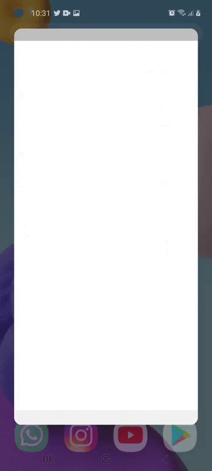

Hoy aprenderás a crear una aplicación de Stickers para WhatsApp usando Flutter. Te enseñaré todo lo que he aprendido al crear [mis propias apps de stickers](https://play.google.com/store/apps/dev?id=4659772107538122360). Todo lo que leí, fallé y experimenté al publicarlo en la Play Store estará resumido aquí.

Esta es la guía 1 de 2 y te recomiendo terminar los dos. «Los que se desaniman pierden». let’s goo

**¿Para quién es este tutorial?**

Cualquier persona puede seguir este tutorial. Si lo desea. Pero, si quiere entender la guía sin problemas, es recomendable que usted ya haya creado proyectos con Flutter y así estar familiarizado con los widgets y conceptos básicos del SDK.

**Toma en cuenta**

La guía para crear esta app de stickers, fue desarrollada apoyándose de un dispositivo Android; aún se desconoce su funcionamiento en IOS. Para los desarrolladores IOS, trataré de facilitarles la documentación si es necesario.

## Los stickers de WhatsApp

WhatsApp te da ciertos [detalles y reglas](https://github.com/WhatsApp/stickers) para crear una app de stickers, además, tiene una [guía](https://faq.whatsapp.com/general/how-to-create-stickers-for-whatsapp) específica para crear los stickers. Aquí te muestro lo esencial que rescate de las lecturas:

«El nombre de tu aplicación **no** debe llevar de alguna manera el nombre de WhatsApp en las tiendas de aplicaciones.»

Debo decir que existen algunas apps que si llevan WhatsApp en su título. Aunque, consulte con un desarrollador llamado [Eduardo Serracín](https://www.youtube.com/user/edenserr) y me advirtió que por ahora talvez no pase nada, pero más adelante pueden retirar tu app de la PlayStore.

#### **¿Cómo se organizan los stickers?**

Los stickers en WhatsApp están organizados dentro de *packs* que cumplen los siguientes requisitos:

**Pack:**

-   Tener como mínimo 3 stickers y un máximo de 30.
-   Tener un «Tray Icon» que representará tu pack en WhatsApp.

**Sticker:**

-   Dimensiones de 512×512 píxeles
-   Formato Webp
-   Tamaño inferior a 100KB

**Tray Icon:**

-   Dimensiones de 96×96 píxeles
-   Tamaño inferior a 50KB
-   El formato que yo uso es PNG y no he tenido problemas.

No debes preocuparte por todo esto, ya que, te facilitaré un repositorio con todos los archivos necesarios. Ahora sí, COMENCEMOS.

## Inicia un proyecto Flutter

Comencemos creando un proyecto. Opcionalmente puedes agregarle el nombre del paquete, con formato `com.yourwebsite`.

```text
flutter create --org com.diegoamorin stickersapp
```

Es recomendable poner el nombre del paquete desde un principio, así luego no la cambias de manera manual. El proceso es un poco complicado en este último.

#### **Instala el paquete**

Vamos a instalar el paquete [flutter\_whatsapp\_stickers](https://pub.dev/packages/flutter_whatsapp_stickers) al `pubspec.yaml`. Permitirá que nuestra app de stickers interactúe con WhatsApp.

```yaml
dependencies:
  flutter:
    sdk: flutter
  flutter_whatsapp_stickers: ^1.0.0+4 // <- Aquí
  // ...
```

#### **Configura el paquete**

Existen dos maneras de configurarlo según el OS que estemos usando. En este caso lo haré para Android, si usted esta en IOS siga las instrucciones del paquete [aquí](https://pub.dev/packages/flutter_whatsapp_stickers).

Agregue lo siguiente en su `app/build.gradle`. Esto evitará que todos los archivos Webp se compriman.

```groovy
android {
    aaptOptions {
        noCompress "webp"
    }
}
```

#### **Incluye los Assets**

Creemos una carpeta «sticker\_packs». Dentro de ella agregaremos nuestros packs y un archivo «sticker\_packs.json» (Archivo que ayuda a registrar y clasificar stickers. [Más Información](https://github.com/WhatsApp/stickers/tree/master/Android#modifying-the-contentsjson-file)) que se encuentran en el repositorio del proyecto.

```text
lib/
sticker_packs/
  negative_cats/
  positive_cats/
  sticker_packs.json
test/
```

Ahora incluye los assets en el `pubspec.yaml`:

```yaml
flutter:
  assets:
    - sticker_packs/sticker_packs.json
    - sticker_packs/positive_cats/
    - sticker_packs/negative_cats/
```

## A Programar!

#### **Crea las rutas**

La app tendrá dos pantallas o rutas. La primera mostrará todos los packs con unos stickers de muestra. Cuando presionen en uno de los packs, la app te enviará a la segunda pantalla. Ahí se podrán ver todos los stickers que contiene dicho pack.

Vamos a crear *rutas con nombres* y además tendremos que pasar datos de stickers entre ellas. Reemplaza el `main.dart` por lo siguiente.

```dart
import 'package:flutter/material.dart';
import 'package:flutter/services.dart';
import 'package:stickersapp/models/pack_model.dart';
import 'package:stickersapp/screens/detail_screen.dart';
import 'package:stickersapp/screens/home_screen.dart';

void main() {
  runApp(MyApp());
}

class MyApp extends StatelessWidget {
  @override
  Widget build(BuildContext context) {
    // Esto hará que la app se mantenga en vertical.
    SystemChrome.setPreferredOrientations([
      DeviceOrientation.portraitUp,
      DeviceOrientation.portraitDown,
    ]);

    return MaterialApp(
      title: "Stickers App",
      initialRoute: "/",
      onGenerateRoute: (settings) {
        switch (settings.name) {
          case "/":
            return MaterialPageRoute(builder: (context) => Home());
          case "/detail":
            {
              // Recuperamos los datos y se lo pasamos al detail_screen.dart
              Pack packData = settings.arguments;
              return MaterialPageRoute(
                builder: (context) => Detail(pack: packData),
              );
            }
          default:
            return null;
        }
      },
    );
  }
}
```

Crea una carpeta «screens» dentro de «lib». Este contendrá las dos rutas en dos archivos separados:

```text
lib/
  screens/
    detail_screen.dart
    home_screen.dart
```

Por el momento, dentro de `home_screen.dart` creamos un *widget con estado* llamado Home:

```dart
import 'package:flutter/material.dart';

class Home extends StatefulWidget {
  @override
  _HomeState createState() => _HomeState();
}

class _HomeState extends State<Home> {
  @override
  Widget build(BuildContext context) {
    return Scaffold(
      body: Center(
        child: RaisedButton(
          child: Text("Home Page"),
          onPressed: () {
            Navigator.pushNamed(context, "/detail", arguments: null);
          },
        ),
      ),
    );
  }
}
```

Para el `detail_screen.dart`, crea un *widget con estado* llamado Detail y su constructor que recibe un pack.

```dart
import 'package:flutter/material.dart';
import 'package:stickersapp/models/pack_model.dart';

class Detail extends StatefulWidget {
  final Pack pack;
  const Detail({this.pack});

  @override
  _DetailState createState() => _DetailState();
}

class _DetailState extends State<Detail> {
  @override
  Widget build(BuildContext context) {
    return Scaffold(
      body: Center(child: Text("Detail Page")),
    );
  }
}
```

Seguramente en tu código se muestran algunos errores; estos se arreglarán ahora mismo.

#### **Crea los modelos**

Ahora vamos a crear los objetos o modelos Pack y Sticker en dos archivos separados. Dentro de la carpeta `lib/models`

Creamos el archivo `pack_model.dart` con el modelo Pack.

```dart
import 'dart:convert';
import 'package:stickersapp/models/sticker_model.dart';

Pack packFromJson(String str) => Pack.fromJson(json.decode(str));

class Pack {
  Pack({
    this.identifier,
    this.name,
    this.publisher,
    this.trayImageFile,
    this.publisherEmail,
    this.publisherWebsite,
    this.privacyPolicyWebsite,
    this.licenseAgreementWebsite,
    this.imageDataVersion,
    this.stickers,
  });

  String identifier;
  String name;
  String publisher;
  String trayImageFile;
  String publisherEmail;
  String publisherWebsite;
  String privacyPolicyWebsite;
  String licenseAgreementWebsite;
  String imageDataVersion;
  List<Sticker> stickers;

  factory Pack.fromJson(Map<String, dynamic> json) => Pack(
        identifier: json["identifier"],
        name: json["name"],
        publisher: json["publisher"],
        trayImageFile: json["tray_image_file"],
        publisherEmail: json["publisher_email"],
        publisherWebsite: json["publisher_website"],
        privacyPolicyWebsite: json["privacy_policy_website"],
        licenseAgreementWebsite: json["license_agreement_website"],
        imageDataVersion: json["image_data_version"],
        stickers: List<Sticker>.from(
            json["stickers"].map((x) => Sticker.fromJson(x))),
      );
}
```

Creamos otro archivo `sticker_model.dart` donde irá el modelo Sticker.

```dart
class Sticker {
  Sticker({
    this.imageFile,
    this.emojis,
  });

  String imageFile;
  List<String> emojis;

  factory Sticker.fromJson(Map<String, dynamic> json) => Sticker(
        imageFile: json["image_file"],
        emojis: List<String>.from(json["emojis"].map((x) => x)),
      );
}
```

VAMOS A EJECUTARLO ??



## Recordemos

En esta primera guía:

-   Conoces como se organizan los stickers en WhatsApp.
-   Tienes claro que existen ciertos requisitos en crear una app o sticker para WhatsApp.
-   Configuraste con éxito el paquete [flutter_whatsapp_stickers](https://pub.dev/packages/flutter_whatsapp_stickers) que será el puente entre la app y WhatsApp.
-   Por último, construiste una aplicación que servirá como base para el siguiente capítulo.

## Conclusión

Si lograste llegar hasta este punto, por favor, te pido que te des unas buenas palmadas en la espalda. Te lo mereces.

Puede que te abrume tanta información o no entender algunos conceptos. Pero créeme que con más práctica, creando apps de este tipo. Lo entenderás mejor y crearás tus programas de manera rutinaria.

En el siguiente artículo te enseñaré a renderizar los Packs y los Stickers. Además, instalaremos los Stickers a WhatsApp.
