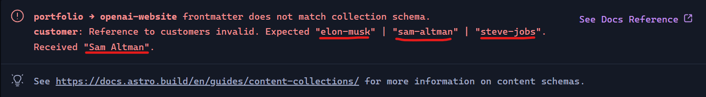

En Astro puedes crear páginas automáticamente añadiendo un archivo `.astro` o `.md` dentro de la carpeta `pages/`. Pero, ¿qué hay de los archivos JSON?

Imagina que quieres guardar datos de un portafolio y/o una lista de elementos, no se siente bien guardarlos en archivos Markdown. Para nuestra suerte, Astro también nos da la posibilidad de convertir nuestros archivos JSON en páginas, y no solo ello, también nos permite «tipar» estos datos con Typescript.

## Crear proyecto Astro

Para este ejemplo crearemos un portafolio. Iniciemos un proyecto de Astro:

```
npm create astro
```

Agrégale el nombre que desees, yo le pondré «astro-portafolio». Más adelante, cuando te pregunta si usarás Typescript, le dices que sí, y eliges el modo «Strict» (como todo un pro).

## Uso de Content Collections

En la documentación nos explican que la mejor forma de administrar y crear contenido en un proyecto Astro es a través de las colecciones de contenido o [content collections](https://docs.astro.build/en/guides/content-collections/). Además, que nos da la posibilidad de tipar nuestros contenidos de Markdown, MDX, YAML o JSON. Si si, JSON.

Las Content Collections, no tienen mucha ciencia. Solo hay que crear una carpeta `content/` dentro de `src/` (en esta carpeta, Astro buscará las colecciones de contenido) y cada carpeta que agregues allí será una colección de contenido.

Vamos a crear 2 colecciones de contenido: `proyectos/` y `clientes/`. Nuestro proyecto tomará una estructura similar a esta:

```bash
public/
src/
    content/
        clientes/
        proyectos/
    pages/
        index.astro
```

En una colección guardaremos nuestros proyectos para el portafolio, y en el otro, guardaremos a nuestros clientes. Más adelante las relacionaremos.

> En la documentación también se [recomienda pasar a Content Collections](https://docs.astro.build/en/guides/content-collections/#migrating-from-file-based-routing) si tienes un blog o un proyecto donde tus archivos Markdown viven dentro de la carpeta `pages/`

Crea el archivo `openai-website.json` dentro de `proyectos/` con la siguiente estructura:

```json
{
  "title": "Sitio web de OpenAI",
  "slug": "sitio-web-de-openai",
  "url": "https://openai.com",
  "customer": "Sam Altman",
  "year": 2024
}
```

El «slug» nos servirá más adelante para crear una ruta donde se accederá a este contenido.

Crea un par de archivos más, por ejemplo, `tesla-website.json` y `apple-website.json`. Recuerda cambiar los datos y que todos compartan la misma estructura. En unas secciones después, le diremos a Astro como debe lucir la estructura de nuestros archivos y que nos avise si alguno no cumple los requisitos.

Luego, para en la colección `clientes/` crea un JSON llamado `sam-altman.json` con la siguiente estructura:

```json
{
  "name": "Sam Altman",
  "image": "sam-altman.jpg"
}
```

Para esta carpeta también crea otros 2 más, como `elon-musk.json` y `steve-jobs.json`. Descarga las imágenes correspondientes y agrégalas dentro de la carpeta `public/`.

```bash
public/
    elon-musk.jpg
    sam-altman.jpg
    steve-jobs.jpg
src/
```

Por el momento, solo hemos estructurado el proyecto. Ahora aprenderemos a generar rutas dinámicas que son la clave para autogenerar las páginas a través de archivos JSON.

## Uso de Dynamic Routes

Sabemos que al crear un archivo `.astro` dentro de `pages/` se crea una ruta. La misión es lograr el mismo efecto pero con archivos `.json`, y para solucionar este problema, Astro nos ofrece las rutas dinámicas o [dynamic routes](https://docs.astro.build/en/guides/routing/#dynamic-routes). Aquí te explicaré lo básico de su funcionamiento, pero puedes ahondar mucho más en [su documentación](https://docs.astro.build/en/guides/routing/#dynamic-routes).

Básicamente, las rutas dinámicas se crean asignando parámatros entre corchetes en las carpetas y/o archivos dentro de `pages/`. Por ejemplo la ruta `/pages/portafolio/[proyecto].astro` recibe el parámetro `proyecto` y la ruta `/pages/[idioma]/[manual].astro` recibe los parámetros `idioma` y `manual`. Los valores que tomen estos parámetros le dicen a Astro que páginas debe crear.

¿Y como asignamos estos parámetros? En los archivos `[proyecto].astro` o `[manual].astro` debemos exportar una función `[getStaticPaths()](https://docs.astro.build/en/reference/api-reference/#getstaticpaths)` que devuelve un arreglo de objetos con una propiedad `params`.

Veámoslo en la práctica. Crea la estructura `/pages/portafolio/[proyecto].astro` y agrega lo siguiente:

```javascript
---
export function getStaticPaths() {
  return [
    {params: {proyecto: 'tesla'}},
    {params: {proyecto: 'openai'}},
    {params: {proyecto: 'apple'}},
  ];
}

// Accede al parámetro a través de Astro.params
const { proyecto } = Astro.params;
---

<h1>Proyecto: {proyecto}!</h1>
```

Puedes ver que la propiedad `params` recibe un objeto donde van los parámetros que va a recibir la ruta dinámica. En nuestro caso, solo definimos el parámetro `proyecto`.

Esto debería generar las rutas `/portafolio/tesla`, `/portafolio/openai` y `/portafolio/apple`. Verifícalo en tu navegador.

Espera un momento. Diego, estas rutas no se generan con los JSON’s que me hiciste crear anteriormente. Eso lo arreglaremos en la siguiente sección.

## Crear rutas con los Content Collections

Ahora que aprendiste a usar «content collections» y «dynamic routes» es momento de combinarlas y crear nuestro portafolio.

La misión es obtener los datos de la colección de contenido `proyectos/` y generar rutas para cada JSON de su interior. Actualiza tu archivo `[proyecto].astro`:

```javascript
---
import { getCollection } from 'astro:content';

export async function getStaticPaths() {
  const proyectos = await getCollection('proyectos');
  console.log(proyectos);

  const arregloObjetos = proyectos.map((proyecto) => {
    return {
      params: {proyecto: proyecto.data.slug},
      props: {data: proyecto.data},
    }
  });

  return arregloObjetos;
}

// Accede a los props a través de Astro.props
const { data } = Astro.props;
---

<h1>Proyecto: {data.title}</h1>
<h3>Customer: {data.customer}</h3>
<h3>Fecha: {data.year}</h3>
<a href={data.url}>Link al proyecto</a>
```

Antes de que te eches a llorar, déjame explicarte el código.

**Línea 5:** Usé la función `getCollection()` para obtener los datos de una determinada colección de contenidos, en este caso los contenidos de `proyectos/` y como devuelve una promesa entonces agregamos async/await.

**Línea 6:** Agregué un `console.log()` para que veas en la consola de Node el retorno de `getCollection()`. Fíjate que nos devuelve una lista de objetos con `id`, `collection` y `data`. El `collection` nos dice a que colección pertenece el objeto, `data` nos ofrece todo el contenido del archivo JSON, y el `id` nos devuelve la RUTA relativa a la colección donde pertenece el archivo (el `id` lo usaremos al final para mejorar las rutas).

**Línea 8-15:** Recuerda que `getStaticPaths()` debe devolver una lista de objetos. Recorrimos todos los proyectos con la función `map()`, y esto retorna una lista de objetos con sus `params` (obligatorio) y `props` (opcional).

-   En `params` defines los parámetros que recibe la ruta dinámica. En nuestro caso es el parámetro `proyecto`, y le asigné el slug definido en los archivos JSON.
-   En `props` asigné los datos extraídos de los JSON’s que se usarán en cada ruta.

Genial. Ahora visita las rutas `/portafolio/` agregando el «slug» que añadiste en cada archivo JSON. En mi caso uno de ellos sería `/portafolio/sitio-web-de-openai`.

Falta un detalle. Si te fijas, no estamos obteniendo los datos de la colección `customers/`, solo estamos usando los datos de `portfolio/`. En la siguiente sección vincularemos ambas colecciones.

## Definir estructuras con Zod y vincular Content Collections

Astro nos da la posibilidad de [definir la estructura](https://docs.astro.build/en/guides/content-collections/#defining-collections) de nuestras colecciones. Lo único que debemos hacer es crear un archivo `config.ts` dentro de `/src/content/`.

El archivo `config.ts` tiene la siguiente estructura:

```javascript
import { defineCollection } from 'astro:content';

// Definimos las colecciones con "defineCollection"
const proyectoCollection = defineCollection({ /* ... */ });

// Exporta el objeto "collections" que vincula
// el nombre de la carpeta colección con su definición
export const collections = {
  'proyectos': proyectoCollection,
};
```

Si ejecutas el proyecto, debería generarse un error porque aún no hemos definido el `defineCollection()`. Debemos enviarle un «esquema», que básicamente es la estructura que tomarán nuestros datos. Para definir esquemas de validación, existen muchas bibliotecas, una de ellas es [Zod](https://zod.dev/), y Astro ya lo tiene integrado.

Definamos los esquemas para `proyectos/` y `clientes/` en `config.ts`:

```javascript
import { defineCollection, reference, z } from 'astro:content';

// Definir colección para proyectos/
const proyectosCollection = defineCollection({
  // 'data' es para definir contenidos JSON o YAML y 'content' es para contenidos Markdown
  type: 'data',
  // definición de esquema con Zod
  schema: z.object({
    title: z.string(),
    slug: z.string(),
    url: z.string().url(),
    customer: reference('clientes'),
    year: z.number(),
  })
});

// Definir colección para clientes/
const clientesCollection = defineCollection({
  type: 'data',
  schema: z.object({
    name: z.string(),
    image: z.string(),
  })
});

export const collections = {
  'proyectos': proyectosCollection,
  'clientes': clientesCollection,
};
```

En la **línea 12**, estamos diciéndole a Astro que el campo `customer:` de un determinado proyecto debe hacer referencia a un elemento de la colección `clientes/`. Esto provocará un error, porque nuestros archivos JSON dentro de `proyectos/` no hacen esta referencia. Pero no te preocupes, Astro nos explicará que estamos fallando.

En mi caso, me pide que agregue una referencia a un elemento de `customers/`. Yo le pase «Sam Altman» cuando debió ser «sam-altman».



Yo lo arreglaré mis archivos JSON para cumplir las demandas del esquema. Tu también has lo mismo.

Mi `openai-website.json` quedo así:

```json
{
  "title": "Sitio web de OpenAI",
  "slug": "sitio-web-de-openai",
  "url": "https://openai.com",
  "customer": "sam-altman",
  "year": 2024
}
```

De esta forma vinculamos nuestras colecciones y definimos su estructura.

**Nota:** En los esquemas puedes eliminar o agregar más campos, añadir valores por defecto, crear campos opcionales y más, gracias a Zod. Puedes visitar su [documentación](https://zod.dev/) para más detalles.

Es momento de recuperar los datos de la colección `customers/`. Actualiza tu `[proyecto].astro` a lo siguiente:

```javascript
---
import { getCollection, getEntry } from 'astro:content';

export async function getStaticPaths() {
  const proyectos = await getCollection('portfolio');

  const arregloObjetos = proyectos.map((proyecto) => {
    return {
      params: {proyecto: proyecto.data.slug},
      props: {data: proyecto.data},
    }
  });

  return arregloObjetos;
}

const { data } = Astro.props;

const customer = await getEntry(data.customer);
---

<h1>Proyecto: {data.title}</h1>
<h3>Customer: {customer.data.name}</h3>

<h3>Fecha: {data.year}</h3>
<a href={data.url}>Link al proyecto</a>
```

**Línea 19:** Para [obtener datos de una colección que hace referencia a otra colección](https://docs.astro.build/en/guides/content-collections/#accessing-referenced-data) debes usar `getEntry()`.

Mira tus páginas con el path `/portafolio/` mas el slug que agregaste a cada uno, todas se generaron a través de archivos JSON y puedes agregar más archivos y automáticamente tendrás nuevas páginas.

Puedes felicitarte, ¡lo lograste! Y si deseas mejorar las rutas para que no escribas manualmente un slug en cada JSON puedes leer la siguiente sección.

## Mejorar las rutas

Cuando agregas un archivo `.astro` en `pages/` se genera la ruta nueva usando el nombre del archivo. Hagamos lo mismo con nuestros archivos JSON, para no tener que escribir un campo «slug» en cada uno de ellos.

Elimina el campo `slug:` de los JSON que se encuentran en `proyectos/`:

```json
{
  "title": "Sitio web de OpenAI",
  "slug": "sitio-web-de-openai", // <-- Elimina esto
  "url": "https://openai.com",
  "customer": "sam-altman",
  "year": 2024
}
```

Recuerda que Astro se quejará porque nuestros archivos no cumplen con la esquema que definimos en `content/config.ts`. Elimina la definición de «slug» del esquema:

```javascript
const proyectosCollection = defineCollection({
  type: 'data',
  schema: z.object({
    title: z.string(),
    slug: z.string(), // <-- Elimina esto
    url: z.string().url(),
    customer: reference('clientes'),
    year: z.number(),
  })
});
```

También usábamos el slug en `[proyecto].astro`, por ello seguiremos teniendo error. Vamos a asignarle el valor `proyecto.id` al parámetro `proyecto`:

```javascript
export async function getStaticPaths() {
  const proyectos = await getCollection('portfolio');

  const arregloObjetos = proyectos.map((proyecto) => {
    return {
      params: {proyecto: proyecto.id},
      props: {data: proyecto.data},
    }
  });

  return arregloObjetos;
}
```

Recuerda que el id es una ruta, en este caso solo devuelve el nombre de los archivos: `apple-website`, `openai-website` y `tesla-website` porque son rutas relativas a la carpeta `content/`. Como resultado, esto generará las siguientes rutas en tu navegador `/portafolio/apple-website`, `/portafolio/openai-website` y `/portafolio/tesla-website`.

Como te decía, el id nos devuelve una ruta. ¿Qué pasaría si creas un subdirectorio dentro de la colección `proyectos/`?

```
content/
    clientes/
        ...
    proyectos/
        apps/
            apple-music.json
        openai-website.json
        spacex-website.json
        tesla-website.json
```

**¿Cuál sería el id de `apple-music.json`?**

Bueno, el ID sería la ruta `app/apple-music`.

El problema es que los `params:` definidos en `getStaticPaths()` no saben procesar rutas. Esto generará un error, ya que hasta el momento solo estaba recibiendo el nombre de los archivos. Para arreglarlo, debemos convertir nuestro parámetro `proyecto` a un «[parametro rest](https://docs.astro.build/en/guides/routing/#rest-parameters)«. No es complicado, solo debemos cambiar el nombre del archivo `[proyecto].astro` a `[...proyecto].astro`

Ahora puedes acceder a `/portafolio/apps/apple-music`.

¡Y con esto terminamos! Espero esta guía haya sido de tu agrado.

## Referencias

-   [Content Collections | Astro Docs](https://docs.astro.build/en/guides/content-collections)
-   [Routing | Astro Docs](https://docs.astro.build/en/guides/routing/)
-   [Pages | Astro Docs](https://docs.astro.build/en/basics/astro-pages/)
-   [Zod | Documentation](https://zod.dev/)
