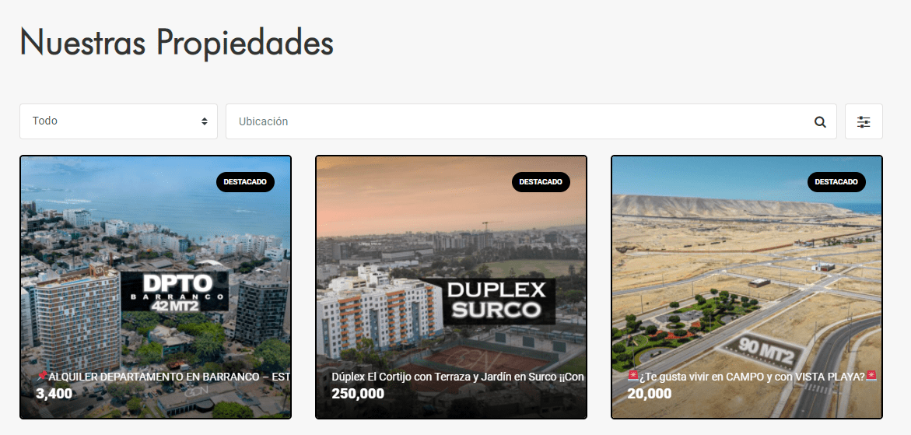
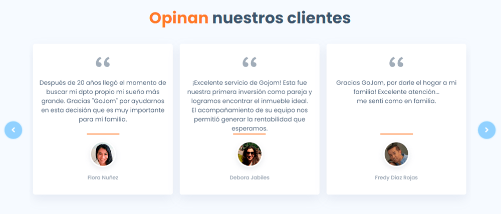
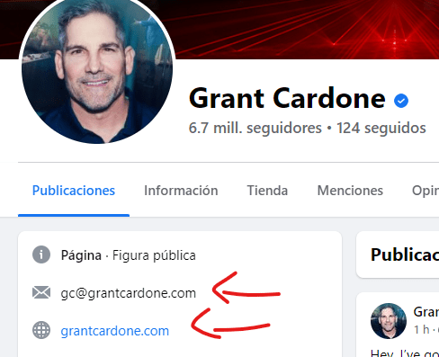
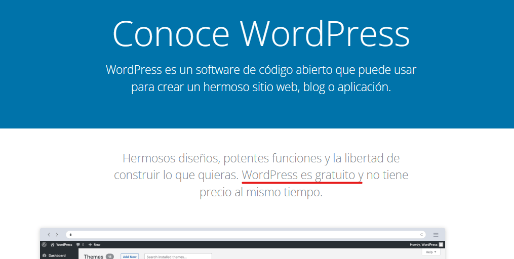

Los sitios web mejoran la presencia de una marca en Internet, porque son una buena fuente de información para las personas que desean conocer más sobre de ti o sobre tu empresa. Conocerán mas sobre tus servicios, tus propiedades, tu equipo, tu visión, etcétera.

La pregunta es, ¿por qué necesito un sitio web, si puedo obtener los mismos beneficios de otras maneras? Si te creas una página de Facebook o una cuenta en un portal inmobiliario, puedes posicionar tu marca en Internet, puedes mantener a tus clientes informados, y además, puedes publicitar tus servicios y propiedades. No existen motivos contundentes para complicarse la vida con un sitio web.

¡Tienes razón!

## Sitios web que venden

Si bien un sitio web mejora la presencia de tu marca y mantiene informado a las personas, también sirve como una herramienta para hacer marketing y ventas. Muchas webs están empezando a tomar este enfoque: informar y vender a la vez. Es decir si una persona quiere conocer sobre tu negocio y tu equipo, buscará información en tu sitio web. Ahora, si quieres vender un servicio o propiedad, una web puede convertirse en un panel publicitario que seducirá a las personas y los convertirá en potenciales clientes.

Ahorita de mostraré como se hace.

Los 6 beneficios que estas a punto de ver se basan en un sitio web que informa y vende a la vez; y al final del artículo aprenderás como obtener un sitio web profesional, y sin complicaciones. Pasemos al primer beneficio:

<AdInArticle />

## 1\. Destaca tu propuesta de valor

Una persona desea vender su casa y se da cuenta que vender una propiedad es más complicado de lo que pensaba. Necesita colocar un precio adecuado a la propiedad, tiene que vérselas con documentos legales, tiene que arreglar y presentar la casa, etc.

Decide contratar a una agencia inmobiliaria.

Busca en Facebook o TikTok agencias inmobiliarias. Para él todas las agencias son similares y no sabe a quién elegir (Recuerda. Es sencillo hacerse una cuenta en TikTok o de Facebook y empezar a competir en el mercado). Hasta que te encuentra y ve en tu perfil un link hacia tu sitio web, hace click, y ve tu [propuesta de valor](https://economipedia.com/definiciones/propuesta-de-valor.html) en letras grandes. En ese instante comprende por que eres la mejor opción ante la competencia.

A continuación, verás un ejemplo de la propuesta de valor del sitio web de «*Zero a la derecha*» al inicio y con letras grandes:

*Extraído del sitio web www.zeroaladerecha.com*

Ni bien ingresen a tu web, las personas sabrán cuál es la relevancia de tu empresa y entenderán por qué eres la mejor opción entre los demás. Esto no solo servirá para captar la atención de clientes potenciales, también te ayudará a captar talento, es decir, las personas querrán formar parte de tu equipo, porque propones algo diferente.

## 2\. Centraliza tu información

Él esta interesado en ti. Ahora desea conocer sobre tus servicios y tu experiencia, ¿a dónde debe ir? ¿a tus redes sociales? Si es así, la única forma de conocerte mejor es haciendo scroll hacia abajo y ver cada video o publicación que hiciste. Eso es muy aburrido. Es mucho mejor llevarle a un lugar donde pueda encontrar todo lo que busca: tus servicios, tu historia, tus motivaciones, tu catálogo de propiedades, tu equipo (los agentes), horarios de atención, redes sociales y más.

Un sitio web te ayudará a ordenar toda la información de una forma estructurada y tu potencial cliente no tendrá que recolectar migajas de información por Facebook, TikTok, YouTube o portales inmobiliarios.

Aquí un ejemplo de la agencia de corretaje GCN que agrupa toda la información de sus propiedades en su sitio web:

*Extraído del sitio web grupogcn.com*

Y aquí muestra a sus agentes:

*Extraído del sitio web grupogcn.com*

<AdInArticle />

## 3\. Obtén la confianza de potenciales clientes

Las personas tienden a confiar en alguien si otras personas también lo hacen. A esto se le llama prueba social y lo puedes aplicar de diversas maneras en tu sitio web. Por ejemplo, puedes recopilar comentarios positivos de antiguos clientes que confirmen que la pasaron bien trabajando contigo.

A continuación, un ejemplo de algunas reseñas del portal inmobiliario GoJom para ofrecer confianza a las personas que buscan comprar o alquilar una propiedad:

*Extraído del sitio web de [GoJom](https://gojom.pe/)*

En el anterior beneficio mencionamos la importancia de organizar toda tu información en un solo lugar. Pero además de ello, ofrecer toda esa información a tu potencial cliente, también le da la confianza que necesita para contactarte.

¡Y esto no es todo! Cuando creas un sitio web, opcionalmente podrás darte el lujo de tener tu propio correo personalizado (ejemplo, contacto@inmobiliaria.com). De esta forma tus perfiles sociales, tendrán mayor profesionalidad. Aquí un ejemplo:

*Perfil de facebook de Grant Cardone*

Con una presencia profesional, las personas tendrán más confianza de escribirte y negociar contigo.

## 4\. Posiciónate como experto en el sector

Para volvernos expertos en algo debemos aprender a dejar ir ciertas cosas. No podemos abarcarlo todo. Es recomendable comenzar con un nicho de mercado que este desatendido y ofrecerle servicios exclusivos (artículo relacionado: [El vendedor de bienes raíces especializado, venderá más](https://www.tupuedesvendermas.com/el-vendedor-de-bienes-raices)).

Algunas personas quieren vender sus propiedades por cuenta propia. Al momento de capacitarse querrán leer artículos y vídeos. Tener un sitio web, te dará la posibilidad de implementar un blog para que puedas publicar artículos referentes a tu área de especialización y posicionarte como un experto. Esto sirve tanto para clientes potenciales que se pondrán en contacto contigo al notar que conoces mejor que ellos sobre el tema, y también, aspirantes a agentes inmobiliarios que pueden considerar trabajar contigo más adelante.

A continuación, un ejemplo del blog de Carlos Pérez-Newman que lo posiciona como un experto en el área de coach Inmobiliario:

*Extraído del sitio web www.tupuedesvendermas.com*

Un blog es un medio más para hacer marketing, es necesario ser persuasivo con los textos escritos y aprender un poco de SEO (optimización en motores de búsqueda). Existen profesionales encargados en el área de SEO y desarrollo web.

<AdInArticle />

## 5\. Crea landing pages para tus embudos

Ahora se viene lo bonito. Usar tu sitio web para vender.

Esto se logra creando en nuestro sitio web, las llamadas páginas de venta (también conocidas como Landing Pages), que te servirán para crear embudos de ventas, donde las personas interesadas dejarán sus datos de contacto para que posteriormente puedas negociar con ellos la compra de un servicio o propiedad.

> Si no conoces sobre embudos de ventas y landing pages, te recomiendo el artículo «[La diferencia entre embudos de ventas y landing pages](/funnel-y-landing-pages/)«.

Para crear Landing Pages existen una gran cantidad de plataformas: LeadPages, ClickFunnels y RealtorSalesFunnel. El problema es que estas plataformas no te permiten personalizar cada detalle de diseño de una landing page, y también, si algún día quieres llevarte tus landing pages a otro lugar, no podrás, estarás amarrado a su plataforma. Pagas y punto si deseas continuar. Y hablando de pagos, también son un poco costosos. Claro que, a cambio, te ofrecen seguridad, rapidez e infraestructura para crear una Landing Page potente.

Pero existe una mejor opción. Si posees un sitio web inmobiliario (que fue creado desde cero o con WordPress), puedes crear ahí mismo tus landing pages, sin restricciones y sin estar amarrado a servicios específicos. Eso sí, necesitarás una mano para diseñar tu Landing Page. Lo ideal es contratar a un diseñador web, que te fijará un precio específico, y que a largo plazo será mas barato que las otras plataformas que te desgastan económicamente cada mes.

## 6\. Libérate de la dependencia de otras plataformas

Este beneficio lo obtendrás dependiendo de las herramientas que utilices para crear tu sitio web. Por ejemplo, si lo creas con herramientas de pago como Wix, Squarespace o Webflow. El sitio web estará arraigado a la plataforma, si deseas irte, no podrás. Si la plataforma decide aumentar sus precios, talvez te veas obligado a asumir los costos si o si. En cambio si lo haces tu mismo con herramientas como [WordPress](https://wordpress.org/) o contratas a un desarrollador web para crear un sitio web desde cero. El sitio web será completamente tuyo. Si deseas cambiar de alojamiento a uno más económico o más potente, puedes hacerlo. Si necesitas crear una página de venta (landing page) para vender lotes de un proyecto, puedes hacerlo sin restricciones. Nadie medirá el número de páginas que puedes crear.

Ahora veremos cómo puedes hacer para crear un sitio web que exprima todos los beneficios mencionados.

<AdInArticle />

## ¿Cómo creo mi sitio web inmobiliario?

Para crear tu sitio web debes decidir si quieres hacerlo tu mismo o deseas que un desarrollador web lo realice. Si quieres hacerlo tu mismo, te recomiendo usar WordPress junto a una [plantilla para Real Estate](https://themeforest.net/category/wordpress/real-estate). Las plantillas son diseños pre-hechos para sacarte de apuros y tener un sitio web al instante, el problema es que algunos son poco flexibles cuando deseas hacer cambios radicales. Por otro lado, si quieres un diseño propio o personalizado será mejor contratar a un diseñador web, una inversión un poco más alta pero que exprimirá todos los beneficios mencionados.

Para contratar a un diseñador web, te recomiendo lo siguiente.

-   Pídele que te muestre su portafolio (accede a los trabajos y míralos desde tu ordenador y móvil).
-   Realicen una reunión virtual y explícale lo que quieres. No pidas precio de frente. Tiene que saber que deseas y así te dará un precio personalizado.
-   Recuerda que a veces hay servicios extra para pagar en la construcción del sitio web, pregúntale que servicio extra puede necesitar, para saber el monto total.
-   Coméntale de este artículo, para que vayan ambos con la misma misión del sitio web.

Puedes crear un sitio web desde cero, pero en la gran mayoría de casos WordPress será tu mejor aliada, es gratis y puedes crear diseños personalizados con la ayuda de las «plantillas personalizadas»:

*Sitio web wordpress.org*

Espero que el artículo te haya ofrecido una visión de las ventajas que puede tener un sitio web en tu negocio. Si te gusto lo que leíste no olvides compartirlo con tus contactos y dejar un comentario. Por cierto, si deseas ayuda con tu web, escríbeme, también soy diseñador web.
