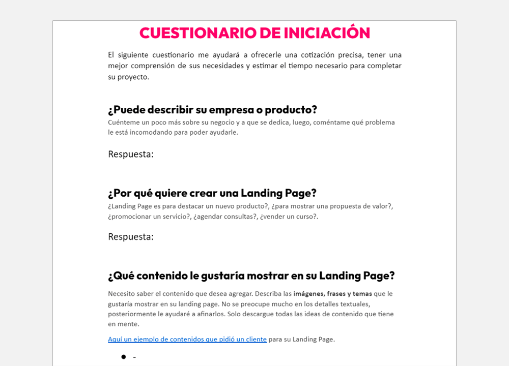

El *brief* es un documento que nos ayuda a entender la necesidad del cliente y lo que esta buscando. Este documento será necesario que lo redactes antes de iniciar un diseño web.

Además, la información del *brief* también nos permite estimar el tiempo que nos tomará diseñar un sitio web, conocer los gustos del cliente, saber el contenido que se quiere mostrar y generar una cotización adecuada.

## La importancia de la información

La base de toda creación, es la información. Por ejemplo, para que tengas ese rostro de dios(a) griego(a), ese cuerpo envidiable y esa personalidad agradable, necesitas de la **información** genética. ¿Y quien la tiene? El ADN.

En el ADN, tus padres «compartieron» algunas instrucciones esenciales de tu apariencia. Lo mismo sucede al diseñar un sitio web. No puedes ponerte a improvisar el diseño, nadie improviso contigo. Necesitas tener la información de tu cliente para crear el diseño que realmente necesita. ¿Y quien guardará la información del cliente? El *brief*.

¿Cómo obtengo esta información?

Algunas empresas ya tienen su *brief* preparado, ahí solo quedaría afinar algunos detalles; pero en la gran mayoría de casos, el negocio no conoce de la existencia del *brief*. Solo te dicen «diséñame un sitio web similar a este sitio web, ¿cuál sería el costo?».

Entonces para darle un precio, necesitamos entender mejor sobre sus necesidades y objetivos. Será nuestro trabajo crear el *brief* a base de preguntas.

En mi caso, yo ya tengo preparado una lista de preguntas que le haré a un potencial cliente antes de reunirme con él o llamarlo. Toda la información que obtengo de él, lo voy agregando al *brief*, de esta forma conozco mejor lo que esta solicitando y me aproximo a un precio justo.

A continuación te mostraré la información que solicito a mis potenciales clientes al momento de iniciar un proyecto web. Estas preguntas podrás enviarlas a través de un Google Docs, o también, puedes responderlas junto con el cliente en una reunión virtual. Ojo, tu puedes agregar o retirar preguntas, no es una plantilla definitiva, debes adaptarte a las diferentes situaciones.

## Brief de diseño web

Este brief lo puedes usar en la gran mayoría de casos, ya sea para crear una tienda online o un sitio informativo.

```markdown
El siguiente cuestionario nos ayudará a ofrecerle una cotización precisa, tener una
mejor comprensión de sus necesidades y estimar el tiempo necesario para diseñar su
sitio web.

1. ¿Puede describir su empresa o producto?
2. ¿Qué crearemos para usted?
3. ¿Cuál es la misión de su empresa/proyecto?
4. ¿Cual es su público objetivo?
5. ¿Tiene textos, imágenes, videos o ilustraciones para su sitio web?
6. ¿Puede aportarnos algunos ejemplos de sitios web que le gusten y decirnos por qué?
7. ¿Qué contenido o información le gustaría mostrar?
    * ...
    * ...
    * ...
8. ¿Cuales son las características avanzadas del sitio web?
9. Adjunte su logotipo
```

**Explicación:**

Estas preguntas te ayudarán a entender que tipo de web esta buscando la persona. La pregunta 2 por ejemplo, deja que la persona determine que tipo de web necesita; y poco a poco, mientras seguimos obteniendo más detalles del proyecto, podremos explicarle si el tipo de web que esta solicitando es la más conveniente.

En la pregunta 6 le pedimos que nos muestren los sitios web que le gustan (a veces son referencias a sitios web de la competencia) y nos servirá para entender sus gustos y para hacer el benchmarking.

En la pregunta 8, nos referimos a funcionalidades avanzadas en un sitio web. Por ejemplo: un buscador, una calculadora de precios, un scroll infinito o un generador de PDFs. Casi siempre no piden funcionalidades complejas, pero es bueno averiguarlo, porque estas características puede tomar mucho tiempo al momento de programar una web.

## Brief de landing page

Este es un brief específico que uso cuando la persona esta decidida que quiere crear una Landing Page, ya que va a lanzar una campaña de Facebook Ads o Google Ads.

```markdown
El siguiente cuestionario nos ayudará a ofrecerle una cotización precisa, tener una
mejor comprensión de sus necesidades y estimar el tiempo necesario para diseñar su
Landing Page.

1. ¿Puede describir su empresa o producto?
2. ¿Por qué quiere crear una Landing Page?
3. ¿Cual es su público objetivo?
4. ¿Tiene textos, imágenes o videos para la landing page?
5. ¿Qué contenido o información le gustaría mostrar?
    * ...
    * ...
    * ...
6. Adjunte su logotipo
```

**Explicación**:

Las landing pages principalmente serán usadas para crear embudos de ventas online, es decir, que enviarán usuarios de las redes sociales a la landing page. Por este motivo, preguntamos quién es su público objetivo (generalmente es el mismo que se definió en la campaña de marketing).

## Ejemplo de brief

Personalmente no uso el término *brief*, es innecesariamente confuso. Yo lo llamo «Cuestionario de iniciación», para dar a entender que son unas preguntas previas para conocerte mejor y trabajar juntos.



## ¿La persona no responde a tus preguntas?

La regla es fácil, si la persona pone muchas trabas para poder ayudarte a rellenar el *brief* o para reunirse contigo, es mejor no insistir, ya que un proyecto web suele durar varias semanas; y si no esta dispuesto a ofrecerte su tiempo, tampoco lo hará en lo que resta del proyecto, y tendrás un proyecto estancado.

## Realiza las preguntas correctas

Después de rellenar el *brief*, lo más probable es que te surjan más dudas. No te preocupes, es normal. Siempre puedes consultar al cliente dejándole un mensaje por WhatsApp, o si son varias dudas puedes planear otra reunión.

Algo que te recomiendo, es que trates de empaparte de información sobre el negocio del cliente. Mira videos o lee blogs acerca de su rubro. Así le harás preguntas específicas en las próximas reuniones y podrás entender todo lo que te cuenta. Por cierto, algo curioso sobre esto, es que también aumentarás la empatía hacia tu cliente, ya que podrás entender mejor sus problemas.

> Las ideas no salen completamente formadas, solo se vuelven claras a medida que trabajas en ellas.
>
> Mark Zukerberg

Con el *brief* definido ya puedes empezar a seguir tu rutina de diseño web. Iniciar el *benchmarking*, crear el *moodboard*, los *wireframes* y los prototipos.

Espero el artículo te haya gustado, si tienes alguna duda o recomendación, puedes dejar un comentario. Y si tienes algún amigo(a) que se lanza a programar de frente un sitio web, mándale este artículo, de seguro le ayudará mucho.
