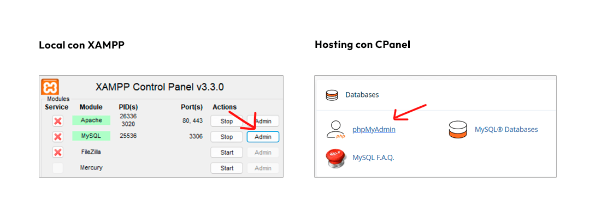
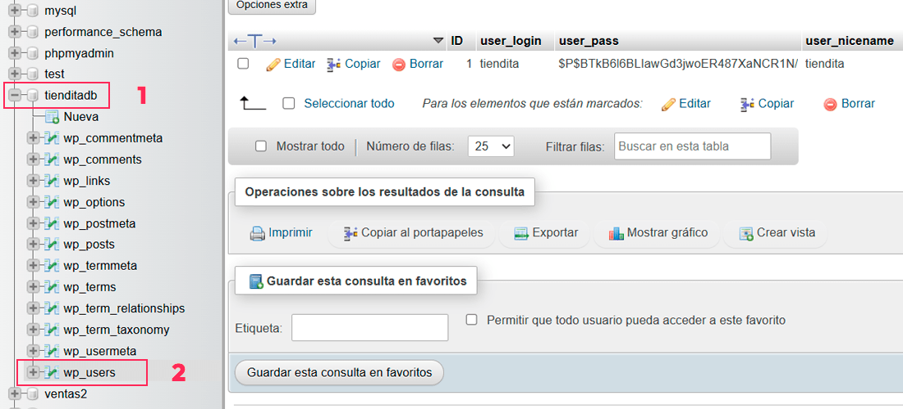
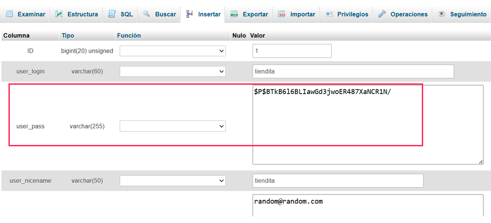
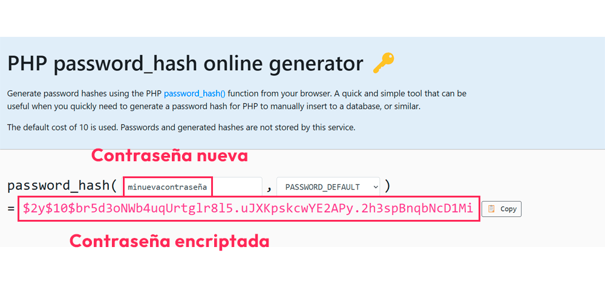

Aprenderás a cambiar la contraseña de una cuenta de WordPress por medio de phpMyAdmin. También veremos la mejor forma de encriptar la contraseña para protegerla de ataques.

## Paso 1. Dirígete a tu phpMyAdmin

En tu panel de control de hosting busca la opción de phpMyAdmin y ábrela. Suele encontrarse en la sección «base de datos» o «databases».



*Dos formas de acceder a phpMyAdmin*

## Paso 2. Encuentra la tabla de usuarios

En el panel de la izquierda, selecciona la base de datos correspondiente a tu instalación de WordPress y selecciona la tabla que tiene el prefijo «wp\_users» (donde «wp\_» puede ser diferente si has cambiado el prefijo durante la instalación).



## Paso 3. Edita la contraseña

Localiza el nombre de usuario en la columna «user\_login», y dale a «editar».

En el campo «user\_pass», encontrarás la contraseña del usuario que está encriptada. Por este motivo, tenemos que reemplazar con nuestra nueva contraseña, pero también encriptada. Pasemos al siguiente paso.



## Paso 4. Genera una contraseña encriptada

Hay muchos algoritmos para encriptar contraseñas, el método que te voy a enseñar usa el algoritmo más recomendado. Te mostraré 2 formas para aplicar este método, el primero es de forma online y el otro es de forma offline.

**Encriptar contraseña de forma online**

Busca «PHP hash generator», accede a una de las páginas. Ya en la página, ingresas la nueva contraseña que deseas, con la opción `PASSWORD_DEFAULT` (esta opción utilizará el algoritmo de encriptación más fuerte por defecto de PHP). Verás como resultado la contraseña encriptada.



La contraseña encriptada es la que copiarás y reemplazarás en el campo `user_pass`. Luego le das a «Continuar» para guardar la información.

Ahora, para acceder a tu cuenta de WordPress, debes usar la contraseña que ingresaste en la herramienta online. ¡Y listo!

**Encriptar contraseña de forma offline**

Si te gustaría replicar el proceso anterior, pero en un entorno local. Primero asegúrate de que puedes [ejecutar PHP desde la consola](/ejecutar-php-consola-windows/).

Crea un archivo llamado `script.php` con el siguiente código:

```xml
<?php
echo password_hash('minuevacontraseña', PASSWORD_DEFAULT);
?>
```

Reemplaza donde dice «minuevacontraseña», con la contraseña que deseas. Y ejecútalo de esta forma:

```bash
php script.php
```

Como resultado, tendrás la contraseña encriptada que copiarás y reemplazarás en el campo `user_pass`. Luego guardas los cambios y ya podrás acceder a WordPress con tu nueva contraseña.
