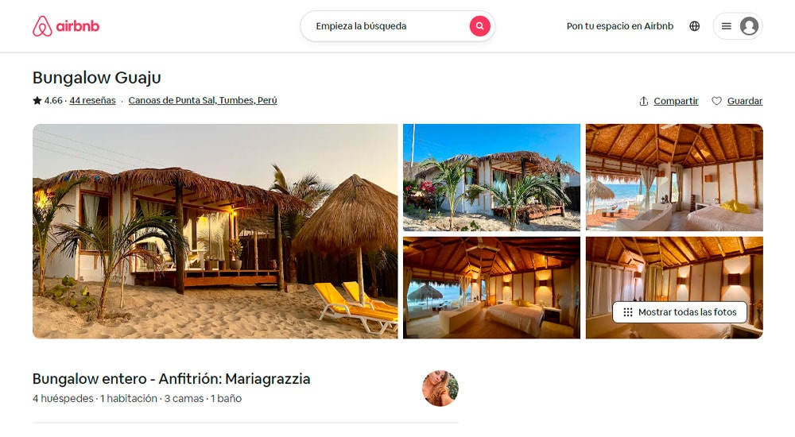
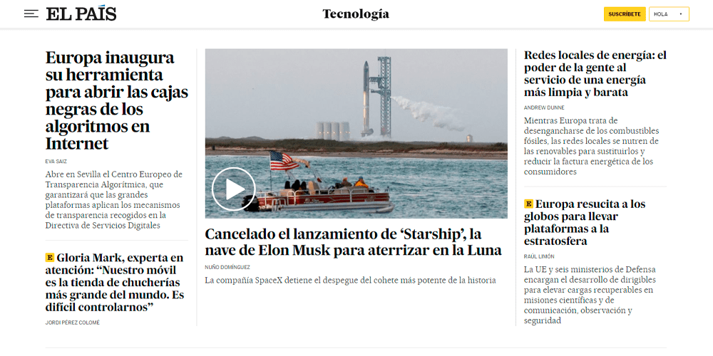
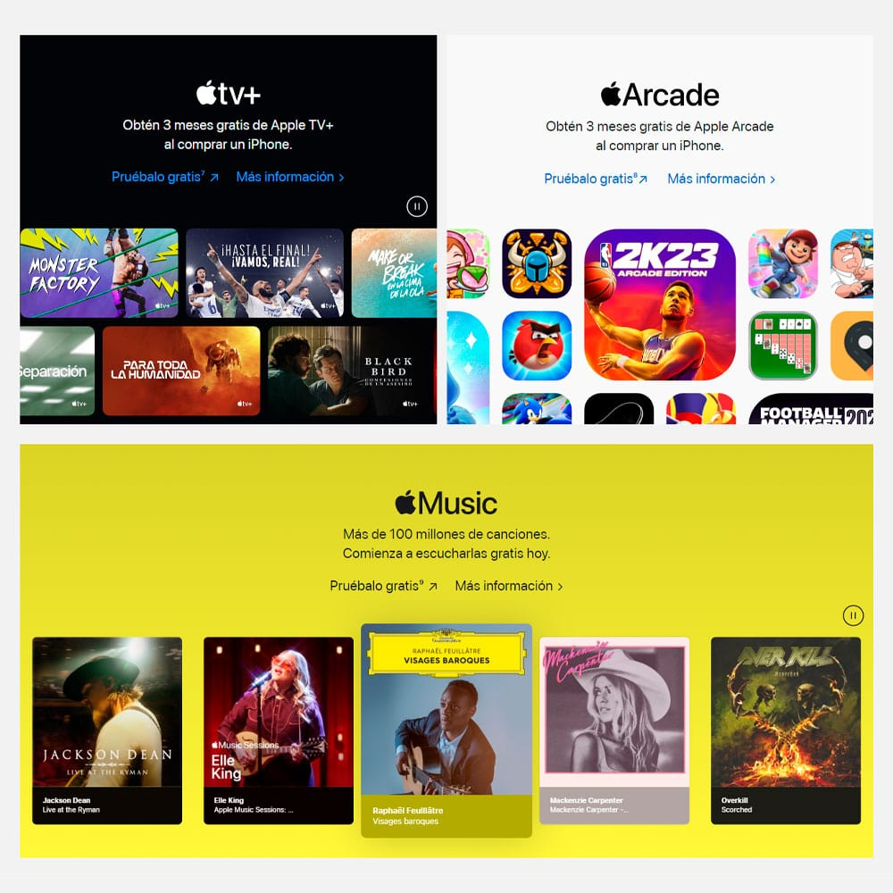
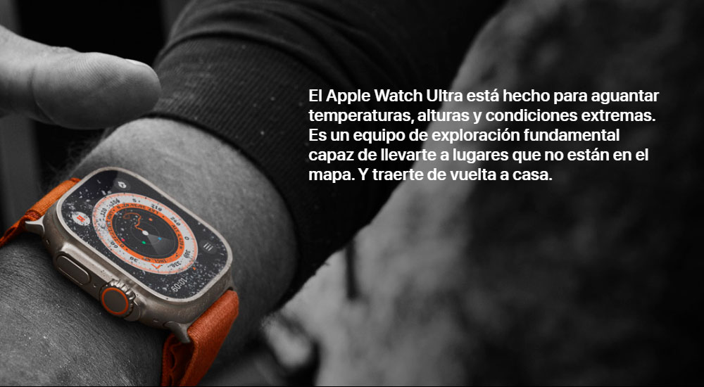
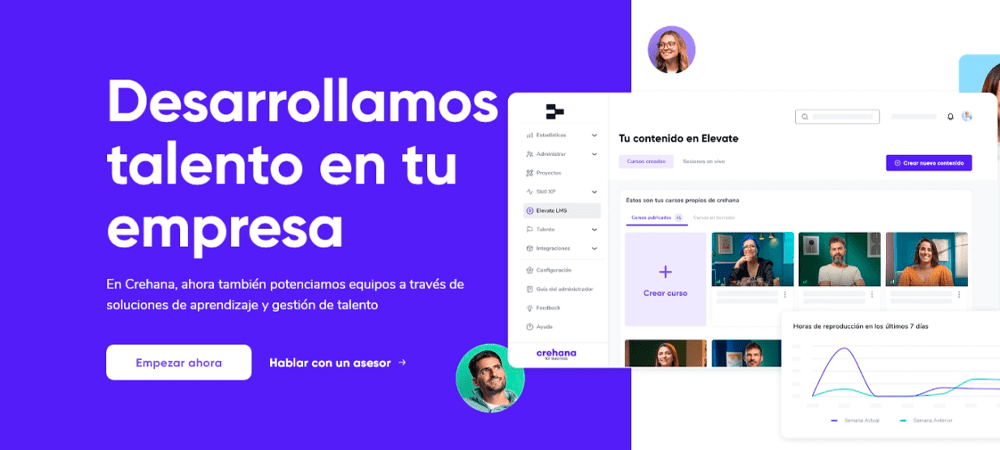
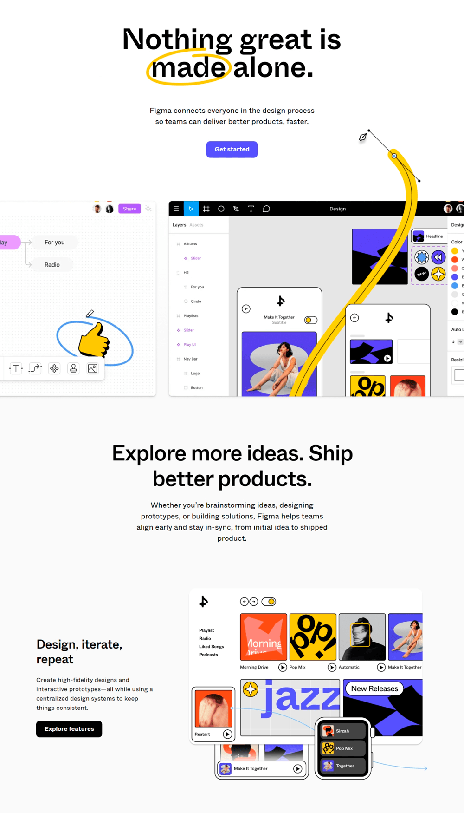
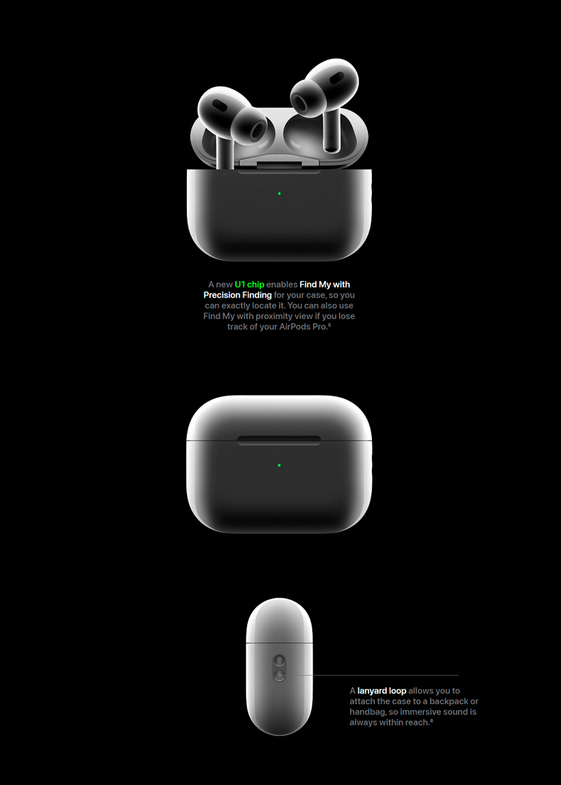

En un mundo donde todos luchan por obtener atención, necesitas crear diseños que mantengan a los usuarios pegados a la pantalla. No queremos aburrirlos, y que luego no quieran volver nunca más.

Aquí viene al rescate, el contraste, que según la RAE significa «oposición o diferencia notable que existe entre personas o cosas».

En el diseño web **podemos aplicarlo diferenciando los elementos que conforman una web**; esto ayuda a dirigir la atención de los usuarios a ciertas partes de la pantalla mientras hacen scroll, y a la vez, también ayudan a ofrecer novedad, lo que evita que los sitios web sean aburridos. Y ya sabemos que pasa si algo es monótono: el vínculo, usuario, interfaz se rompe.

Lo mismo hacen las redes sociales, quieren que estes pegado a su plataforma, pero ellos no solo usan el contraste, también usan tus datos para recomendarte cosas.

Veamos todas las formas de crear contrastes en un diseño web.

## 1\. Contraste usando tamaño

Nuestro primer contraste es a través del tamaño, puedes ir desde lo más pequeño a lo más grande. Veamos algunos ejemplos.

En la landing page de Netflix se puede apreciar los diferentes tamaños de las fuentes y de los botones.

*Captura extraída de [netflix.com](https://www.netflix.com/)*

El texto inicial es más grande porque se desea que el usuario enfoque su atención ahí. Lo mismo sucede con el botón «comenzar», que es más grande que el botón de «iniciar sesión». La idea es que los nuevos visitantes sepan que Netflix tiene «Películas y series ilimitadas» y que pueden «Comenzar» una suscripción dejando su email. Si el usuario quiere más información, puede leer las letras pequeñas o puede seguir explorando la página.

Otro caso. Airbnb usa el contraste de tamaño en la galería de imágenes de cada propiedad.

*Captura extraída de [airbnb.com](https://www.airbnb.com.pe/rooms/636281875082971993) de anfitrión: Mariagrazzia*

Lo quieras o no, tus ojos se sienten atraídos por la imagen más grande, y esta imagen es la primera impresión que los usuarios se llevan al momento de elegir si les gustaría o no alojarse en esa propiedad. Eso no es todo, los usuarios querrán verlo en mayores dimensiones, por ello se sentirán tentados a darle click a la imagen más grande.

Lo mismo aplica al revés, si se desea que algo no tome tanta relevancia entonces lo haces más pequeño. Este tema se describe mejor en un principio llamado «Ley de Fitts» (uno de los [principios de usabilidad de Bruce Tognazzini](/principios-usabilidad-tognazzini/)).

Pero, el contraste no está limitado a textos o imágenes, también esta aplicado a otros elementos abstractos de una web. En la página del periódico «El País», agrandan ciertas secciones de su web para destacar las principales noticias.

*Captura extraída del sitio web de [elpais.com](https://elpais.com/tecnologia/)*

Toda tu atención será dirigida al centro gracias a las dimensiones de la sección central, luego lo más probable es que te fijes en el texto grande de la izquierda y luego ya lo demás.

## 2\. Contraste usando color

Cuando alguien te menciona «contraste», puede que lo relaciones directamente con el color. Esto sucede porque es una técnica muy usada en el área del diseño gráfico y en los textos de la web (fondo blanco con letras oscuras).

Existen muchas formas de conseguir contrastes con colores. Te recomiendo ver este video con «[7 formas de lograr contrastes con los colores](https://www.youtube.com/watch?v=E30P7BBrocg)«. Veamos algunos ejemplos de este contraste en la web.

En la landing page del iPhone hay una sección que muestra de forma perfecta el contraste entre diferentes textos con diferentes fondos, y en ninguno de los casos tendrás problemas al leerlo.

*Captura extraída de [apple.com](https://www.apple.com/la/iphone/), producto iPhone.*

También puedes resaltar productos o ciertos elementos de tu web usando este tipo contraste. Veamos como lo usa Apple para su producto Apple Watch Ultra:

*Captura extraída de [apple.com](https://www.apple.com/la/apple-watch-ultra/), producto Apple Watch Ultra.*

Lo primero que harán las personas es ver la imagen. Tratarán de entender la interfaz del Apple Watch Ultra, y ahí es donde querrán leer el texto. De esta forma logran destacar el producto y su descripción.

**DATO:** Si deseas más ejemplos te recomiendo visitar las landing pages de los productos de Apple. Ellos saben manejar tu atención para no perderte ningún detalle de sus productos.

## 3\. Contraste usando formas

Cabe recalcar que el «contraste por tamaño» forma parte del «contraste por formas», porque cuando cambias el tamaño, de cierta manera también alteras la forma. En este artículo los separamos ya que el «contraste por tamaño» quería su propio espacio.

Veamos como Crehana usa el «contraste por formas» en su página de inicio:

*Captura extraída de [crehana.com](https://crehana.com)*

Se puede apreciar que Crehana resalta los rectángulos con bordes redondeados (el botón y la imagen principal) y para los elementos secundarios se usan imágenes con forma circular. Esto ayuda al usuario a discernir lo esencial (los rectángulos) y lo complementario (los círculos).

También le aplican el «contraste por tamaño». La imagen esencial es más grande y las imágenes secundarias más pequeñas.

Además de ello, el contraste por forma también te ayudará a cautivar al usuario mientras hace scroll. Exactamente, cuando aplicas este contraste por cada sección de la página. Una sección puede tener una forma, y la siguiente otra forma, así ofreces novedad cada vez que el usuario se desplaza por la página. El resultado tiene premio doble. Te ayudará a delimitar las secciones de la web y también el cliente estará más dispuesto a conocer lo que tienes para ofrecerle. Veamos un ejemplo con la landing page de Figma:

*Captura extraída del sitio web [figma.com](https://figma.com)*

Si te fijas existen formas diferentes para cada sección. En el primero muestran sus dos programas de diseño en dos rectángulos, uno al lado del otro, y agregan una «línea amarilla creada con una pluma» para dar a entender que sus productos son de diseño.

En la siguiente sección, cambia la forma de organizar la información y la forma de las imágenes. La imagen en este caso hace referencia a «un diseño adaptado a diferentes plataformas: web, celular y smart watch».

De esta manera, las formas diferencian cada sección y les dan significado, además de fomentar la curiosidad del usuario. También fíjate en el texto inicial principal, hay una forma contrastando la palabra «made» de las demás palabras.

## 4\. Contraste usando el espaciado

Para entender esta sección debes tener en cuenta 2 términos que se usan en fotografía:

-   Espacio negativo: es todo lo que rodea a un elemento pero que no aporta información relevante, es el lugar donde no hay interés visual.
-   Espacio positivo: es el lugar donde están todos los elementos que quieren atraer la atención de los visitantes.

Ya más o menos deduces por donde voy. Me refiero a que puedes jugar con el espacio negativo y positivo de la web para ofrecer mayor protagonismo a ciertos elementos. Te voy a poner un ejemplo. Veamos como Apple presenta los Airpods:

*Captura extraída del sitio web [apple.com](https://www.apple.com/airpods-pro/) producto AirPods.*

En la imagen anterior, el producto y el texto son el espacio positivo, y todo el espacio oscuro es el espacio negativo. De esta forma, concentras la atención del usuario al producto y los textos. Luego, si nos fijamos en el contraste del color, el que tiene mayor relevancia es el producto y luego ciertas palabras del texto: «U1 chip», «Find My with Precision Finding» y «lanyard loop».

Ahorita, me puedes decir, Diego ahí todo se parece, ¿el usuario no se aburrirá?

No porque esto solo representa una sección de toda la Landing Page. Si la visitas y vez la página completa, notarás que aplican el contraste por forma en diferentes secciones.

Antes de concluir recuerda que muchos de los ejemplos que te mostré combinan muchos de los contrastes al mismo tiempo.

## ¿Para qué más me servirá lo que aprendí hoy?

De seguro que ya estas ansioso de poner en práctica estos conocimientos, y cuando lo hagas, recuerda que tu cliente o jefe te pedirá explicaciones de por qué ciertos elementos están ubicados exactamente ahí.

Yo antes solo decía, «me guíe de la página web de Netflix» o «me inspiré del diseño de Airbnb», y nada más. No cometas ese error. Tu debes explicar lo que aprendiste hoy: lo diseñe de esta forma, porque quiero guiar la atención de los usuarios a los aspectos más importantes de la web y esto lo pude lograr contrastando este elemento con este otro.

Recuerda que todo tiene un por qué. Si Airbnb agrego el botón a la esquina superior derecha. No necesariamente te funcionará a ti. Aquí ya entran otros temas de usabilidad e investigación, no ahondaremos en ello. Pero ya conociendo sobre contrastes, podrás ver con otros ojos las páginas web de las empresas que más admiras.

Espero que el artículo te haya gustado, puedes dejarme un comentario si te sirvió, o también, puedes compartirlo con tus colegas.
