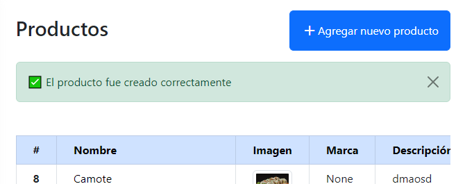
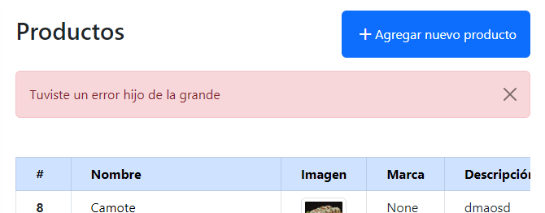

Para mejorar la experiencia de usuario (UX) en nuestra web, debemos mantener a nuestros usuarios informados acerca de lo que esta sucediendo en el sistema. Cuando agregamos, eliminamos o actualizamos un elemento o realizamos alguna otra tarea; el usuario debe saber si la acción se ha realizado con éxito o no.

> Mantener a nuestros usuarios informados es uno de los [10 principios de la usabilidad web](/10-principios-usabilidad/)

El [marco de mensajes](https://docs.djangoproject.com/en/dev/ref/contrib/messages/) de Django, nos permite almacenar mensajes temporales en una solicitud, para luego recuperarlos y mostrarlos en una solicitud posterior (generalmente es la siguiente).

## Configuración

El archivo predeterminado de `settings.py` ya tiene habilitado el soporte para mensajes. Pero puedes verificar que todo este configurado correctamente, teniendo en cuenta lo siguiente:

```python
INSTALLED_APPS = [
    ...
    "django.contrib.messages",
]

MIDDLEWARE = [
    ...
    "django.contrib.sessions.middleware.SessionMiddleware",
    "django.contrib.messages.middleware.MessageMiddleware",
]
```

Y en tu variable `TEMPLATES` en la lista `context_processors` agregar la siguiente cadena si no se encuentra:

```python
"django.contrib.messages.context_processors.messages"
```

<AdInArticle />

## Nivel de Mensajes

Los niveles de mensajes nos permiten agrupar mensajes por su tipo y posteriormente filtrarlos o mostrarlos de manera diferente en las vistas o plantillas. Por ejemplo, podemos mostrar el `ERROR` de color rojo y el `SUCCESS` de color verde.

A continuación tienes una tabla con todos los niveles de mensaje y sus respectivas etiquetas (tags):

| CONSTANTE | NIVEL | ETIQUETA CSS | PROPÓSITO |
| --- | --- | --- | --- |
| DEBUG | 10 | debug | Mensajes relacionados con el desarrollo que se ignorarán (o eliminarán) en una implementación de producción |
| INFO | 20 | info | Mensajes informativos para el usuario |
| SUCCESS | 25 | success | Una acción fue exitosa, por ejemplo, «Su perfil se actualizó con éxito» |
| WARNING | 30 | warning | No ocurrió una falla pero puede ser más adelante |
| ERROR | 40 | error | Una acción no tuvo éxito o se produjo algún otro error |

Por defecto, Django muestra niveles desde 20 a mas. Es decir, todos menos DEBUG. En caso de que quieras cambiar este comportamiento, puedes abrir tu archivo `settings.py` y agregar lo siguiente:

```python
from django.contrib.messages import constants as message_constants
MESSAGE_LEVEL = message_constants.DEBUG
```

De esta forma podrás tomar valores desde el 10 en adelante (todos básicamente).

## Agrega un mensaje

Ahora que verificamos que todo esta en orden, podemos agregar un mensaje a nuestra web con el siguiente método.

```javascript
from django.contrib import messages
messages.add_message(request, messages.INFO, 'Le quedan 2 intentos más.')
```

O también puede hacerlo usando los métodos abreviados:

```javascript
messages.debug(request, 'Se ejecutaron las sentencias SQL.')
messages.info(request, 'Le quedan 2 intentos más.')
messages.success(request, 'El producto fue creado correctamente.')
messages.warning(request, 'Tu cuenta caduca en tres días.')
messages.error(request, 'Documento eliminado.')
```

En nuestro archivo de `views.py` podemos usarlo de la siguiente manera:

```php
def producto_add(request):
    form = ProductoForm()

    if request.method == "POST":
        form = ProductoForm(request.POST, request.FILES)

        if form.is_valid():
            form.save()
            messages.success(request, "El producto fue creado correctamente")
            return redirect("pos:producto-list")
        else:
            messages.warning(request, "El código del producto debe tener 5 carácteres")

    return render(request, "pos/producto_add.html", {"form": form})
```

<AdInArticle />

## Muestra el mensaje

Luego en la plantilla que mostrará los mensajes, agregué lo siguiente:

```xml

    <ul class="messages">
        
            <li class="{{ message.tags }}">{{ message }}</li>
        
    </ul>

```

Obtendrá una salida HTML:

```xml
<ul class="messages">
  <li class="success">El producto fue creado correctamente</li>
</ul>
```

Si necesita agregar más etiquetas a su mensaje puede asignarle un valor a `extra_tags` con las etiquetas adicionales:

```javascript
messages.success(request, 'El producto fue creado correctamente', extra_tags='tag1 tag2')
```

Obtendrá la salida:

```xml
<ul class="messages">
  <li class="tag1 tag2 success">El producto fue creado correctamente</li>
</ul>
```

## Mensajes con Bootstrap 5

Usaremos los [alerts de Bootstrap](https://getbootstrap.com/docs/5.2/components/alerts/) para estilizar nuestros mensajes. Para ello lo primero que haremos es actualizar las etiquetas de los mensajes predefinidos. Vamos a dirigirnos al archivo `settings.py` y agregamos lo siguiente:

```javascript
from django.contrib.messages import constants as messages

MESSAGE_TAGS = {
    messages.DEBUG: 'alert-dark',
    messages.INFO: 'alert-info',
    messages.SUCCESS: 'alert-success',
    messages.WARNING: 'alert-warning',
    messages.ERROR: 'alert-danger',
}
```

y en la plantilla donde mostrarás los mensajes, actualiza a lo siguiente:

```xml

    
        <div class="alert {{ message.tags }} alert-dismissible fade show" role="alert">
            {{ message }}
            <button type="button" class="btn-close" data-bs-dismiss="alert" aria-label="Close"></button>
        </div>
    

```

En mi caso tengo una salida como la siguiente:



Si agregas otro tipo de mensaje como `WARNING` tendrás un mensaje color amarillo gracias a Bootstrap.

<AdInArticle />

## Mensajes Personalizados

En algunos casos particulares será necesario crear un mensaje personalizado. Recuerda, que los niveles de cada mensaje son meramente números enteros, así que puedes definir un valor constante que puedes agregar a tus mensajes.

```javascript
CRITICAL = 50

def mi_vista(request):
    messages.add_message(request, CRITICAL, 'Tuviste un error hijo de la grande.')
```

y para asignarle su respectiva etiqueta dirígete a `settings.py` y agrega lo siguiente a tu `MESSAGE_TAGS`:

```javascript
MESSAGE_TAGS = {
    ...
    50: 'alert-danger',
}
```

Puedes mejorar este código importando una constante global llamada `CRITICAL`.

Si reemplazas este nuevo mensaje en tu aplicación tendrás una salida parecida a esta:



Si te gusto esta guía no olvides compartirla en tus redes o suscribirte. Además, si tuviste algún problema puedes dejar un comentario y te responderé lo mas pronto posible. Aunque StackOverflow es mas rápido.
