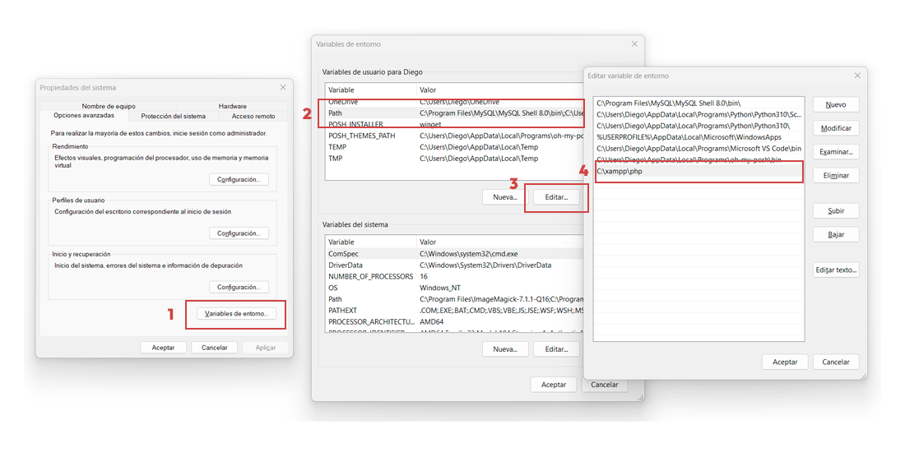

Personalmente ejecuto archivos de PHP en la consola para probar algunas funciones del lenguaje, o para afinar mis habilidades. Este es el proceso que sigo:

## Paso 1: Instalar XAMPP

Si ya tienes instalado el XAMPP, puedes saltarte este paso. Caso contrario, sigue [este tutorial de instalación](https://www.youtube.com/watch?v=a4EUpiPcfWs).

XAMPP es un paquete de software que facilita la creación de un entorno de desarrollo local para sitios web. Incluye herramientas como Apache (un servidor web), MySQL (un sistema de gestión de bases de datos) y PHP, lo que justamente estamos necesitando.

## Paso 2: Añadir PHP al PATH del sistema

Ahora necesitamos que la consola encuentre el ejecutable de php, que normalmente esta en `C:\xampp\php`.

Agreguemos esta ruta al PATH del sistema para decirle al terminal: ¡Hey! Aquí hay programas que puedes usar.

1.  En windows busca: «Editar las variables de entorno del sistema».
2.  Luego te aparecerá una ventana llamada «Propiedades del sistema», ahí dale a «Variables de entorno…»
3.  Selecciona la variable «Path» en el cuadro superior y dale a editar.
4.  Ahí agrega `C:\xampp\php`.



*Pasos para agregar una nueva variable de entorno*

Luego le das aceptar, aceptar, aceptar.

## Paso 3: Crea un script PHP y ejecútalo

Comprobemos que PHP esta accesible en la consola. Abre una nueva consola de Windows y ejecuta:

```bash
> php -v

PHP 8.2.4 (cli) (built: Mar 14 2023 17:54:25) (ZTS Visual C++ 2019 x64)
Copyright (c) The PHP Group
Zend Engine v4.2.4, Copyright (c) Zend Technologies
```

Te saldrá la versión de tu PHP.

Luego crea un script en donde desees. En mi caso crearé un archivo llamado «script.php» y tendrá lo siguiente:

```xml
<?php
$part1 = "El aburrimiento";
$part2 = "es el enemigo del éxito";

echo $part1 . " " . $part2
?>
```

Ya en la consola, ubícate en la ruta de tu archivo. Luego ejecútalo con el siguiente comando:

```bash
> php script.php

El aburrimiento es el enemigo del éxito
```

¡Y listo! Puedes ejecutar pequeños scripts de PHP desde la consola. Puede ser útil para practicar la lógica de PHP, al menos yo lo uso para ello.
