## Conceptos básicos

Flexbox es un sistema de diseño en CSS que extiende el flujo tradicional de bloques o en línea, introduciendo direcciones de flujo flexible. Este modelo se basa en un contenedor flexible (flex container) y sus elementos hijos (flex items), que se ajustan dinámicamente según el espacio disponible.

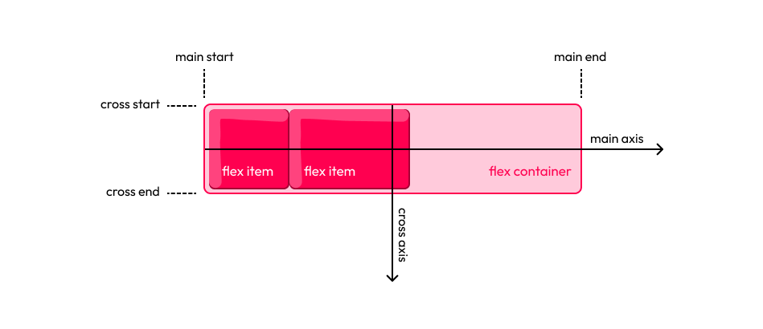

-   **main axis**: Es la dirección principal del contenedor, que puede ser horizontal o vertical, dependiendo de la propiedad `flex-direction`.
-   **main start**: Es el punto de inicio del main axis.
-   **main end**: Es el punto de finalización del main axis, opuesto al main start.
-   **cross axis**: Es la dirección perpendicular al main axis. Si el main axis es horizontal, el cross axis es vertical, y viceversa.
-   **cross start**: Es el punto de inicio del cross axis.
-   **cross end**: Es el punto de finalización del cross axis, opuesto al cross start.

## Propiedades para el contenedor

A continuación, se enumeran todas las propiedades aplicables a un contenedor flex (flex container). Es importante destacar que, salvo `display`, todas las demás propiedades solo funcionan si el contenedor tiene `display` configurado como `flex` o `inline-flex`.

### display

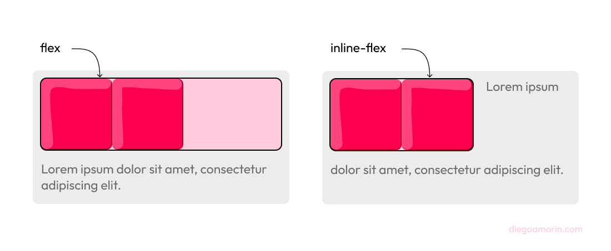

Esta propiedad define si el contenedor es un contenedor flexible o no. Aunque la flexibilidad de Flexbox afecta a los hijos directos, el comportamiento del contenedor con respecto a los elementos externos puede variar entre un `inline` (si es `inline-flex`) o un `block` (si es `flex`).

```css
.contenedor {
  display: flex | inline-flex;
}
```

-   `flex`: Aplica las reglas de Flexbox al contenedor, pero el contenedor se comporta como un bloque, ocupando todo el ancho disponible.
-   `inline-flex`: Aplica las reglas de Flexbox al contenedor, pero este se comporta como un elemento en línea, ocupando solo el espacio necesario.

### flex-direction

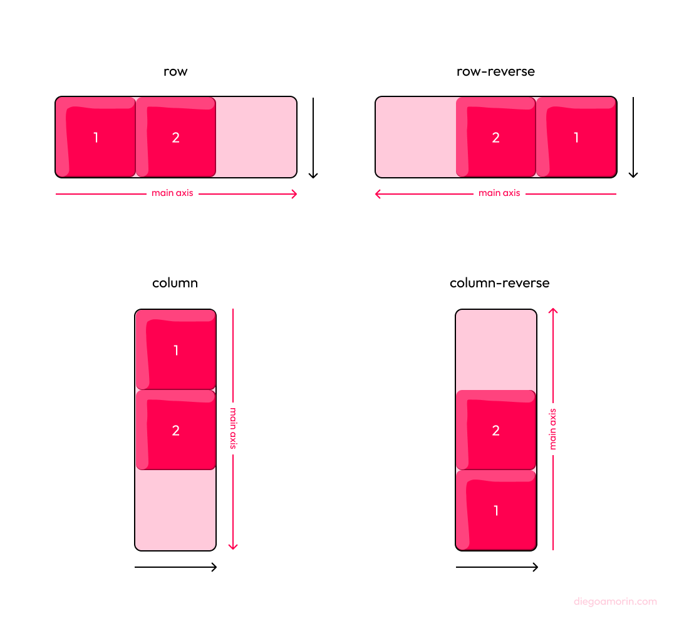

Define la dirección en la que los elementos hijos (flex items) se distribuyen dentro del contenedor flexible. `flex-direction` es sensible a la dirección del texto y al modo de escritura del idioma, lo que afecta cómo se alinean los elementos en el contenedor.

<AdInArticle />

La imagen superior describe la distribución de elementos para contenido que fluye de izquierda a derecha (LTR): textos en inglés, español, francés, etc.

```css
.contenedor {
  flex-direction: row | row-reverse | column | column-reverse;
}
```

-   `row` (por defecto): Los elementos se alinean en una fila de izquierda a derecha.
-   `row-reverse`: Los elementos se alinean en una fila, pero en orden invertido, de derecha a izquierda. [Ver accesibilidad](/#problemas-de-accesibilidad).
-   `column`: Los elementos se alinean en una columna, de arriba a abajo.
-   `column-reverse`: Los elementos se alinean en una columna, pero en orden invertido, de abajo hacia arriba. [Ver accesibilidad](/#problemas-de-accesibilidad).

### flex-direction (RTL)

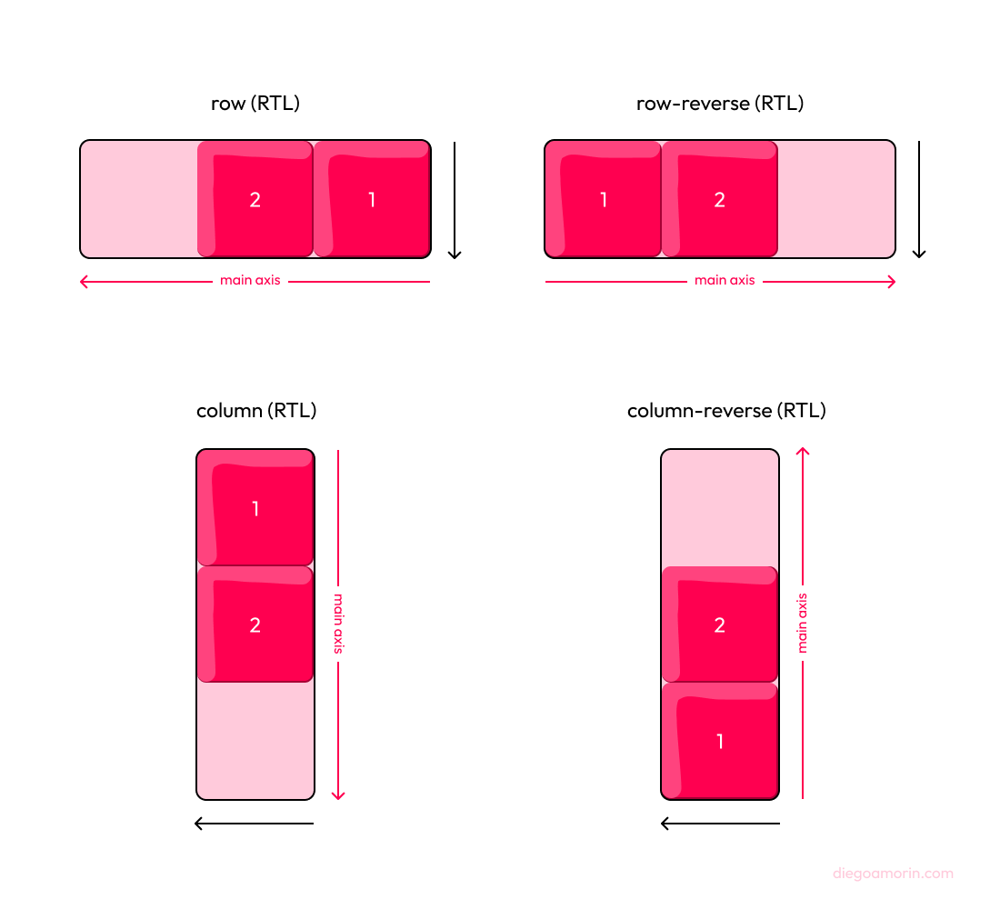

En caso de que trabajes con contenido RTL, como textos en idioma árabe, el comportamiento de `flex-direction` puede cambiar. Ver la imagen superior.

```css
.contenedor {
  direction: rtl;
  flex-direction: row | row-reverse | column | column-reverse;
}
```

-   `row` (por defecto): Los elementos se alinean en una fila de derecha a izquierda.
-   `row-reverse`: Los elementos se alinean en una fila, pero en orden invertido, de izquierda a derecha. [Ver accesibilidad](/#problemas-de-accesibilidad).
-   `column`: Los elementos se alinean en una columna de arriba a abajo. La dirección de texto RTL no afecta el apilamiento vertical, pero si el cross-axis, que va de derecha a izquierda.
-   `column-reverse`: Los elementos se alinean en una columna, pero en orden invertido, de abajo hacia arriba. [Ver accesibilidad](/#problemas-de-accesibilidad).

### flex-wrap

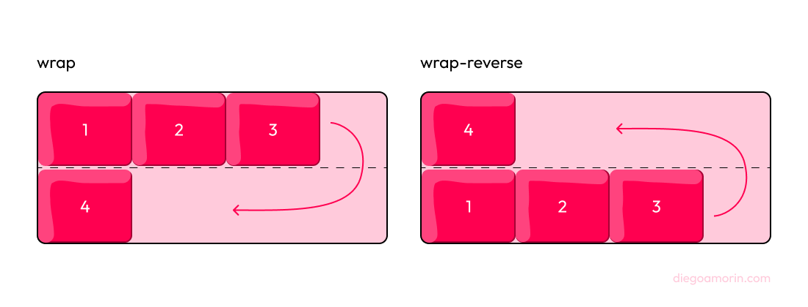

Controla si los elementos hijos (flex items) se ajustan a nuevas líneas dentro del contenedor flexible cuando no hay suficiente espacio. Esto es útil cuando se trabaja con varios elementos y deseas que se distribuyan en más de una línea.

```css
.contenedor {
  flex-wrap: nowrap | wrap | wrap-reverse;
}
```

-   `nowrap` (por defecto): Los elementos permanecen en una sola línea, incluso si esto significa que se desborden del contenedor.
-   `wrap`: Los elementos se distribuyen en varias líneas si no caben en una sola línea.
-   `wrap-reverse`: Los elementos se ajustan a nuevas líneas, pero las líneas adicionales se colocan por encima de la línea anterior, en lugar de debajo. [Ver accesibilidad](/#problemas-de-accesibilidad).

### flex-flow

Es una propiedad abreviada que combina las propiedades `flex-direction` y `flex-wrap`. Controla la dirección del flujo de los elementos hijos y si deben ajustarse en varias líneas.

```css
.contenedor {
  flex-flow: row nowrap; /* valor por defecto */
}
```

### justify-content

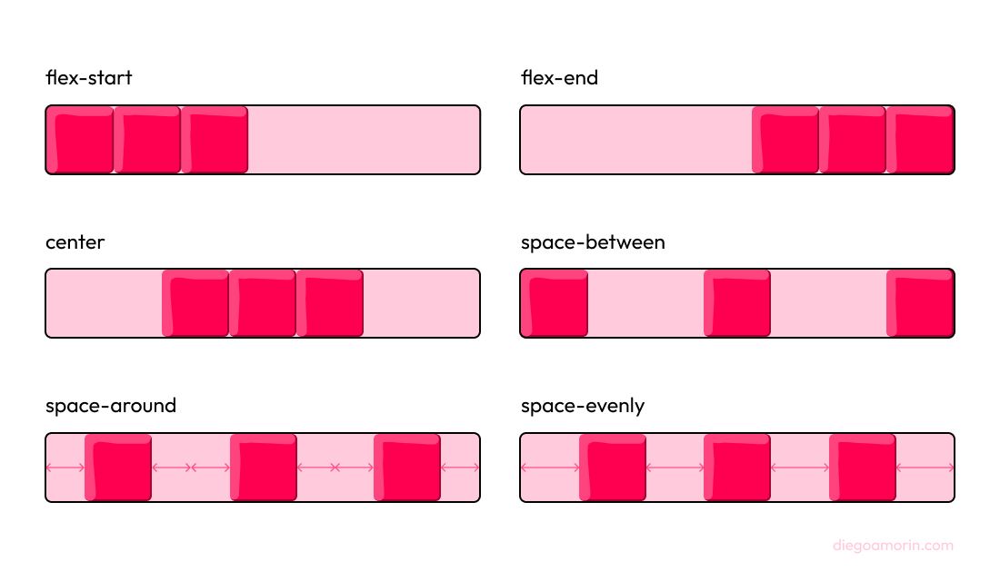

Controla la alineación de los elementos hijos a lo largo del main axis. Determina cómo se distribuye el espacio entre los elementos, afectando su alineación o separación.

```css
.contenedor {
  justify-content: flex-start | flex-end | center | space-between | space-around | space-evenly
}
```

-   `flex-start` (por defecto): Los elementos se alinean al inicio del main axis.
-   `flex-end`: Los elementos se alinean al final del main axis.
-   `center`: Los elementos se centran en el main axis.
-   `space-between`: El primer y el último elemento se alinean con los bordes del contenedor, y los elementos restantes tienen espacios iguales entre ellos.
-   `space-around`: Los elementos tienen espacios iguales a su alrededor, lo que significa que los espacios en los bordes son la mitad de los espacios entre elementos.
-   `space-evenly`: Los elementos tienen espacios iguales tanto entre ellos como en los bordes del contenedor.

### align-items

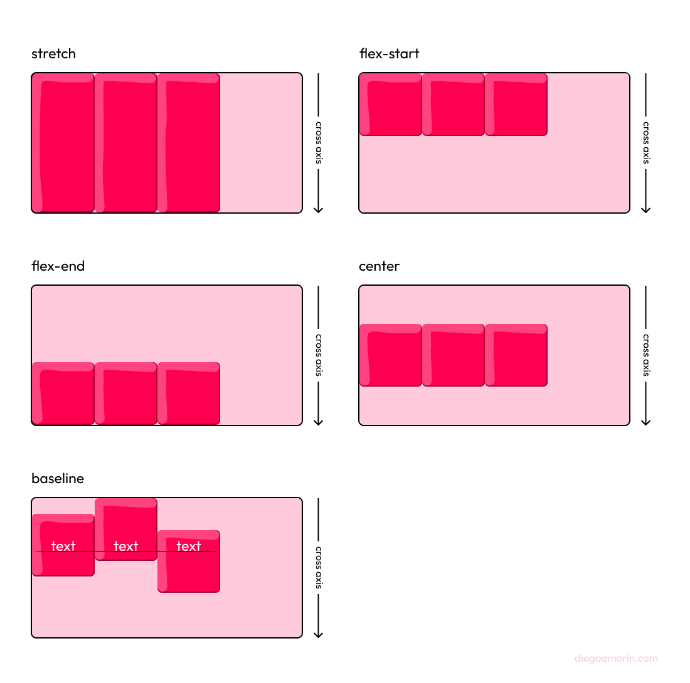

Define cómo se alinean los elementos hijos a lo largo del cross axis.

Toma en cuenta que esta propiedad alinea los elementos dentro de cada línea del contenedor. Por defecto, si no hay un ajuste de contenido (wrap), todos los elementos se alinean en una única línea que ocupa todo el contenedor.

```css
.contenedor {
  align-items: stretch | flex-start | flex-end | center | baseline
}
```

-   `stretch` (por defecto): Los elementos hijos se estiran para llenar el espacio disponible en el cross axis. Solo se aplica si no se ha especificado una altura o ancho explícito en los hijos.
-   `flex-start`: Los elementos hijos se alinean al principio del cross axis.
-   `flex-end`: Los elementos hijos se alinean al final del cross axis.
-   `center`: Los elementos hijos se centran a lo largo del cross axis.
-   `baseline`: Los elementos hijos se alinean de acuerdo con sus líneas base de texto.

### align-content

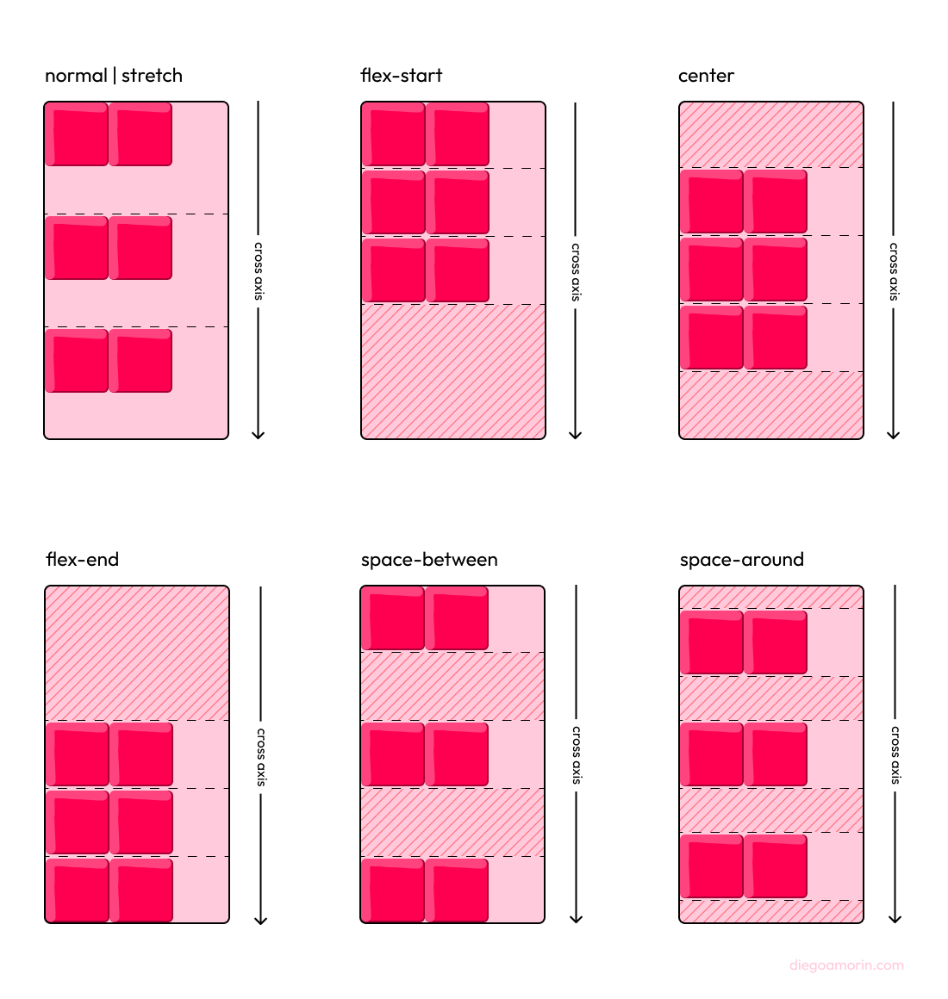

Controla cómo se distribuyen las líneas dentro del contenedor, a lo largo del cross axis. Esta propiedad solo afecta cuando hay varias líneas de elementos debido al uso de `flex-wrap` configurado como `wrap` o `wrap-reverse`.

<AdInArticle />

**Diferencia con align-items:**

`align-content` distribuye las líneas en el cross axis, mientras que `align-items` distribuye los elementos individuales dentro de cada línea, también en el cross axis.

```css
.contenedor {
  align-content:  normal | flex-start | flex-end | center | space-between | space-around | stretch;
}
```

-   `normal` (por defecto): En flexbox, `normal` se comporta como `stretch`.
-   `stretch`: Las líneas se estiran para ocupar todo el espacio disponible en el cross axis del contenedor flex.
-   `flex-start`: Las líneas se agrupan al principio del cross axis.
-   `flex-end`: Las líneas se agrupan al final del cross axis.
-   `center`: Las líneas se agrupan en el centro del cross axis.
-   `space-between`: La primera línea se coloca al principio del cross axis y la última al final, con el espacio restante distribuido equitativamente entre las líneas intermedias.
-   `space-around`: El espacio antes de la primera línea y después de la última línea es la mitad del espacio entre las líneas adyacentes.

### gap, row-gap, column-gap

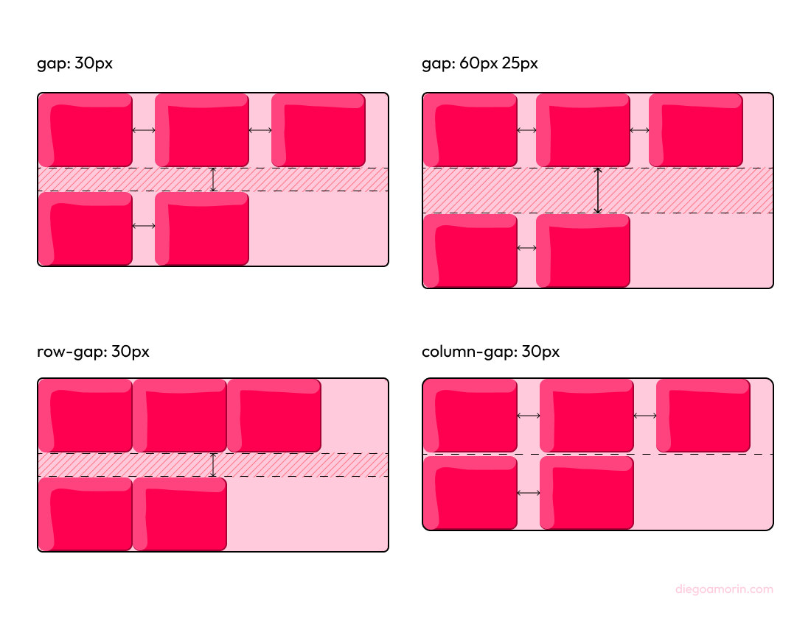

La propiedad `gap` controla el espacio entre los elementos hijos dentro del contenedor flexible, tanto en el main axis como en el cross axis. Si el contenido se distribuye en múltiples líneas, `gap` aplica el espacio entre las líneas de elementos además de entre los elementos dentro de cada línea.

```css
.contenedor {
  gap: 30px;
  gap: 60px 25px; /* row-gap y column-gap */
  row-gap: 30px;
  column-gap: 30px;
}
```

-   `gap`: Establece el espacio entre los elementos dentro del contenedor flexible, tanto en el main axis como en el cross axis.
-   `row-gap`: Establece el espacio entre las líneas de elementos a lo largo del cross axis.
-   `column-gap`: Establece el espacio entre las columnas de elementos a lo largo del main axis.

## Propiedades para los elementos

Ahora veremos las propiedades que pueden aplicarse a los elementos dentro de un contenedor Flexbox. En las ilustraciones, coloque los valores de cada propiedad en unos cuadros con degradado; el tono rojizo son los valores por defecto, el tono azulado son los valores asignados.

### order

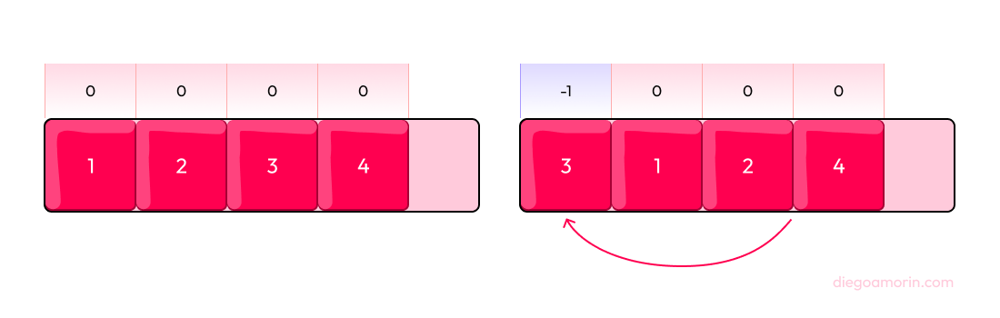

Es una propiedad que permite cambiar el orden visual de los elementos dentro de un contenedor flexible. [Ver accesibilidad](/#problemas-de-accesibilidad).

```css
.elemento {
  order: 2;
}
```

-   `0` (por defecto): Valores positivos o negativos cambian el orden.

### flex-basis

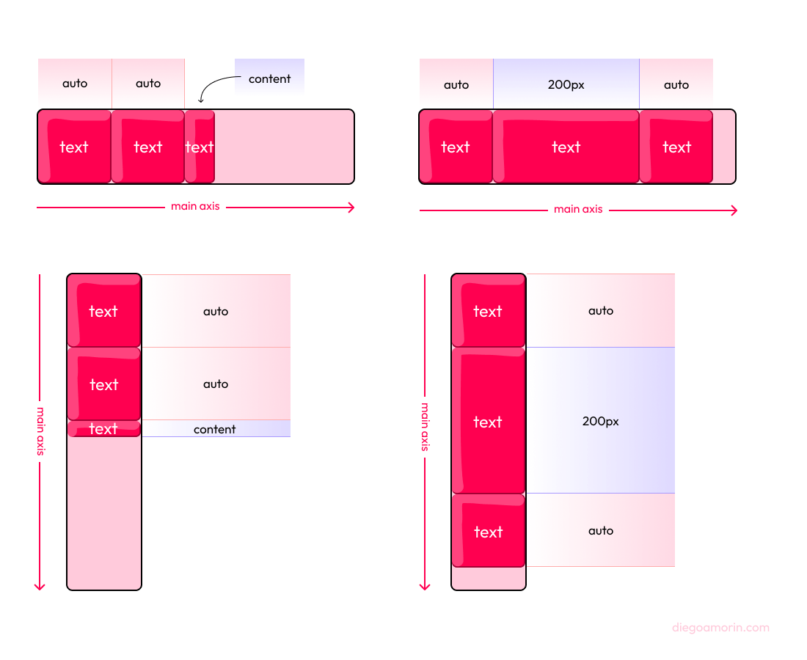

La función principal de `flex-basis` es definir el tamaño inicial del elemento flex. Este tamaño se utiliza como punto de partida antes de que se apliquen las propiedades `flex-grow` y `flex-shrink`.

**Diferencias con la propiedad width:**

-   `flex-basis` define el tamaño inicial de un elemento en el eje principal del contenedor flex, actuando como `width` si el main axis es horizontal y como `height` en main axis es vertical.
-   Cuando `flex-basis` tiene un valor distinto de `auto`, sobrescribe `width` o `height` en el main axis. Aunque, las propiedades `width` o `height` todavía se aplican en el cross axis.

Más información en [What are the differences between flex-basis and width?](https://stackoverflow.com/questions/34352140/what-are-the-differences-between-flex-basis-and-width)

```css
.elemento {
  flex-basis: 20px;
}
```

-   `auto` (por defecto): Usa `width` o `height` si están definidas; si no, toma el tamaño natural del contenido.
-   Valores de longitud: Se utilizan unidades absolutas como `px`, `em`, `rem`, etc., o relativas como porcentajes (`%`) para definir un tamaño fijo.
-   `content`: Siempre toma el tamaño natural del contenido, ignorando los valores de `width` o `height`.

### flex-grow

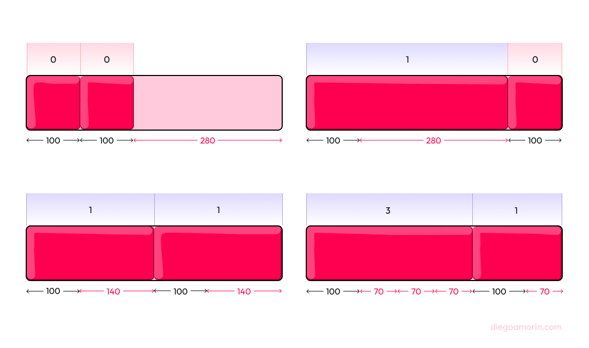

Asigna una proporción del espacio libre disponible dentro del contenedor a un elemento. El espacio libre es cualquier espacio que queda después de que se han distribuido los elementos flexibles con sus tamaños base (definidos por `flex-basis`, `width` o `height`, o su contenido).

```css
.elemento {
  flex-grow: 1;
}
```

-   `0` (por defecto): El elemento no crecerá para llenar el espacio libre. Mantendrá su tamaño base.
-   cualquier número mayor a cero: El elemento crecerá para llenar el espacio libre. El número representa la *proporción* en la que el elemento crecerá en comparación con otros elementos flexibles.

### flex-shrink

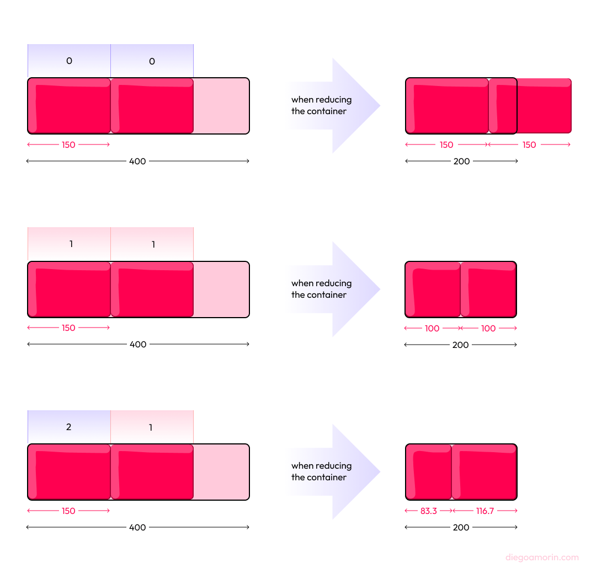

La propiedad `flex-shrink` controla cómo se encogen los elementos dentro de un contenedor cuando no hay suficiente espacio disponible. `flex-shrink` determina la cantidad en que cada elemento se reducirá en relación con los demás.

<AdInArticle />

**Nota:** El cálculo exacto de cuánto se encoge cada elemento depende del valor de `flex-shrink` en relación con los demás elementos. Aunque el cálculo puede ser algo complejo, en la práctica, los valores más comunes y predecibles son `1` y `0`.

```css
.elemento {
  flex-shrink: 1;
}
```

-   `1` (por defecto): Cada elemento dentro de flex se encoge proporcionalmente a su tamaño.
-   `0`: Evita que el elemento se reduzca. Mantendrá su tamaño según lo definido por `flex-basis` (o su contenido si `flex-basis` es `auto`)
-   cualquier número mayor a cero: Estos valores representan un factor de encogimiento. Cuanto mayor sea el número, mayor será la proporción en la que se encogerá el elemento en comparación con otros elementos.

### flex

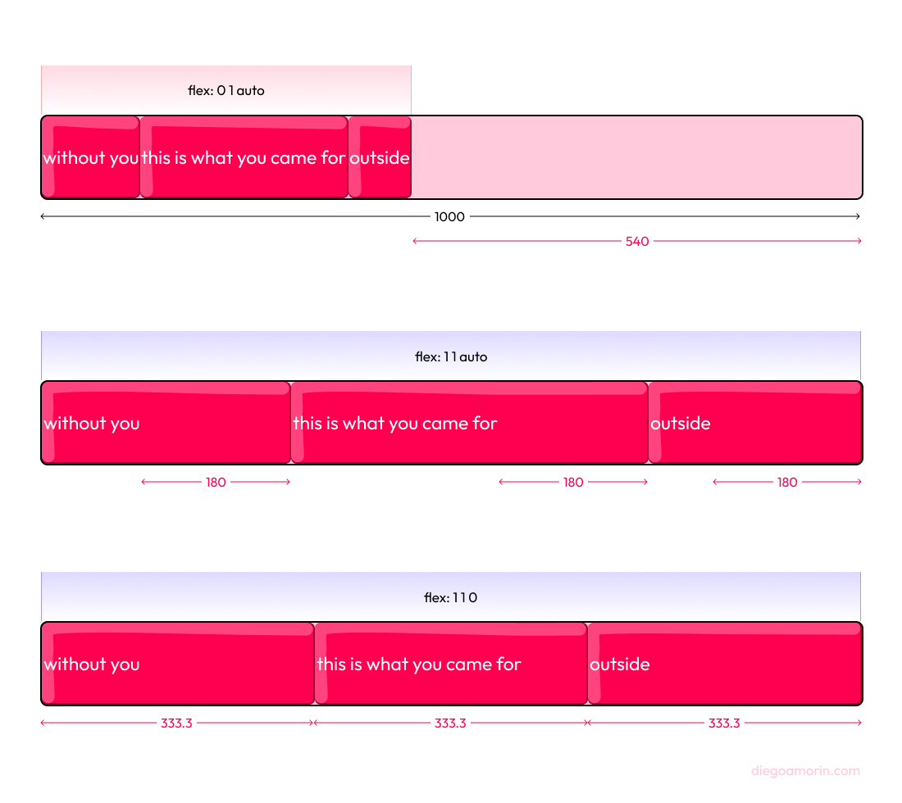

La propiedad `flex` es una forma abreviada para establecer las propiedades: `flex-grow`, `flex-shrink` y `flex-basis`.

```css
.elemento {
  flex: 0 1 auto; /* valor por defecto */
}
```

### align-self

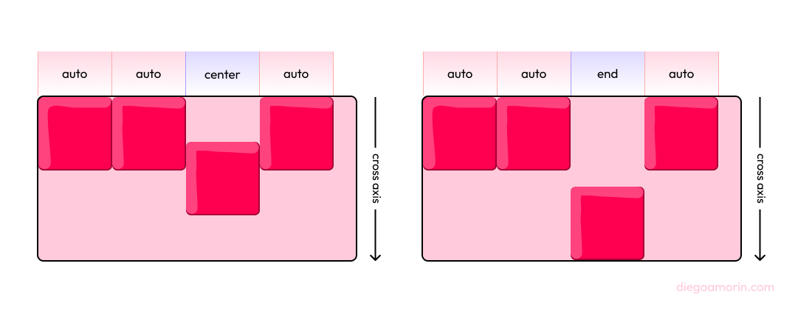

La propiedad `align-self` permite a un elemento hijo dentro de un contenedor Flexbox anular la alineación definida por la propiedad `align-items` del contenedor. Esto significa que se puede alinear de manera diferente respecto a los demás elementos en la misma línea, solo para ese elemento en específico.

```css
.elemento {
  align-self: auto | flex-start | flex-end | center | baseline | stretch;
}
```

-   `auto` (por defecto): Usa el valor de `align-items` del contenedor.
-   `flex-start`: Alinea el elemento al principio del cross axis.
-   `flex-end`: Alinea el elemento al final del cross axis.
-   `center`: Centra el elemento en base del cross axis.
-   `baseline`: Alinea el elemento con la línea base de su contenido.
-   `stretch`: Estira el elemento para que ocupe todo el espacio disponible en la línea a lo largo del cross axis.

## Problemas de accesibilidad

Los cambios realizados por Flexbox son principalmente visuales, afectando la distribución y alineación de los elementos dentro del contenedor sin modificar el orden o la estructura real del HTML.

Propiedades como `order`, y valores como `wrap-reverse` o `column-reverse` pueden invertir el flujo visual de los elementos, causando discrepancias con el orden real del HTML. Esto puede generar algunos problemas en accesibilidad, lo que podría confundir a lectores de pantalla y la navegación con tabulaciones.

Para evitar estos problemas, es recomendable no depender de estas propiedades o valores en situaciones críticas de accesibilidad. Si el orden lógico de los elementos es importante, lo mejor es ajustarlo directamente en el HTML.

Flexbox sigue siendo una herramienta versátil y eficaz para construir layouts flexibles y responsivos, siempre que se utilice de manera consciente y se consideren las necesidades de accesibilidad.
