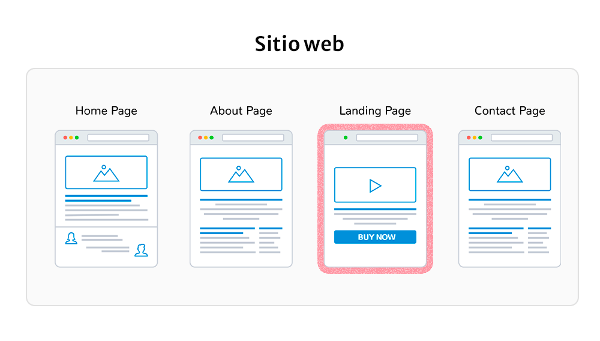
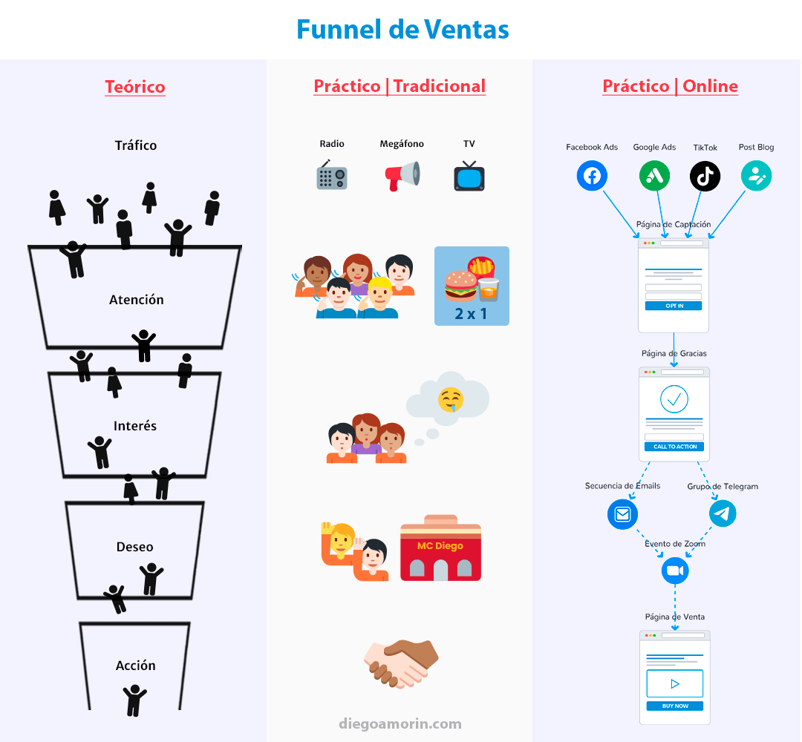
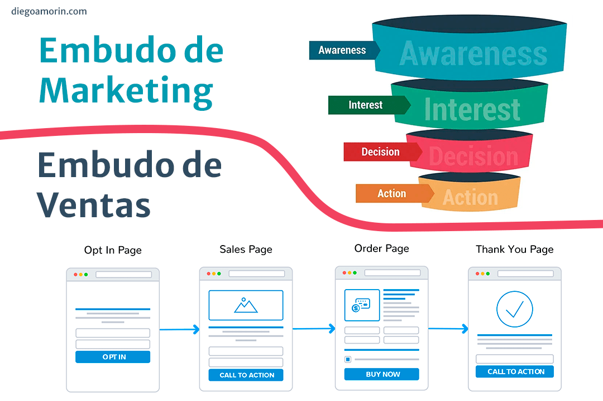

**La Landing Page es una página web que tiene el objetivo de persuadir a las personas para que realicen una acción. En cambio, el Embudo de Ventas es un proceso que recorre una persona, desde su primer contacto con una marca hasta el cierre de una venta. El Embudo al ser un proceso, se apoya de muchas herramientas y una de ellas son las Landing Pages.**

Seguramente notaste que algunos *marketers* y vendedores llaman «Embudo de venta» a sus Landing Pages, lo cual puede generar mucha confusión.

Déjame explicarte en este artículo sobre las diferencias y la relación entre estos 2 términos. Primero entendamos que es una landing page y luego nos encargamos de los embudos de venta.

## ¿Qué es una landing page?

Para saber que es una landing page (página de aterrizaje en español), primero debes conocer la relación que existe entre un sitio web y una página web. Para hacerlo más sencillo, usaré la analogía de un libro. Un libro es un sitio web, y cada página del libro es una página web. Es decir, que el sitio web es un conjunto de páginas web.

Y cada página tiene una función dentro del sitio:

-   **Página de Acerca de mí o Nosotros:** Generar empatía y conexión con los visitantes.
-   **Página de Carrito:** Muestra los productos que están en tu lista de compras.
-   **Página de Contacto:** Pretende generar una conversación.
-   **Página de Entradas o Blog:** Ganar autoridad y captar suscriptores.

Y la landing page es una **página web** que tiene el objetivo de persuadir a una persona para que realice una acción. Es una página más dentro de un sitio web.

Aquí un esquema de un sitio web con sus tipos de páginas:

Eso no es todo, también existen tipos de landing pages. Si las clasificamos de acuerdo a sus objetivos, tenemos 2 tipos:

-   **Página de captación:** Captar potenciales clientes para realizar futuras ventas.
-   **Página de ventas:** Para realizar la venta directa.

Para que la Landing Page alcance estos objetivos, tiene unas características peculiares que lo diferencian de las demás páginas de un sitio web.

Suelen tener un diseño limpio, sin elementos que distraigan al visitante: textos, gráficos y botones que lo motiven a realizar una acción. Dejando en segundo plano la barra de navegación o los links externos que hacen que el cliente salga de la página.

## ¿Qué es un embudo de ventas?

Embudo de ventas, funnel de ventas o sales funnel se refieren a lo mismo. La gran mayoría de blogs y videos en internet lo definen como: ***«Un embudo de ventas es el proceso que recorre un cliente potencial, desde su primer contacto con la marca hasta el cierre de una venta»***.

Si deseas saber más, mira el siguiente video:

<iframe src="https://www.youtube-nocookie.com/embed/ISyW5uqkPTc" title="¿Qué es el embudo de ventas?" loading="lazy" allow="accelerometer; autoplay; clipboard-write; encrypted-media; gyroscope; picture-in-picture; web-share" allowfullscreen></iframe>

Pero si un embudo es un **proceso**, no tendría sentido compararlo con una **página** de aterrizaje. ¿Proceso vs página? Algo anda mal. Esta definición no nos aclara la relación que existe entre una landing page y un embudo de ventas.

## Embudos de ventas en la práctica

Aquí esta el truco. El embudo de ventas al llevarlo a la práctica, puede tomar muchas formas. Y en algunos casos esta obligado a usar una o muchas Landing Pages.

### Caso práctico #1

Imagina que eres un agente inmobiliario que quiere vender un curso sobre «venta de propiedades».

Lo primero que necesitas es que conozcan tu trabajo y tu experiencia. Entonces, creas un evento gratuito llamado «Vende propiedades cada mes». Lanzas publicidad en las redes sociales y todo el tráfico lo llevas a una Landing Page. La Landing Page se encargará de seducir al potencial cliente para que deje sus datos (nombre, email, entre otros) mostrándole los detalles del evento, beneficios, etc.

Una vez que la Landing obtiene el correo, puedes enviarle emails para recordarle la fecha del evento. Ya en el evento por Zoom, impactas con tu conocimiento a los potenciales compradores, y les dices que si desean obtener más conocimientos valiosos, deben adquirir el curso «Vende propiedades cada mes». El curso online, pueden comprarlo por medio de otra landing page o directamente conversando con el tutor.

Como pudiste apreciar, las personas siguen un proceso desde el primer contacto contigo hasta la compra, eso fue un embudo aplicado en la vida real, y tuvo que apoyarse de las Landing Pages.

> El embudo de ventas es un proceso, y para recrear este proceso de forma online, se usan las Landing Pages.

### Caso práctico #2

Un embudo que no usa Landing Pages podría ser un anuncio por la TV o radio: «Llévate 2 hamburguesas por el precio de 1. ¡Solo por hoy!». Ahí entras al embudo, y si tienes hambre y dinero, entonces te diriges al establecimiento o pides un delivery. Y en caso de que no tengas hambre, te sales del embudo.

Hice una imagen para que veas como es un embudo teórico y las formas que puede tomar en la práctica:

A tu izquierda, embudo teórico. En el centro, embudo tradicional que no usa Landing Pages. A tu derecha un embudo online que usa Landing Pages.

## Las definiciones confusas de ClickFunnels

Por alrededor de un año estuve confundido con los términos de embudo de ventas y landing pages. Una de las causas fue las definiciones que ClickFunnels le daba de sus productos. Y que al parecer, muchas personas adoptaron.

Al embudo de ventas lo definen como «una serie de landing pages», y el embudo teórico (el proceso), lo definen como embudo de marketing.

Extracto traducido de [un artículo](https://www.clickfunnels.com/blog/what-is-clickfunnels/) de su blog: ***«En pocas palabras, un embudo de ventas es una serie de páginas en línea que se crean intencionalmente para convertir a los visitantes en leads y a los leads en clientes, paso a paso.»***

En [otro artículo](https://www.clickfunnels.com/blog/landing-page-best-practices/) agregan lo siguiente: ***«Un embudo de ventas es en realidad solo una serie de Landing Pages de alta conversión.»***

Aquí un ejemplo de un embudo de ventas basado en la definición de ClickFunnels:

*La imagen superior derecha fue extraída de Clickfunnels.com*

Recomiendo no tomar estas definiciones, ya que están muy arraigadas a sus productos. Incluso comparan embudos de ventas con sitios web, dos conceptos muy diferentes.

Otro dato. El término embudo de marketing y embudo de ventas es un tema muy aparte que no debemos mezclar en este artículo. Si te gustaría ahondar más, te recomiendo el artículo «[Marketing Funnel Vs. Sales Funnel](https://www.8x8.com/blog/marketing-funnel-vs-sales-funnel)«.

Si no quieres hacerte un montón de problemas, es mejor no adoptar sus definiciones. La gran mayoría de *marketers* definen a un embudo como un proceso, y las landing pages, como páginas web. Punto.

## ¿Cómo crear landing pages para mis embudos?

Para crear landing pages existen plataformas que te facilitan casi todo (por no decir todo), dos de ellas son ClickFunnels y LeadPages. El problema es que tienen un costo un poco elevado. Pero, si al contrario, te gustaría ahorrar dinero, te recomiendo crear tus propias páginas con WordPress y [Elementor](https://elementor.com/?ref=26828). O escríbeme y yo te la creo.

Si te gusto este artículo no te olvides de compartirlo, y si tienes alguna duda u opinión puedes dejar un comentario. ¡Gracias por leer!
