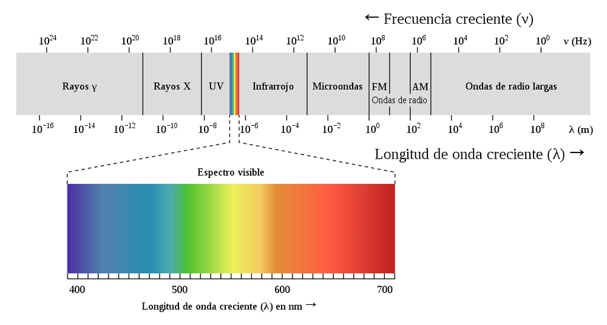
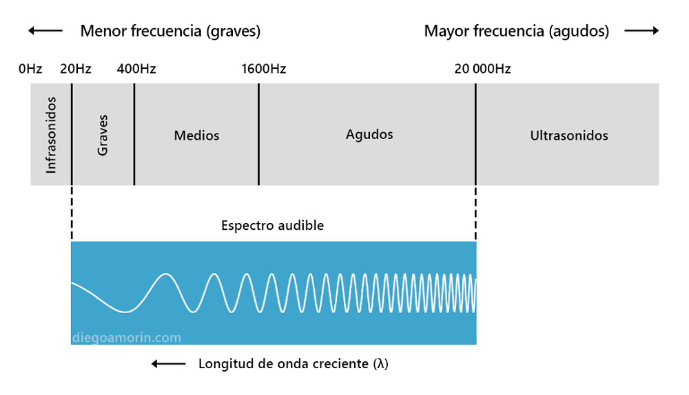

La computadora o celular que tienes en frente, ¿cómo fue creado?

Cómo un trozo de materia puede sacar cálculos más rápido que tú, cómo puede guardar gigabytes de información: tus músicas, tus fotos y tus videos educativos en full HD. O cómo puede aprender a escribir, a jugar al Minecraft o crear obras de arte.

Si. Esto es un logro de la computación, pero los científicos e ingenieros que lo crearon, incluso los emprendedores que los llevaron a las masas. Conocen de física. Unos más que otros. Pero conocen.

La física esta en todas partes, todo lo que ves, lo que sientes, lo que oyes y lo que te rodea, es física. En este artículo te mostraré la importancia de la física en la vida cotidiana, en la ingeniería y en el emprendimiento. Incluso conocerás algunos de los retos de la física actual. Comencemos con lo esencial.

## ¿Qué es la física?

No podemos saber para que sirve la física, sin saber qué es la física:

«**La física es la ciencia que estudia la naturaleza y fenómenos más fundamentales del universo como son el espacio, el tiempo, la materia y la energía**«.

En otras palabras, la física nos ayuda a comprender las leyes que rigen el universo. De esta forma, podemos saber cómo esta programada nuestra realidad.

Genial, ya sabemos que la física es una ciencia que nos ayuda a comprender lo que nos rodea, pero, ¿qué es la ciencia?

**«La ciencia en pocas palabras es el conocimiento adquirido a través del método científico, es decir, a través del proceso de, 1) la observación, 2) el planteamiento del problema, 3) la hipótesis, 4) la experimentación, 5) el análisis de resultados y 6) la conclusión».**

Cualquier conocimiento adquirido a través de estos 6 pasos podría considerarse como ciencia.

<AdInArticle />

## Física en la vida cotidiana

Ahora si, lo que todos se preguntan. ¿Donde aplico la física en la vida diaria?

La respuesta puede que te decepcione un poco. Y es que directamente no vas a ponerte a hallar la velocidad de un auto que pasa por tu casa. No hay motivos para hacerlo. A menos… que te paguen por ello.

¿Y quién te pagaría por aplicar los conocimientos de esta ciencia?

Si tu meta es apuntar a lo más alto, y espero que sea así. La física será importante en tu vida, ya sea que quieras ser ingeniero(a) o emprendedor(a), tendrás que saber cómo mantener un edificio en pie, o cómo usar eficientemente la energía de un auto, o lo más común, cómo resolver un problema específico de una empresa o del gobierno. Necesitarás comprender el mundo que te rodea para dar soluciones las soluciones adecuadas. Ellos te lo compensarán si les ayudas (este tema lo ahondaremos más en la sección «Física en la ingeniería» y «Física en el emprendimiento»).

Aprender física puede ser aburrido cuando no hay un motivo para hacerlo. Pero hay alguien que sabe de física y lo utiliza a tu favor de forma inconsciente: tu cuerpo. Siempre lo llevas contigo así que forma parte de tu vida diaria. Veamos como nuestro cerebro y nuestros sentidos usan la física sin que nos demos cuenta.

### El Cerebro

Tu cerebro necesita de tus sentidos para obtener datos de lo que te rodea y así saber cuando algo quema, algo huele mal, algo es muy ruidoso o si estas en un lugar muy alto. Nuestro cuerpo es «similar» al funcionamiento de un computador que necesita recolectar datos de la pantalla táctil, del mouse o del teclado para obtener instrucciones y saber que debe hacer. El cerebro usa pulsos eléctricos para interpretar la información de afuera y realiza ciertos cálculos de forma inconsciente.

### **Sentido de la vista**

La luz es una onda electromagnética (también es una partícula, aquí nos centraremos en su propiedad de onda) y nuestros ojos son sensibles a ciertas longitudes de estas ondas. Las ondas que si podemos ver, se denominan [espectro visible](https://es.wikipedia.org/wiki/Espectro_visible) (ver imagen de abajo) y nuestro cerebro las interpreta como colores. Las otras ondas que no podemos ver son llamadas ultravioletas (a la izquierda del espectro visible) e infrarrojas (a la derecha del espectro visible). Si nuestros ojos serían sensibles a ellas, entonces podríamos ver las ondas de señal que emiten las radios y los wifis. Y talvez denunciemos a las compañías de telecomunicaciones por contaminación visual.

*[Espectro de las ondas electromagnéticas](https://commons.wikimedia.org/wiki/File:EM_spectrum_es.svg?uselang=es) *by* Zedh con licencia bajo [CC Attribution-Share Alike 3.0 Unported](https://creativecommons.org/licenses/by-sa/3.0/deed.en)*

Mira este video para comprender un poco más: [¿Qué es la luz? ¿Por qué vemos colores?](https://www.youtube.com/watch?v=5E3kl_7_cT0&t=11s)

La luz que recibimos del sol es de color blanco, la luz blanca contiene todos los colores y cuando llegan a un cierto objeto, este absorbe algunas longitudes de onda y refleja otras. Las reflejadas son las que vemos. Por ejemplo, una pera absorbe todas las ondas, excepto la longitud de onda que nuestro cerebro interpreta como «verde»; por eso es verde. Los objetos blancos (como el hielo) reflejan todo y los negros absorben todo (un polo negro absorbe todas las ondas de la luz del sol por eso «quema» más). Todo lo que ves, son ondas electromagnéticas que detectan nuestros ojos y son interpretados en el cerebro.

Además cabe señalar que todos los objetos emiten ondas infrarrojas, es decir que emiten luz que nuestros ojos no pueden detectar. Pero teniendo estos datos, surgió la idea de crear herramientas que nos permitan ver tales ondas. De ahí surge los lentes de [visión nocturna](https://www.youtube.com/watch?v=P_FSr4vlSSM) (veremos más ejemplos en la sección de ingeniería).

Por otra parte, si sabes cómo tus ojos interactúan con la luz, podrás comprender mejor la [teoría del color](https://www.youtube.com/watch?v=J22sm6Gmj9U). Útil si te gusta el diseño gráfico, la pintura y la decoración. Incluso en la fotografía verás como usan la luz para tomar mejores fotos, el difusor es una herramienta que ellos usan para este propósito.

<AdInArticle />

### **Sentido auditivo**

Lo mismo sucede con lo que oímos, el sonido es una onda que nuestro sistema auditivo convierte en señales eléctricas y que nuestro cerebro interpreta. El oído humano capta sonidos de entre 20Hz (Hertz) a 20.000Hz aproximadamente. Lo que llaman espectro audible (ver imagen inferior). Pero algunos animales como tu perro captan un rango más amplio: entre 20Hz a 65.000Hz.

Pero, poco nos importa cómo se comportan nuestros oídos, queremos saber cómo podemos usar la física y el sonido en algo más práctico; y el mejor ejemplo es la música. A todos nos gusta la música, y quisimos ser músicos o DJ’s en algún momento. Pero te apuesto a que no sabías que las siete notas musicales (do, re, mi, fa, sol, la, si) fueron creadas matemáticamente, todo para agradar a tu exigente oído que solo escucha a Bad Bunny.

Si algunas vez quisiste crear música electrónica con un [sintetizador](https://en.wikipedia.org/wiki/Digital_synthesizer) (instrumento musical que permite crear sonidos) encontrarás términos como, armónicos, compresión, ratio, onda de diente de sierra, onda cuadrada, etcétera. Todo nace del entendimiento físico del sonido, y que luego fue plasmado en lenguaje matemático.

Te recomiendo ver este video sobre el origen de las notas musicales: [¿Por qué tenemos 12 notas musicales?](https://www.youtube.com/watch?v=P7iC-fbdKmQ)

### **El sentido del olfato, del gusto y del tacto.**

Como te podrás imaginar los demás sentidos también reciben datos del exterior y lo envían al cerebro para su procesamiento. Aunque me gustaría detenerme en el sentido del tacto:

**… cuando tocamos algo lo que está ocurriendo es que los electrones de las capas externas de las dos superficies «en contacto» se repelen. En realidad, nada entra en contacto, por eso las comillas, lo que sentimos como tacto es realmente repulsión eléctrica entre cargas del mismo signo. Y sí, no importa que sea una caricia…, cualquier tipo de tacto es el resultado de una intensa repulsión.**

Santaolalla, Javier. Inteligencia física (p. 40).

Nuestra mente y sentidos son nuestra mejor herramienta para entender el mundo, pero a la vez nuestra mayor limitante. Como ahora sabes, nuestra vista solo detecta un cierto rango de ondas electromagnéticas (que nuestro cerebro interpreta en colores), nuestros oídos solo perciben [un rango de los sonidos](https://es.wikipedia.org/wiki/Espectro_audible) entre graves y agudos. Nuestro cerebro evolucionó para procesar estos datos, y que al mismo tiempo puede limitarnos en la comprensión de los misterios del universo, con información que no esta acostumbrado a procesar.

Al igual que las computadoras, tu programación esta basada en la evolución humana y su interacción con la naturaleza próxima.

La importancia de la física en la vida cotidiana, es ver el mundo de otra forma. Saber que hay animales que pueden ver lo que tú no puedes, las víboras de pozo por ejemplo, ven en infrarrojo para cazar; saber que tu perrito no ladra por las puras, el escucha cosas que tú no puedes oír, y que todo lo que ves, sientes, oyes, hueles, saboreas son solo interpretaciones de tu cerebro, ¿será así la realidad?

> Un PLUS. Si te gustaría **leer libros de ciencia ficción**, debes aprender física básica. Algunos autores explican posibles realidades utópicas o distópicas con la ayuda de la física.

Al final del artículo te recomendaré algunos libros que me ayudaron a aprender de física. ¡No te vayas!

<AdInArticle />

## Física en la ingeniería

Antes de seguir avanzando, primero debes conocer la estrecha relación entre tecnología e ingeniería. Definamos ambos términos para tenerlo más claro.

### ¿Qué es la tecnología?

**Según la RAE, es el conjunto de teorías y de técnicas que permiten el aprovechamiento práctico del conocimiento científico.**

En otras palabras dice que la ciencia llevada a la práctica es tecnología. ¿Y quienes son los encargados de hacer eso? Sí, los ingenieros.

Algunos ejemplos de tecnología son, los lapiceros, las bombillas, el lenguaje, los autos, la IA, la realidad aumentada, etcétera. Si piensas que un lapicero no es una tecnología, te comprendo. La tecnología deja de verse como tecnología cuando todos disponen de ella y se normalizan. Tus nietos, no verán a la computadora como tecnología.

### ¿Qué es ingeniería?

**Según Oxford Languages, arte y técnica de aplicar los conocimientos científicos a la invención, diseño, perfeccionamiento y manejo de nuevos procedimientos en la industria y otros campos de aplicación científicos.**

En pocas palabras dice que la ingeniería es la aplicación de los conocimientos científicos para la resolución de problemas. Y la tecnología era la ciencia aplicada en la resolución de problemas. Podemos concluir que ingeniería se refiere al proceso, y tecnología se refiere al resultado.

Los ingenieros se encargan de construir y diseñar cohetes, edificios, sistemas informáticos, carreteras, medicamentos, vacunas, vehículos, y otras cosas más que nos ofrecen una mejor calidad de vida. Hay un montón de ejemplos de ingeniería. Solo debes mirar alguna cosa de tu entorno y preguntarte ¿cómo funciona esto?, o, ¿por qué tienes este aspecto? Veamos solo un ejemplo.

### Ejemplo de la energía

La energía eléctrica que llega a tu hogar es gracias a los generadores, dispositivos que transforman el movimiento en corriente eléctrica. También tenemos los motores eléctricos, que realizan el proceso inverso, convierten la energía eléctrica en movimiento. Y adivina que, los autos eléctricos usan estos dos elementos: cuando aceleran convierten la energía eléctrica en movimiento, y cuando frenan, el movimiento se convierte de nuevo en energía. Así logran que las baterías no se agoten rápido.

Mira este video de una espectacular obra de ingeniería (hasta que se normalice):

<iframe src="https://www.youtube-nocookie.com/embed/sX1Y2JMK6g8" title="SpaceX Falcon Heavy- Elon Musk's Engineering Masterpiece" loading="lazy" allow="accelerometer; autoplay; clipboard-write; encrypted-media; gyroscope; picture-in-picture; web-share" allowfullscreen></iframe>

*Video de [Spaceflight TV](https://www.youtube.com/@SpaceflightTV) en YouTube*

Ahí viste a muchos ingenieros felices por un logro que fue posible gracias al conocimiento científico, en particular, el de la física. Pero hay alguien más, alguien que dio forma al proyecto, alguien que dirige las tropas. Me refiero al líder o emprendedor. Toca hablar de él.

<AdInArticle />

## Física en el emprendimiento

Talvez la ingeniería no sea lo tuyo y prefieres los negocios, y puede que se te haya pasado por la cabeza dejar la universidad o tu trabajo porque tuviste una idea genial que te haría millonario. Y si lo hiciste, puede que te hayas ido de cara. Al menos eso me paso a mí.

Emprender no es sencillo, necesitas de cierta experiencia y tener un buen producto. Y sí, hay personas que te dirán que no necesitas todo ello. Y tienen razón, existen excepciones. Pero si algún día soñaste ser como Elon Musk, Mark Zukerberg, Jeff Bezos, Henry Ford o Steve Jobs u otro emprendedor-millonario-famoso que hayas oído. Notarás un patrón, [aparte de la suerte](https://www.youtube.com/watch?v=IrRiVoH3sGQ&ab_channel=Veritasiumenespa%C3%B1ol) y de ser hábiles en los negocios, ellos crearon o financiaron la construcción de buenos productos.

Te arrojaré algunos datos. Steve Jobs se colaba en clases de física y diseño de fuentes tipográficas, algo que pudo ser crucial para entender la viabilidad de crear un ordenador personal que llegara a las masas, y clave para elegir a Steve Wozniak (ingeniero electrónico) como cofundador. Otro dato más. Elon Musk estudió ingeniería, física y economía, algo fundamental que le ayudó a comprender la viabilidad de crear el automóvil eléctrico propuesto por Straubel, Eberhard y Tarpenning (cofundadores de Tesla Motors). Nadie creyó en ellos, solo Elon entendió la visión de estos ingenieros. Estos mismos conocimientos le ayudaron a entender la viabilidad de construir cohetes que llevaran carga al espacio a un bajo coste y así cofundar SpaceX. Otro datos más. Jeff Bezos estudió ingeniería eléctrica e informática, carrera que obligatoriamente lleva física.

<AdInArticle />

Si no me crees, aquí un extracto que mencionó Larry Page (cofundador de Google) en el libro de Ashlee Vance sobre Elon Musk.

**«He aprendido que la intuición no funciona muy bien en lo relativo a cosas de las que uno no sabe mucho —cuenta Page—. Tal como lo explica Elon, uno siempre necesita comenzar por los principios básicos de un problema. ¿Cuál es la física implicada? ¿Cuánto tiempo se necesitará? ¿Cuánto costará? ¿Cuánto lo puedo abaratar? Es necesario poseer ciertos conocimientos de ingeniería y física para juzgar lo que es posible e interesante. Elon es excepcional porque no solo tiene esos conocimientos, sino que además sabe de negocios, de organización, de liderazgo y de cuestiones administrativas.»**

Vance, Ashlee. Elon Musk (HUELLAS). Ediciones Península.

Los grandes productos necesitan de personas que los ayuden a llevarlos a las masas: los inversores, emprendedores y vendedores. Si deseas tener un buen ojo para hallar productos innovadores, necesitas aumentar tu campo de visión, necesitarás los lentes de un físico.

## Física como ciencia

Los físicos son humanos que comprenden muchas cosas que nos rodean, eso les da un superpoder. Ellos hallaron la distancia entre la Tierra y la Luna con física, obtuvieron el peso de la Vía Láctea con física, saben cuales son las estrellas más cercanas a la Tierra, ojo, sin necesidad de guiarse de su luminosidad, saben como crear antimateria, el material más caro del planeta, entre muchas cosas más.

Imagínate, descubrieron al planeta Neptuno, sin verlo, solo con física y matemáticas.

Aún no sabemos como crear las naves intergalácticas, los autos voladores u obtener energía limpia a bajo coste, porque hay muchas cosas que no podemos entender, y que la ciencia se encuentra en la constante búsqueda de respuestas.

En la física por ejemplo, faltan un cúmulo de cosas por conocer:

<AdInArticle />

1.  Hasta el momento no se sabe que pasa exactamente dentro de un **agujero negro**. Nuestras leyes físicas fallan al momento de querer entenderlas.
2.  Cuando «pesaron» cada uno de los elementos que conforman la Vía Láctea y lo compararon con el peso total, el peso total es superior a la suma de todos los elementos. ¿Qué es lo que no estamos viendo? Aquí inicia la búsqueda de una tal **«materia oscura»**.
3.  Conocer física permitió a las personas predecir ciertos fenómenos, hasta que **la cuántica y la indeterminación** llamaron la atención de los físicos. Las predicciones exactas no aplican a nivel cuántico.
4.  Si la gravedad atrae, por qué solamente las galaxias cercanas se «atraen», y las que están lejos, se alejan cada vez mas rápido, ¿qué las esta alejando? Hola, **energía oscura**.

Y hay muchos retos más, y si decides dedicarte a la física, desde ya, mis respetos.

## ¿Te aburre aprender física?

Después de lo que leíste estoy seguro de que te interesa mucho más la física. Ya tienes la motivación necesaria, pero estoy seguro que después de un tiempo, toda la motivación que sentías, se morirá.

Lo que te recomiendo es preguntarte por qué no te gusta la física. En mi caso fue porque en la universidad me toco 2 profesores que eran renegones. A uno le gustaba dejarte en ridículo cuando le preguntabas, y el otro solo afirmaba: No entiendes porque no estas atento. Además, que no sabía donde lo usaría en mi vida. Pero al hallarle a la física un por qué, no me importo lo demás y quise aprender a como de lugar.

Y espero que este artículo te haya permitido encontrar una razón para aprenderlo. Pero si no encontraste un motivo o si ya deseas iniciarte en la física pero de manera divertida te recomiendo leer libros de ciencia ficción o libros de divulgación científica.

Te voy a dar una lista de libros que leí yo y acrecentaron mi gusto por la física:

1.  **El bosón de Higgs no te va a hacer la cama:** Aprenderás lo esencial de la cuántica, relatividad, materia oscura, antimateria, el Big Bang, y otros temas de divulgación científica de la mano de Javier Santaolalla (Dr. en Física de Partículas). Algunos temas son un poco complicados, así que puedes ver su [canal de YouTube](https://www.youtube.com/@dateunvlog/) para complementar lo que no entiendas.
2.  **Inteligencia Física:** Un libro que te habla sobre la física de tus sentidos y de la vida cotidiana. También por el mismo autor, Javier Santaolalla.
3.  **El proyecto Hail Mary:** Es un libro de ciencia ficción del autor Andy Weir donde existe una misión para salvar al planeta Tierra. Existen algunos temas técnicos que entenderás si tienes conocimientos básicos de física, por ello te recomiendo los libros de Javier. El proyecto Hail Mary aumento mis ganas de aprender más de física para complementar mi carrera.
4.  **Elon Musk el empresario que anticipa el futuro:** Una biografía de Elon Musk antes de que compre Twitter, habla de todo lo que hizo y como los conocimientos en física, ingeniería y economía, le ayudaron a alcanzar el éxito.
5.  **Vida 3.0:** Este no es un libro de física, sino de computación e inteligencia artificial. Pero habla de algunos temas de física que pueden acrecentar tus ganas de aprenderla.

Esta lista no es obligatoria, puedes leer uno de ellos y es suficiente. Recuerda, existen diferentes caminos para llegar a un objetivo. Busca el que mejor te funcione.

<AdInArticle />

También puedes ver algunas películas como Interestellar o series como «[Los 100](https://es.wikipedia.org/wiki/Los_100_\(serie_de_televisi%C3%B3n\))«, me gustó esta serie por la ingeniera, y como sus conocimientos pueden salvar a 100 personas en un mundo postapocalíptico.

Espero que el artículo te haya gustado, compártelo con los compañeros de tu salón, con tus colegas, personas que estudian ingeniería (a ellos con más razón, créeme te lo agradecerán), tus amigos emprendedores que quieren abandonar los estudios sin una base. Lo escribí para un público amplio, así que compártelo sin dudarlo. Y si crees que me falto mencionar algo o encontraste algún error, déjame un comentario o contáctame, y así poder corregirlo.
