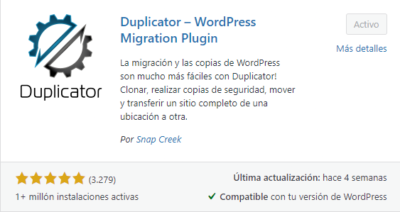
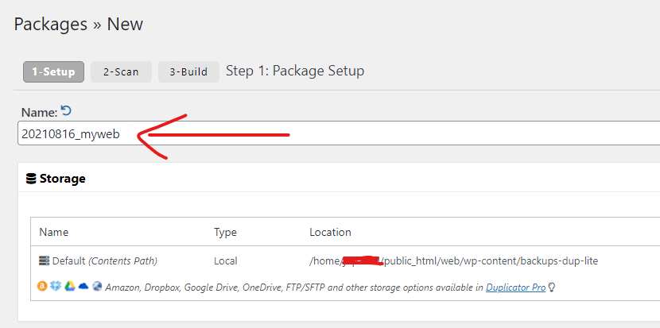
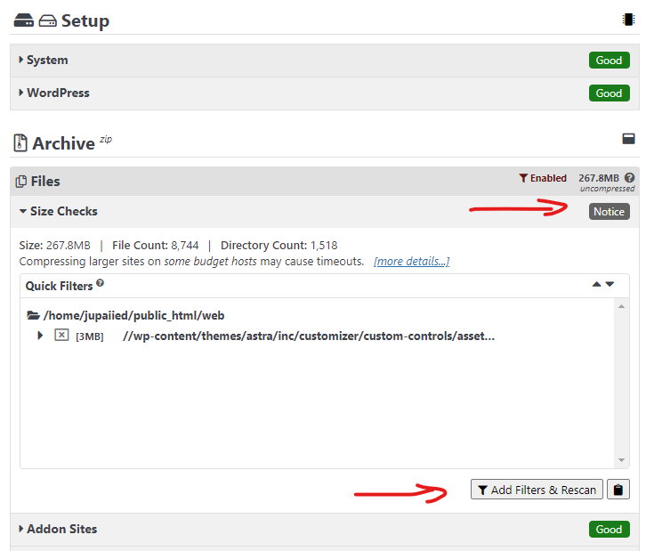
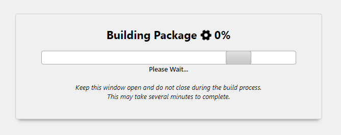
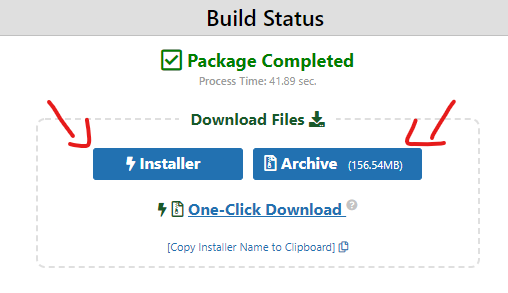
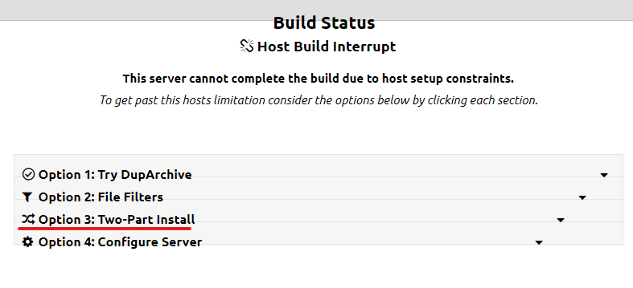
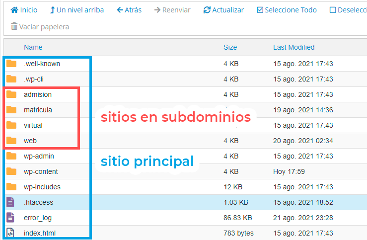
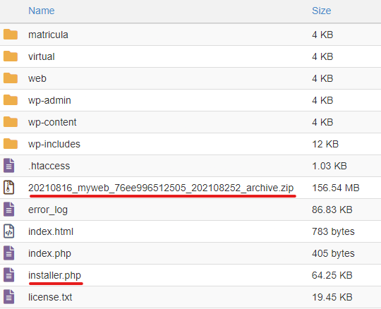
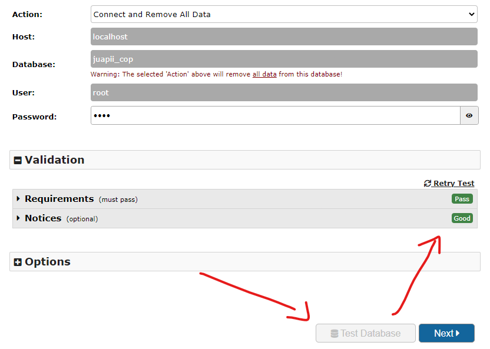
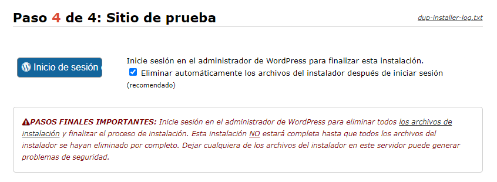

Migrar un sitio de un subdominio a un dominio principal puede realizarse literalmente con unos clicks. Aún así, no estamos libres de cometer errores o que surjan problemas inesperados. Puede que el plugin de migración falle o tengas problemas con el hosting en el proceso. Por estos motivos, es recomendable que tengas una copia de seguridad del sitio que será reemplazado (el que se encuentra en tu dominio principal en este caso).

Si deseas ir directamente al proceso, puedes saltarte la siguiente sección.

## En Contexto

Un amigo me llamo solicitando mi ayuda para duplicar el sitio de un colegio. La idea era pasar el sitio web del subdominio al dominio principal. No sabía como hacerlo al principio, yo solo acepte. Cuando me lanzó la propuesta, al instante pensé en pasarlo todo manualmente, es decir, iba a rediseñar el sitio principal guiándome del sitio que estaba en el subdominio (eso iba a tomar mucho tiempo). Mientras seguíamos hablando, me pregunto cuanto tiempo me tomaría y yo le dije una semana. Porque pensaba pasar todas las entradas manualmente. En el transcurso de la llamada me pregunté si habría algún plugin o funcionalidad en CPanel para duplicar sitios. «Debe de haber, es obvio» dije en mis adentros. Terminada la llamada, me puse a buscar el bendito plugin.

Existe gran variedad de plugins para realizar una migración. Los principales son [All-in-One WP Migration](https://es.wordpress.org/plugins/all-in-one-wp-migration/), [UpdraftPlus](https://wordpress.org/plugins/updraftplus/) y [Duplicator](https://es.wordpress.org/plugins/duplicator/). En este caso te voy a enseñar a hacerlo con Duplicator. Los plugins no son la única opción pero son las más fáciles.

## ¿Por qué Duplicator?

Existen 2 razones principales por las que elijo Duplicador. Primero, porque te permite migrar un sitio sin necesidad de tener una instalación WordPress en el hosting de destino. Segundo, te permite realizar una migración por partes, si tu sitio es muy pesado y tu servidor tiene problemas de «[timeout](https://smallbusiness.chron.com/server-connection-timeout-mean-71381.html)» (Algo muy común en hostings económicos).

Si tu plugin de migración nunca llega a concluir su carga, ya sea al exportar o importar. Es posible que el servidor donde se aloja tu sitio tenga un problema de timeout.

*Yo ya lo tengo instalado y activado. No sé que esperas XD*

## Crear un paquete

Una vez hayas instalado el plugin dirígete a «Duplicator > Packages» y presiona el botón «Create New» para crear un nuevo paquete (sólo son 3 pasos).

En el paso de «Setup» podrás colocar un nombre para tu paquete, elegir que archivos o carpetas excluir en el proceso de exportación o solo exportar base de datos, entre otras cosas. Por ahora solo coloca un nombre o deja el que te viene por defecto. Después dale a «Next».

En el siguiente paso se analizará el estado y peso de tu sitio web. Es muy probable que te aparezca una advertencia sobre el tamaño de tu sitio. Puedes aplicar algunos filtros y presionar «Add Filters & Rescan» para eliminar ciertos elementos pesados. Normalmente yo no aplico ningún filtro.

Si sigue con la advertencia solo marca la casilla «Yes. Continue with the build process!» que se encuentra en la parte inferior. Dale a «Build» y esperamos unos minutos.

En este punto puede que ocurran una de dos cosas. Que todo haya salido genial o que exista un problema con el host (roguemos que te suceda el primero).

### **Caso 1: Package Completed**

Una vez que termine el proceso de construcción. Descarga el «Installer» y el «Archive».

### **Caso 2: Host Build Interrupt**

Si te salió este error de host. Duplicator te ofrece una serie de opciones que puedes seguir (yo te recomiendo que elijas la tercera opción). Puedes seguir los pasos que te ofrecen son muy detallados.

Pronto estaré publicando un artículo de para realizar una migración en dos partes con Duplicator.

Si tienes un tercer caso no dudes en dejarme un comentario. Encontraré la manera de apoyarte.

## Instalar el paquete

Ahora tienes que dirigirte al Administrador de Archivos de tu CPanel y encontrar donde se aloja el sitio del «dominio principal». Probablemente en la carpeta «public\_html». Puede que tu sitio tenga una estructura parecida a esta.

En la parte superior del Administrador encontrarás la opción «Cargar». Presiónalo y te llevará a una página donde subirás los dos archivos que descargaste anteriormente.

Opcionalmente puedes usar FTP para cargarlos.

**En este punto te recomiendo tener una copia de seguridad de tu sitio principal.**

Para comenzar la instalación dirígete a «tudominio.com/installer.php» y verás una página de instalación. Ahí Duplicator te mostrará una advertencia. Te recomiendo que lo leas, pero básicamente dice que sobrescribirá todos los archivos y la base de datos. Por la base de datos no te preocupes luego le podemos pedir que use otra base de datos diferente. Acepta los términos que se encuentran en la parte inferior y dale a «Next».

Espera unos minutos hasta que se extraigan todos los archivos.

A continuación, especificarás que base de datos usará para la instalación. Te recomiendo [crear una base de datos aparte](https://youtu.be/-LpupjA9mis). Toma los datos y completa los campos. Dale a «Test Database» para que verifique si se logró realizar la conexión y dale a «Next».

Tienes que esperar un momento hasta que se instale la base de datos.

En el siguiente paso podrás actualizar datos del sitio y crear un nuevo usuario administrador. Puedes dejarlo todo como esta y continuar.

Por último, Duplicator te permite eliminar los archivos de instalación cuando inicias sesión. Una vez lo hayas hecho, verifica en tu Administrador de Archivos si realmente se borraron para evitar problemas de seguridad.

Genial! Migraste un sitio desde un subdominio al dominio principal 🎉🎉.

## Conclusión

Migrar un sitio WordPress puede llegar a ser complicado, pero existen plugins que nos facilitan la vida. Aunque no son 100% infalibles.

Lo aprendido aquí no solo te servirá para migrar un sitio de un subdominio a un dominio, sino que podrás migrar sitios WordPress a otros hostings, exista o no una instalación WordPress. Si te gustaría un tutorial de migración a otro hosting o si tuviste algún problema al momento de migrar puedes dejarme un comentario.

No olvides suscribirte a mi blog, subo contenido de WordPress y desarrollo web.
