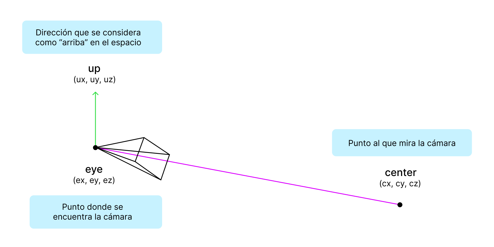
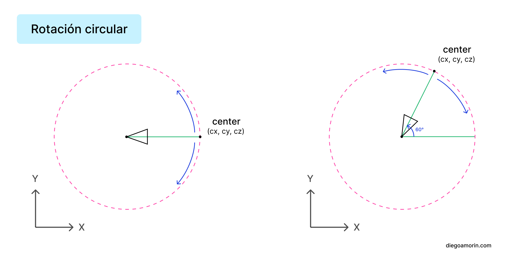
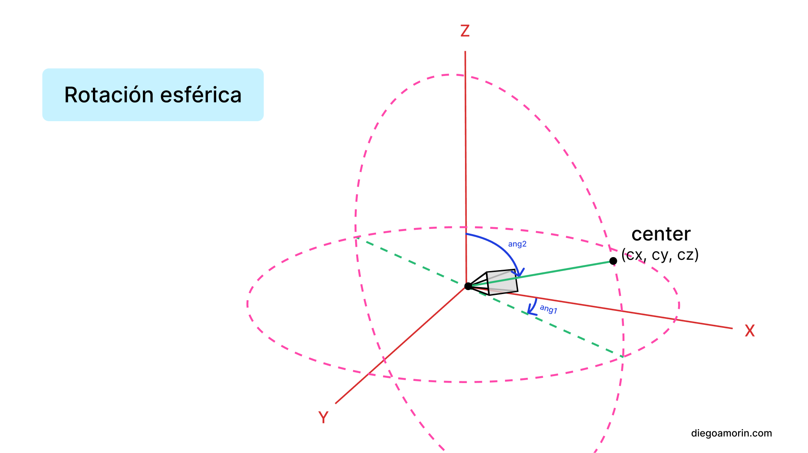
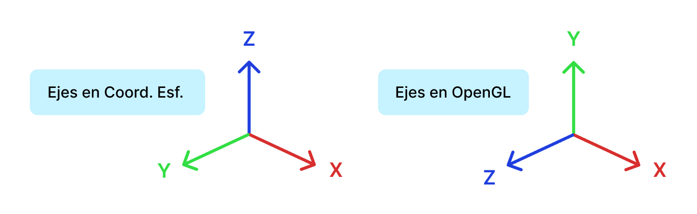
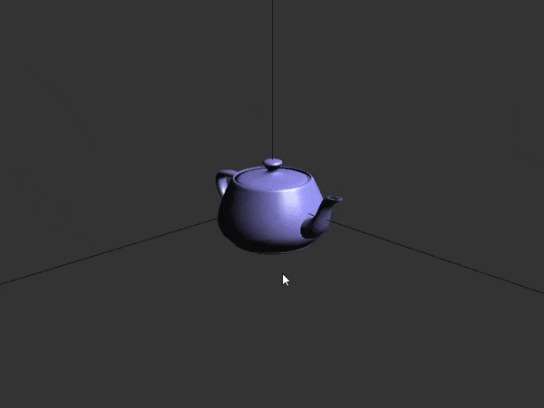

Tenía que recorrer una escena 3D en «primera persona» para mi proyecto universitario, me tomo 3 días encontrar la forma de lograrlo. Aquí te muestro una de las soluciones.

En este caso usaré OpenGL con GLUT (freeGLUT en específico, [guía de instalación](https://youtu.be/VMsTI_CC-jc)) aunque aprendiendo la teoría de esta guía podrás adaptarlo a otro proyecto que tengas con librerías alternativas como GLFW. Aquí el [repositorio en GitHub](https://github.com/diegoamorin/movimiento-camara-opengl).

## Funcionamiento de la cámara

Para posicionar y fijar donde mira la cámara necesitamos la función `gluLookAt` que recibe 9 parámetros. Los 3 primeros son las coordenadas XYZ donde se posicionará la cámara (también llamado «eye»). Los 3 siguientes son las coordenadas XYZ del punto hacia donde mirará la cámara (también llamado «center»). Y los últimos 3 son para el vector «up» que definen la dirección que se considera como «arriba».



Entonces, para desplazar la cámara necesitamos mover el punto «eye», y para controlar donde mira la cámara debemos mover el punto «center».

## Mover los puntos

Mover el punto «eye» es más sencillo, es similar a caminar. Podemos avanzar, retroceder, ir a la izquierda, ir a la derecha.

El detalle esta en el punto «center», que servirá para dirigir a donde mira la cámara. Ahí la cámara es como nuestra cabeza, va a girar a la izquierda o a la derecha, arriba o abajo; pero siempre teniendo en cuenta que para girar la cámara en OpenGL necesitamos mover el punto «center» por una trayectoria circular.



¿Y como podemos hacer para que el punto «center» recorra una circunferencia?

La clave esta en usar coordenadas polares. Estas coordenadas nos ayudarán a describir una circunferencia usando un (radio, ángulo) en vez de usar una coordenada rectangular `(x, y)`. Si aplicamos esto a OpenGL necesitaríamos crear una variable que guarde el ángulo y el radio, luego solo necesitaríamos modificar el ángulo y lo convertimos a rectangulares y se lo pasamos al `gluLookAt`. ¿Sencillo no?

El detalle es que las coordenadas polares solo nos permiten girar a la izquierda o derecha. O sea en 2D. Esa no es la idea, nosotros también queremos que gire hacia arriba y abajo, en el espacio 3D. Para ello necesitamos un segundo ángulo.



¿Y cómo podemos hacer para que el punto «center» recorra una trayectoria esférica?

En matemáticas esto se conoce como «coordenadas esféricas» que incluyen el (radio, angulo1, angulo2) y justamente esto es lo que usaremos en nuestro programa.

**Nota:** Las coordenadas esféricas es una de las opciones que puedes seguir, aunque investigando un poco me tope con un término llamado «[bloqueo de cardán](https://www.youtube.com/watch?v=zc8b2Jo7mno&ab_channel=GuerrillaCG)» que puede suceder cuando aplicamos esta forma de rotación. Ojo, no lo ahonde mucho. También existe otra alternativa a las coordenadas esféricas, llamadas [Cuaterniones](https://www.youtube.com/watch?v=zjMuIxRvygQ&ab_channel=3Blue1Brown).

## Todo se reduce a una conversión

¿Todo lo que te conté parece complejo no? Al final todo se reduce a una conversión de coordenada esférica (radio, angulo1, angulo2) que servirá para rotar, a una coordenada rectangular (x, y, z) que son los valores que entiende OpenGL.

Si te gustaría ahondar más en esto, puedes verte [una playlist de coordenadas polares, cilíndricas y esféricas](https://www.youtube.com/playlist?list=PL9SnRnlzoyX1R0sy3ZiQmRUiXtXuJJD5G). Es opcional, puedes continuar con las fórmulas que te voy a dar:

```javascript
// Conversión de coordenada esférica a rectangular
x = rho * cos(angulo_theta) * sen(angulo_phi)
y = rho * sen(angulo_theta) * sen(angulo_phi)
z = rho * cos(angulo_phi)
```

Rho significa radio, angulo\_theta es el ángulo 1, y angulo\_phi es el ángulo 2. Con estas fórmulas puedes obtener su equivalente en XYZ.

Toma en cuenta que en las coordenadas esféricas el eje «Z» apunta arriba, en cambio en OpenGL el eje «Y» apunta arriba. Cuando lo programes lo puedes cambiar en cambio de «Z» le pones «Y» y en cambio de «Y» le pones «Z».



Terminamos la teoría, ahora iremos a la práctica. Con los conocimientos que aprendiste estas listo para aplicarlo en tu proyecto, independientemente de la librería que uses. A continuación verás la implementación en OpenGL con GLUT.

## Programa para iniciar

Para comenzar puedes usar un proyecto que ya tienes, o también, puedes copiar y ejecutar este pequeño programa que muestra una tetera y las líneas X, Y y Z. Aquí realizaremos las modificaciones posteriores.

```cpp
#include <GL/glut.h>

void ventana_escalable(int width, int height) {
    glClearColor(0.2f, 0.2f, 0.2f, 1.0f);

    glViewport(0, 0, width, height);
    glMatrixMode(GL_PROJECTION);
    glLoadIdentity();
    gluPerspective(20.0, (GLfloat)width / (GLfloat)height, 1.0, 2000.0);
    // Posición de la cámara
    gluLookAt(5.0, 5.0, 5.0, 0.0, 0.0, 0.0, 0.0, 1.0, 0.0);

    glMatrixMode(GL_MODELVIEW);
}

void escena() {
    // Función de visualización
    glClear(GL_COLOR_BUFFER_BIT | GL_DEPTH_BUFFER_BIT);

    // Dibujar lineas x, y, z
    glPushMatrix();
        GLfloat line_material_diffuse[] = {1.0, 0.5, 0.0, 1.0};
        glMaterialfv(GL_FRONT, GL_DIFFUSE, line_material_diffuse);

        glBegin(GL_LINES);
            glVertex3f(0.0, 0.0, 0.0);
            glVertex3f(50.0, 0.0, 0.0);
        glEnd();
        glBegin(GL_LINES);
            glVertex3f(0.0, 0.0, 0.0);
            glVertex3f(0.0, 50.0, 0.0);
        glEnd();
        glBegin(GL_LINES);
            glVertex3f(0.0, 0.0, 0.0);
            glVertex3f(0.0, 0.0, 50.0);
        glEnd();
    glPopMatrix();

    // Dibujar tetera
    glPushMatrix();
        GLfloat material_diffuse[] = {0.6, 0.6, 1.0, 1.0};
        GLfloat material_specular[] = {1.0, 1.0, 1.0, 1.0};
        GLfloat material_shininess = 50.0;
        glMaterialfv(GL_FRONT, GL_DIFFUSE, material_diffuse);
        glMaterialfv(GL_FRONT, GL_SPECULAR, material_specular);
        glMaterialf(GL_FRONT, GL_SHININESS, material_shininess);

        glutSolidTeapot(0.5);
    glPopMatrix();
    glFlush();
}

void luces() {
    glEnable(GL_LIGHTING);
    glEnable(GL_LIGHT0);
    GLfloat light_pos[] = {1.0f, 1.0f, 1.0f, 0.0f};
    glLightfv(GL_LIGHT0, GL_POSITION, light_pos);
}

int main(int argc, char** argv) {
    // Inicializar GLUT y crear la ventana
    glutInit(&argc, argv);
    glutInitDisplayMode(GLUT_SINGLE | GLUT_RGB | GLUT_DEPTH);
    glutInitWindowSize(800, 600);
    glutInitWindowPosition(100, 100);
    glutCreateWindow("Movimiento de cámara en OpenGL");

    // Activar la profundidad
    glEnable(GL_DEPTH_TEST);

    // La función ventana_escalable se llama cuando la ventana se crea inicialmente
    // y también cada vez que se redimensiona gracias a "glutReshapeFunc"
    glutReshapeFunc(ventana_escalable);

    // Configurar las luces
    luces();

    // Configurar la función de visualización
    glutDisplayFunc(escena);

    glutMainLoop();
    return 0;
}
```

Una vez lo hayas copiado asegúrate de que se ejecute correctamente. Si tienes conocimientos base de OpenGL te recomiendo tratar de entender el código. Así será pan comido entender lo que sigue.

## Rotar la cámara en OpenGL

Nos enfocaremos en mover esféricamente el punto «center» para girar la cámara. Primero, definimos las variables y constantes que necesitaremos. Agrega lo siguiente en la parte superior, antes de la función `ventana_escalable()`:

```cpp
#include <math.h>

const float rho = 1.0; // el radio
float angulo_theta = 3.9;
float angulo_phi = 2.2;

// Radianes a aumentar o disminuir a los angulos theta y phi
const float saltos = 0.05;
// Valor de movimiento de la camara para avanzar, retroceder, etc.
const float valor_movimiento = 1.0;

// Valores para el punto "eye"
float eye_x = 5.0, eye_y = 5.0, eye_z = 5.0;
// Valores para el punto "center" cuando el punto "eye" esta en (0, 0, 0)
float center_x = 0.0, center_y = 0.0, center_z = 0.0;
```

Recuerda que los ángulos los trabajaremos en radianes (es lo normal cuando se trabaja con coordenadas esféricas). Elegí `angulo_theta = 3.9` y `angulo_phi = 2.2` porque en estos ángulos la cámara apunta a la tetera de nuestro programa. Rho esta en 1 porque quiero seguir la convención de un [circulo unitario](https://www.youtube.com/watch?v=94Q4zFxKs84&ab_channel=FisicaProfeSantamaria): radio=1, pero si deseas puedes experimentar cambiando los valores.

Elimina la línea donde esta el `gluLookAt` de la función `ventana_escalable()`:

```cpp
gluPerspective(20.0, (GLfloat)width / (GLfloat)height, 1.0, 2000.0);
// Posición de la cámara
gluLookAt(5.0, 5.0, 5.0, 0.0, 0.0, 0.0, 0.0, 1.0, 0.0);

glMatrixMode(GL_MODELVIEW);
```

Agrega lo siguiente a la función `escena()`:

```cpp
void escena() {
    // Función de visualización
    glClear(GL_COLOR_BUFFER_BIT | GL_DEPTH_BUFFER_BIT);

    // Posición de la cámara
    glLoadIdentity();
    gluLookAt(
        eye_x, eye_y, eye_z,
        eye_x + center_x, eye_y + center_y, eye_z + center_z,
        0.0, 1.0, 0.0
    );
    // ------
}
```

Agregamos el `gluLookAt` aquí para que se llame cada vez que cambien las variables que definimos al principio.

Finalmente debemos «oír» cuando las flechas (arriba, abajo, izquierda y derecha) se presionan, y así, aumentar o disminuir los valores del `angulo_theta` y el `angulo_phi` que provocará el movimiento del punto «center».

Copia lo siguiente y pegalo antes de la función `main()`:

```cpp
void teclado_girar_camara(int key, int x, int y) {
    float saltos = 0.05;

    switch (key) {
        case GLUT_KEY_LEFT: {
            angulo_theta -= saltos;
        } break;
        case GLUT_KEY_RIGHT: {
            angulo_theta += saltos;
        } break;
        case GLUT_KEY_UP: {
            angulo_phi -= saltos;
            // Limitar el giro hacia arriba
            float angulo_undecimal = floor(angulo_phi * 10) / 10;
            if (angulo_undecimal <= 0.0) {
                angulo_phi += saltos;
            }
        } break;
        case GLUT_KEY_DOWN: {
            angulo_phi += saltos;
            // Limitar el giro hacia abajo
            float angulo_undecimal = floor(angulo_phi * 10) / 10;
            if (angulo_undecimal >= 3.0) {
                angulo_phi -= saltos;
            }
        } break;
    }

    // De coordenada esferica (rho, theta, phi) a coordenada rectangular (x, y, z)
    center_x = rho * sin(angulo_phi) * cos(angulo_theta);
    center_z = rho * sin(angulo_phi) * sin(angulo_theta);
    center_y = rho * cos(angulo_phi);

    glutPostRedisplay();
}
```

La variable `saltos` contiene el valor en radianes que queremos aumentar o quitar a los angulos phi y theta.

Ahí también puse un límite al momento de girar verticalmente: Si `angulo_phi` es menor o igual a 0 radianes entonces le agregamos ese salto que le quitamos anteriormente, para que se quede estático; lo mismo al otro, si es mayor o igual a 3 radianes entonces le quitamos ese salto que le aumentamos, para que también se queda estático.

Luego convertimos las coordenadas esféricas (con los 2 ángulos y radio) a coordenadas rectangulares que serán asignadas al `gluLookAt()` cuando se redibuje la ventana gracias al `glutPostRedisplay()`.

Lo último es agregar la función `glutSpecialFunc` al `main()`:

```cpp
// ...
glutDisplayFunc(escena);

// Mover la camara con las flechas
glutSpecialFunc(teclado_girar_camara);
// ...
```

¡Y listo! Mueve las flechas y verás que tu cámara gira.

**Nota:** Si quitas el límite que le puse al girar verticalmente la cámara, ocurrirá un efecto espejo extraño, talvez sea por el vector «up» de la cámara, no lo ahonde mucho, así que si sabes por qué ocurre este efecto, te agradecería enormemente que lo comentes o me dejes un mensaje.

## Mover la cámara en OpenGL

Chévere Diego. Ahora quiero que la cámara también se mueva por el espacio 3D.

Para ello usaremos las teclas W (avanzar), S (retroceder), A (ir a la izquierda) y D (ir a la derecha) para mover la cámara.

Hacer avanzar y retroceder la cámara fue sencillo, lo que se me complico fue ir a la izquierda y a la derecha; para solucionarlo creé una función `avanzar_izq_der()` que gira la cámara 90° (`PI/2` en radianes), a la izquierda o derecha dependiendo de la tecla que se presione, luego avanzo, y luego lo vuelvo a su ángulo inicial. Así genere el movimiento a la izquierda y derecha, fue una solución que se me ocurrió al momento. Veámoslo.

Después de la función `teclado_girar_camara()` y antes de `main()`, agrega lo siguiente:

```cpp
void avanzar_izq_der(bool is_izq) {
    // Girar para la izq o derecha 90 grados
    if (is_izq) {
        angulo_theta -= (M_PI / 2);
    } else {
        angulo_theta += (M_PI / 2);
    }

    // Convertir coordenada esferica a coordenada rectangular,
    // no se calcula ly porque angulo_phi no cambia
    center_x = rho * sin(angulo_phi) * cos(angulo_theta);
    center_z = rho * sin(angulo_phi) * sin(angulo_theta);

    // Avanzamos hacia adelante, ignorando el valor en "y" para no
    // multiplicar valores en "y", solo movimiento a la izquierda en "x" y "z"
    eye_x = eye_x + center_x * valor_movimiento;
    eye_z = eye_z + center_z * valor_movimiento;

    // Retornamos al angulo inicial
    if (is_izq) {
        angulo_theta += (M_PI / 2);
    } else {
        angulo_theta -= (M_PI / 2);
    }
    // De coordenada esferica a coordenada rectangular
    center_x = rho * sin(angulo_phi) * cos(angulo_theta);
    center_z = rho * sin(angulo_phi) * sin(angulo_theta);
}

// Función que escucha las teclas que mueven la camara en el espacio.
void teclado_mover_camara(unsigned char key, int x, int y) {
    switch (key) {
        case 'w': // Avanzar
            eye_x = eye_x + center_x * valor_movimiento;
            eye_z = eye_z + center_z * valor_movimiento;
            eye_y = eye_y + center_y * valor_movimiento;
            break;
        case 's': // Retroceder
            eye_x = eye_x - center_x * valor_movimiento;
            eye_z = eye_z - center_z * valor_movimiento;
            eye_y = eye_y - center_y * valor_movimiento;
            break;
        case 'a': { // Izquierda
            avanzar_izq_der(true);
        } break;
        case 'd': { // Derecha
            avanzar_izq_der(false);
        } break;
    }
    glutPostRedisplay();
}
```

Y en la función `main()` añade:

```cpp
// ...
glutSpecialFunc(teclado_girar_camara);

// Registrar la función de devolución de llamada para el teclado
glutKeyboardFunc(teclado_mover_camara);
// ...
```

Y ya estaría, lo lograste. Todo el código esta comentado como puedes ver, puedes tomarte tu tiempo para comprenderlo.

## Resultado



Espero el artículo te haya gustado. Para cualquier duda puedes dejar un comentario, y si tienes amigos que están sufriendo para lograr el movimiento de cámara, mándales este artículo. Te lo agradecerán, en serio.
