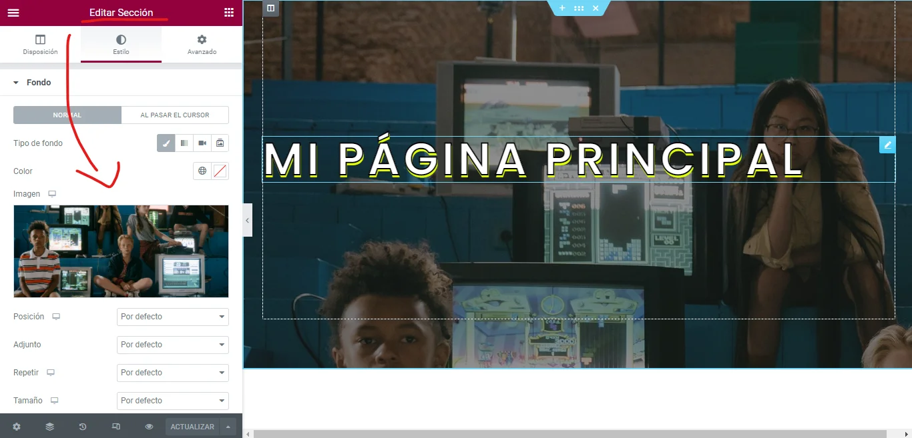
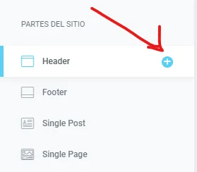
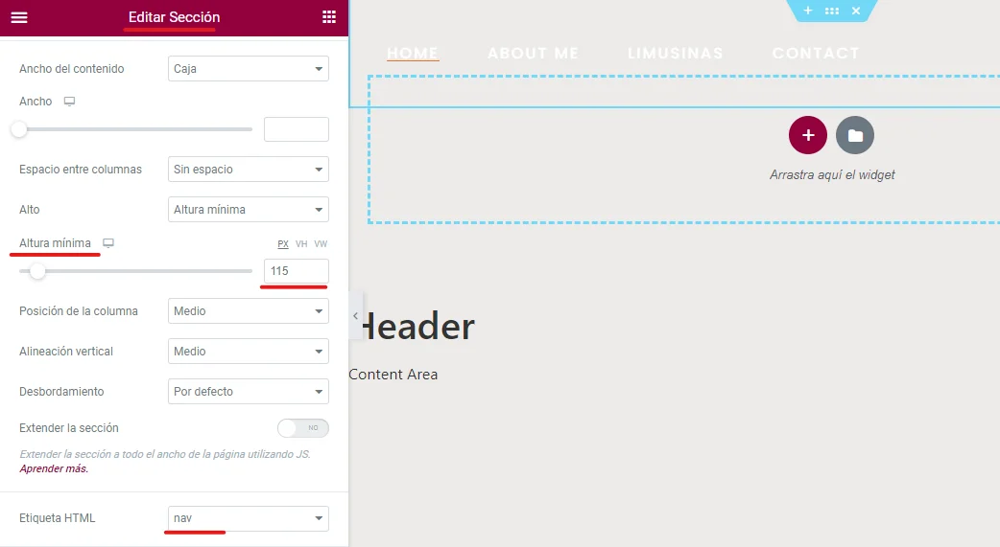
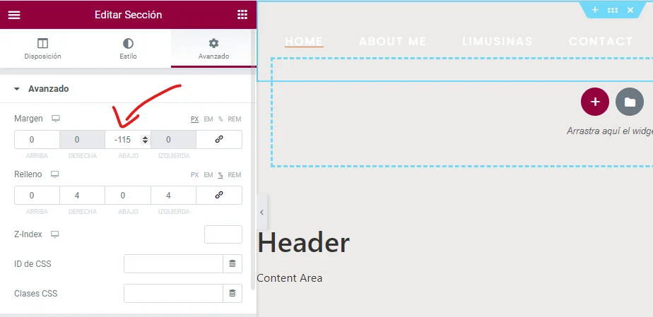
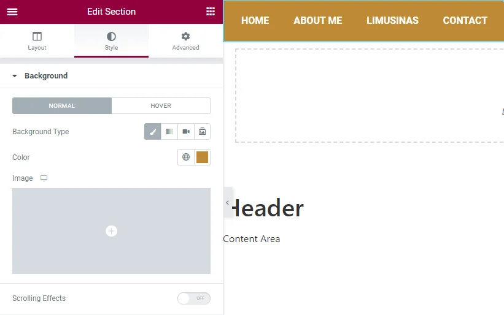
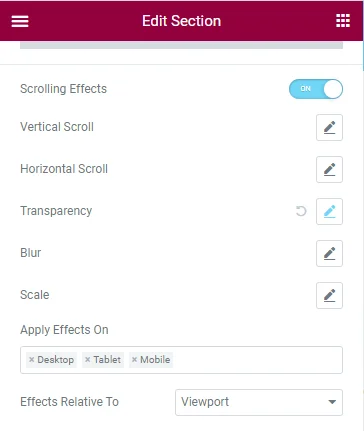
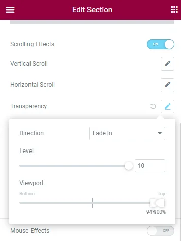

En esta guía rápida aprenderás como crear una navegación transparente en Elementor y posteriormente verás como cambiar el fondo de la navegación al hacer scroll. Antes de iniciar es recomendable que tengas conocimientos básicos de Elementor y la **[versión PRO](https://trk.elementor.com/amorin)**.

## Crear diseño de fondo

Te recomiendo crear una página con el [page layout](https://elementor.com/help/using-elementors-canvas-page-template/) «Elementor Full Width». Posteriormente debes agregar una *sección* con un fondo oscuro. De esta manera nuestra navegación transparente se podrá notar. En mi caso usaré una imagen.

## Crear Navegación

Primero nos dirigimos al maquetador de temas de Elementor en la dirección `Dashboard > Templates > Theme Builder` y creamos un Header si no tenemos uno.

En esta parte puedes empezar a diseñar tu navegación (utiliza un semitransparente para que no exista complicaciones al momento de diseñar).

## Hacerlo transparente

El truco de una navegación transparente esta en su altura mínima.

En la sección contenedora, dirígete a la parte `Disposición > Alto` y seleccionas altura mínima, colocas un valor que permita abarcar todo el contenido de tu navegación. En mi caso 115px.

> Ten en cuenta que una imagen (ejm: Logo) o widget con dimensiones mayores a la navegación agrandará tu Header sin respetar la altura mínima.

En la misma sección dirígete a `Avanzado > Margen` y agrégale un margen inferior con el valor negativo de la altura mínima. En mi caso -115px.

El margin inferior correrá el contenido hacia arriba exactamente la misma altura de la navegación.

Por último, solo queda poner a la sección un fondo transparente y con ello será suficiente. A mí me quedó así:

## Cambiar el color al desplazarse

Si deseas que tu navegación sea un sticky menu, un fondo transparente hará invisible tu header al momento de hacer scroll. Para corregir esto, debemos cambiar los colores de la navegación. En este tutorial te enseñaré un método sencillo en Elementor. Este método no es el único y no es el definitivo para todos los casos.

Para iniciar, debemos asignar un color de fondo a la navegación (este color se mostrará al momento de hacer scroll)

Activa la opción Scrolling Effects y en la opción «Effects Relative To» selecciona Viewport.

En la opción Transparency, en los controles deslizantes yo coloque los valores entre el 94% y 100%.

Ahora cuando bajas el fondo se tornará de otro color:

Y así de sencillo tienes tu navegación transparente que cambia de color…

Como mencioné este no es el único método. Existirán casos donde debas cambiar los colores de los textos, el logo y los iconos. Aquí hay [un video](https://www.youtube.com/watch?v=b5_-LzAtN5A) muy bueno del canal LivingWithPixels donde explica paso a paso como lograr este efecto.

Espero que este tutorial te haya gustado y si es así considera suscribirte al blog, y si tuviste alguna duda puedes dejarme un comentario.
