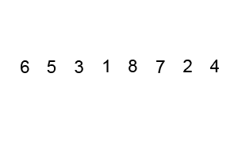
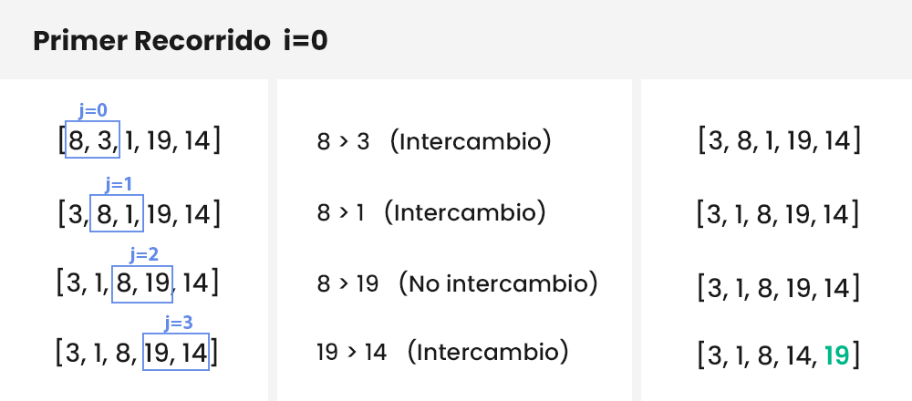
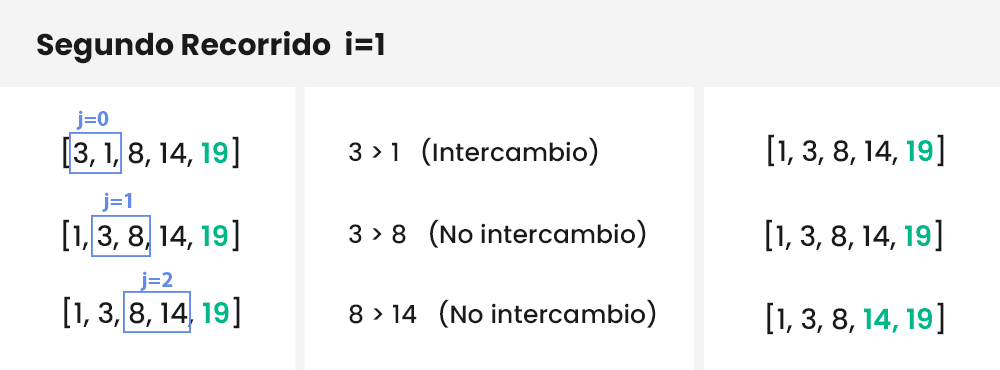
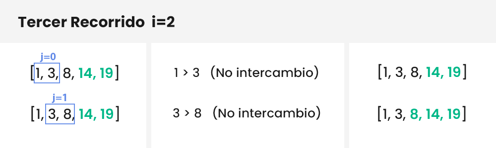
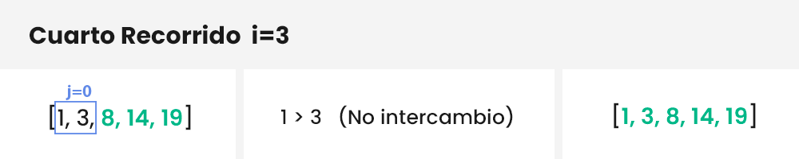

El ordenamiento de burbuja es un algoritmo que te permite ordenar valores de un arreglo. Funciona revisando cada elemento con su adyacente. Si ambos elementos no están ordenados, se procede a intercambiarlos, si por el contrario los elementos ya estaban ordenados se dejan tal como estaban. Este proceso sigue para cada elemento del arreglo hasta que quede completamente ordenado.



***[Animated example on bubble sort
](https://upload.wikimedia.org/wikipedia/commons/c/c8/Bubble-sort-example-300px.gif)**por **Swfung8** bajo **[Creative Commons](https://en.wikipedia.org/wiki/en:Creative_Commons)**.*

Ahora, vamos a entender como podemos programar este algoritmo.

## Entendiendo el proceso

Vamos a ordenar la lista «a» de longitud `n=5`:

```python
a = [8, 3, 1, 19, 14]
```

El algoritmo burbuja se compone de 2 bucles, uno dentro del otro. Llamaremos «bucle hijo» al que se encuentra dentro del otro bucle, es decir del «bucle papá». Estos nombres son solo para que entiendas.

El «bucle papá» realizará el número de iteraciones necesarias para ordenar la lista (las iteraciones necesarias son `n-1` veces) y el «bucle hijo» se encargará de comparar cada elemento con su adyacente y ordenarlos.

Si deseamos ordenar la lista «`a`«, el papá y el hijo comenzarán recorriendo `n-1` veces (es decir, 4 veces), tomando en cuenta, que cuando el padre realice una iteración, el número de iteraciones del hijo se irá reduciendo: comienza con `n-1-0` iteraciones, luego `n-1-1` iteraciones, luego `n-1-2` iteraciones…

Parece muy complicado, ¿cierto? Analicemos esto gráficamente.

En los siguientes gráficos, el bucle padre tiene índice `"i"` y el bucle hijo tiene el índice `"j"`, y recuerda, iniciaremos ambos bucles desde la posición 0 hasta el 3 (casi siempre los bucles inician desde el cero). Si te das cuenta 0, 1, 2 y 3 son igualmente los 4 recorridos que buscamos.

Pasemos al primer recorrido:



**Primer recorrido del bucle padre `i=0`:** el bucle hijo con índice `j` recorre desde 0 a 3 (`n-1`). Como se puede apreciar, cada elemento es comparado con su adyacente. Si están ordenados correctamente se pasa a comparar con el siguiente elemento, y si no están ordenados se realiza un intercambio.



**Segundo recorrido del bucle padre `i=1`:** El bucle hijo con índice `j` reduce su rango, ahora va desde 0 a 2 (`n-1-1`) y ya no se evalúa el último elemento (el 19, de color verde) porque ya esta ordenado. Además, en este recorrido se realiza solamente un intercambio y la lista queda completamente ordenada. Luego agregamos al 14 a la lista de elementos ordenados.



**Tercer recorrido del bucle padre `i=2`:** El bucle hijo con índice `j` sigue reduciendo su rango, con valores desde 0 a 1 (`n-1-2`), porque los últimos elementos ya no se evalúan (porque están ordenados) y se van acumulando.

En este punto ya no existen intercambios, pero el algoritmo va a recorrer hasta `i=n-1`. No importa si la lista esta ordenada o no. En nuestro caso realizará un «Cuarto Recorrido», el cual es innecesario. Por este motivo existe una variación de este algoritmo que evita que se hagan recorridos extra una vez que la lista ya este ordenada (en este artículo te enseñaré a implementar el original y la variación).



**Cuarto recorrido del bucle padre `i=3`:** El bucle hijo con índice `j` solo toma el valor de 0 (`n-1-3`). Verifica que estén ordenados correctamente y el bucle padre llega al final de su recorrido.

Ahora que ya sabemos como funciona el algoritmo de burbuja, pasemos a la práctica. Como les mencioné anteriormente, vamos a implementar el algoritmo original y la variación optimizada de este algoritmo.

## Implementación en Python

Implementación del algoritmo de burbuja en Python:

```python
def ord_burbuja(arreglo):
    n = len(arreglo)

    for i in range(n-1):       # <-- bucle padre
        for j in range(n-1-i): # <-- bucle hijo
            if arreglo[j] > arreglo[j+1]:
                arreglo[j], arreglo[j+1] = arreglo[j+1], arreglo[j]

elementos = [8, 3, 1, 19, 14]
ord_burbuja(elementos)

print(elementos)
```

La salida es la siguiente:

```python
[1, 3, 8, 14, 19]
```

Como puedes apreciar, la lista se ordenó correctamente. Además, también puedes agregar estas 2 líneas de código al algoritmo para observar cada recorrido en la consola:

```python
for i in range(n-1):
    print(f"{i+1} Recorrido (i = {i})")
    for j in range(n-1-i):
        print("j =", j)
        if arreglo[j] > arreglo[j+1]:
            arreglo[j], arreglo[j+1] = arreglo[j+1], arreglo[j]
```

La salida ahora sería la siguiente:

```
1 Recorrido (i = 0)
j = 0
j = 1
j = 2
j = 3
2 Recorrido (i = 1)
j = 0
j = 1
j = 2
3 Recorrido (i = 2)
j = 0
j = 1
4 Recorrido (i = 3)
j = 0

El arreglo es: [1, 3, 8, 14, 19]
```

Puedes empezar a comparar esta salida con la explicación que se hizo al inicio y verás que es exactamente igual.

¡Genial! Creaste tu primer algoritmo de burbuja.

Espera un momento, aún debemos resolver un problema. Si vuelves arriba y te fijas en la imagen del «Tercer recorrido» notarás que el algoritmo ya verificó que no existen intercambios, eso quiere decir que ya se ha verificado que la lista esta completamente ordenada. Sin embargo, el algoritmo sigue dando un «Cuarto Recorrido» innecesario. ¿Qué hubiera pasado si la lista se hubiera ordenado en el «Primer Recorrido»? Simple, al algoritmo le importaría un comino y se iría de largo hasta el «Cuarto Recorrido». Para resolver este problema, debemos realizar una variante de este algoritmo. Vamos a verlo.

## Implementación Optimizada

El algoritmo de burbuja tiene un [rendimiento de O(n^2)](https://www.campusmvp.es/recursos/post/Rendimiento-de-algoritmos-y-notacion-Big-O.aspx). Independientemente de si este o no ordenada la lista, siempre será ese el rendimiento. Por ello, te voy a mostrar una variante optimizada de este algoritmo, que detendrá el bucle si no hubieron intercambios internos.

Puedes crear un archivo aparte o modificar el algoritmo anterior a lo siguiente:

```python
def burbuja_optimus(arreglo):
    n = len(arreglo)

    for i in range(n-1):
        intercambio = False

        for j in range(n-1-i):
            if arreglo[j] > arreglo[j+1] :
                arreglo[j], arreglo[j+1] = arreglo[j+1], arreglo[j]
                intercambio = True

        if intercambio == False:
            break

elementos = [8, 3, 1, 19, 14]
burbuja_optimus(elementos)

print(elementos)
```

Lo único que se agrego es un una variable «intercambio» que nos ayudará a validar si hubo intercambios internos dentro del bucle padre, en el caso de que no existan intercambios el bucle se rompe con un `break`.

Ahora si le agregas las 2 líneas de código para observar cada recorrido en la consola, verás lo siguiente:

```
1 Recorrido (i = 0)
j = 0
j = 1
j = 2
j = 3
2 Recorrido (i = 1)
j = 0
j = 1
j = 2
3 Recorrido (i = 2)
j = 0
j = 1

El arreglo es: [1, 3, 8, 14, 19]
```

Si te fijas atentamente, el bucle padre no llega a dar el «Cuarto Recorrido» innecesario. Hemos optimizado el algoritmo correctamente.

## Realiza pruebas

Te recomiendo hacer algunas pruebas con los 2 algoritmos que implementamos en este post, para que puedas familiarizarte con sus funcionamientos:

-   Prueba colocar una lista semiordenada como: `[2, 1, 3, 5, 4]`. Y luego observa que sucede cuando lo ordenamos con el algoritmo original y con el algoritmo optimizado.

Además, este algoritmo no esta limitado solamente a números sino que también puedes ordenar nombres o caracteres alfabéticamente. Por ejemplo, si cambiamos los elementos a estos:

```php
elementos = ["Diego", "Raissa", "Alvaro", "Thalia", "Nayeli"]
burbuja_optimus(elementos)

print(elementos)
```

Como salida obtendrás todos los nombres ordenados alfabéticamente:

```json
['Alvaro', 'Diego', 'Nayeli', 'Raissa', 'Thalia']
```

## Conclusión

Aprendiste sobre el funcionamiento del algoritmo burbuja y como programarlo en Python. Entender la lógica que hay detrás de este algoritmo es útil para poder implementarlo en cualquier otro lenguaje de programación.

Quiero aclarar que este algoritmo no es el mas eficiente a la hora de ordenar. Existen mejores alternativas como «[Ordenamiento por Selección](/ordenamiento-seleccion-python/)«, «Quicksort» o «Ordenamiento por Inserción».

Diego, entonces, ¿aprendí esto por las puras?

Claro que no, porque a veces nos retan a ordenar una lista de elementos y lo que haces por intuición es algo parecido al algoritmo burbuja. Recorres cada elemento y lo comparas con su adyacente, comparando e intercambiando, e iteras este proceso hasta que quede ordenado. Ahora ya sabes que hacerlo de esta manera no es la mejor opción si estas buscando mejorar el rendimiento de tu programa. También podrás identificar algoritmos de burbuja, y así, optimizarlos con alternativas mas eficaces. O simplemente estarás preparado para el examen de la universidad.

No olvides suscribirte al blog si deseas aprender mas de programación en Python y un poco de desarrollo personal.
