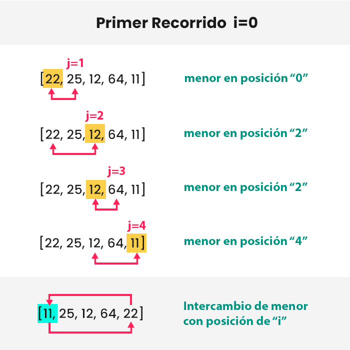
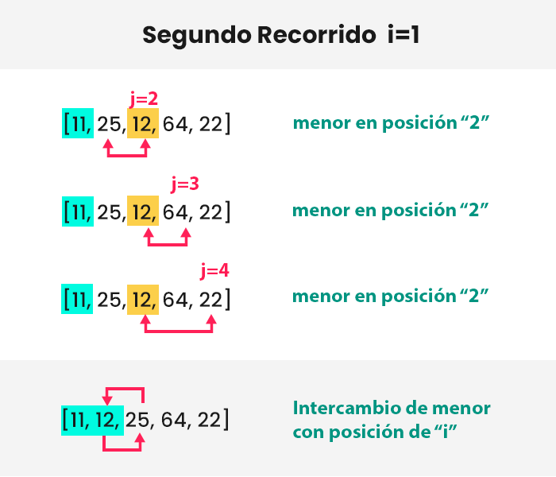
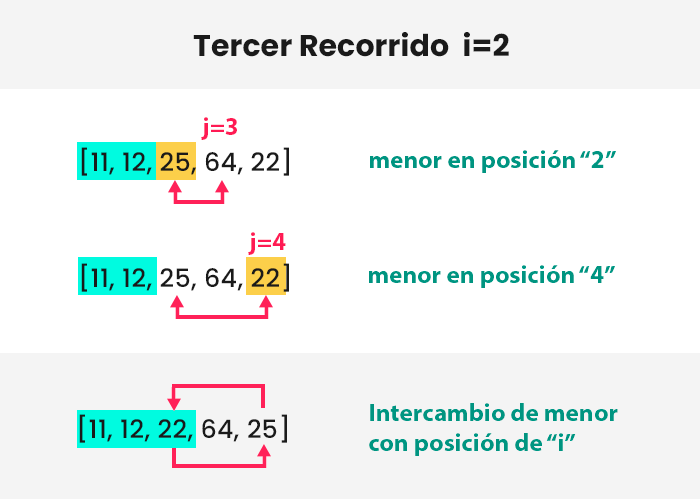
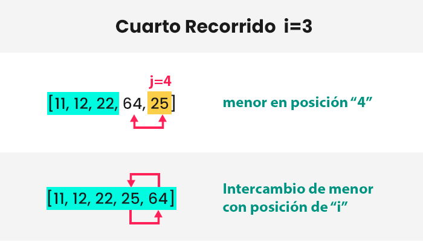

El ordenamiento por selección es un algoritmo que te permite ordenar los valores de una lista, y tiene una complejidad de `O(n^2)`. Y también, cabe señalar que es más eficiente que el [ordenamiento burbuja](/ordenamiento-burbuja-python/) porque realiza intercambios de máximo una vez por cada recorrido, mientras que en burbuja realizamos de cero a más intercambios por recorrido.

> Si desea saltarse la teoría y ver el código, diríjase a la sección «Implementación en Python».

## Entendiendo el proceso

Su funcionamiento es sencillo, tenemos la siguiente lista desordenada:

```python
lista = [3, 1, 4, 2]
```

Primero buscamos al mínimo elemento de la lista (el 1). Luego lo intercambiamos con el primer elemento (el 3). Y obtendrías:

```python
lista = [1, 3, 4, 2]
```

Segundo, otra vez buscamos al mínimo elemento de la lista, pero esta vez ignorando al primer elemento porque esta ordenado. El mínimo es el 2. Intercambiamos con el segundo elemento (el 3). Obtienes:

```python
lista = [1, 2, 4, 3]
```

Tercero, buscamos al menor de la lista, ignorando al primero y segundo elemento porque están ordenados. El mínimo es el 3. Intercambiamos con el tercer elemento (el 4). Obtienes la lista ordenada:

```python
lista = [1, 2, 3, 4]
```

Así de sencillo funciona este algoritmo… Ahora analicemos este proceso de manera técnica.

## ¿Cómo programarlo?

Tienes la siguiente lista «a» con `n=5` elementos:

```python
a = [22, 25, 12, 64, 11]
```

La programación consta de 2 bucles, uno dentro del otro. Llamaré «bucle hijo» al bucle que se encuentra anidado al interior del otro bucle, es decir en el «bucle padre» (Los nombres son referenciales para que me entiendas). El «bucle padre» realizará el `n-1` recorridos, que son las iteraciones necesarias para ordenar la lista, y el “bucle hijo” se encargará de buscar al menor elemento de la lista en cada recorrido de su papá.

Si queremos ordenar la lista «`a`«, el número de recorridos del padre son 4 veces (`n-1`, recuerda). Cabe mencionar que los bucles casi siempre inician desde la posición 0, entonces recorreremos desde el 0 hasta el 3 (0, 1, 2, 3, son igualmente los 4 recorridos que necesitamos).

Analicemos el proceso gráficamente. El bucle padre tendrá índice «`i`» y el bucle hijo índice «`j`«. Y el posible menor de la lista será resaltado en amarillo. Veamos el primer recorrido:



**Primer recorrido del bucle padre `i=0`:** Al inicio, cuando programemos el algoritmo por selección debemos asignar al primer elemento como «el menor» (resaltado en amarillo) por *default*. Luego, el bucle hijo (índice «`j`«) será el encargado de hallar al verdadero valor menor de la lista; una vez se encuentra la posición del menor, en nuestro caso en la posición 4, lo intercambiamos con la posición `i=0` del padre. De esta forma obtenemos a nuestro primer elemento ordenado, el 11 (resaltado de celeste).

**Atención:** En los siguientes recorridos el bucle hijo no buscará en los elementos resaltados de celeste porque ya están ordenados.



**Segundo recorrido del bucle padre `i=1`:** Asumimos que el menor es el primer elemento (obviando elementos ordenados), es decir, 25; pero el bucle hijo inmediatamente encuentra un nuevo valor menor que es el 12, en posición 2, luego sigue recorriendo la lista y no encuentra otro elemento inferior. Entonces, intercambiamos la posición del menor (que es 2) con la posición de `i=1` del padre.



**Tercer recorrido del bucle padre `i=2`:** Asumimos que el menor es 25, luego el hijo encuentra al 22 en posición 4. Intercambiamos la posición 4 con la posición de `i=2` del padre.



**Cuarto recorrido del bucle padre** `**i=**`**`3`:** El menor inicia siendo 64 e inmediatamente se haya el 25 en posición 4. Intercambiamos la posición 4 con la posición `i=3` del padre.

Si te fijas atentamente, en cada recorrido resaltaba solo un nuevo elemento de color celeste. Sin embargo, en el último recorrido (que es el cuarto) resaltamos los 2 últimos, porque si solo pintamos un elemento, nos quedaría solo el 64. Este elemento se asume que es el mayor y el último de la lista; por ello evitamos el «quinto recorrido» y solo recorremos `n-1` veces.

## Implementación en Python

Si ya entiendes el proceso, entonces, entender el código te resultará pan comido. Veamos la implementación en Python:

```python
def ord_seleccion(arreglo):
    for i in range(len(arreglo) - 1):        # <-- bucle padre
        menor = i # primer elemento por default será el mínimo

        for j in range(i + 1, len(arreglo)): # <-- bucle hijo
            if arreglo[j] < arreglo[menor]:
                menor = j

        if menor != i:
            arreglo[menor], arreglo[i] = arreglo[i], arreglo[menor]

a = [22, 25, 12, 64, 11]
ord_seleccion(a)

print(a)
```

La salida sería la siguiente:

```python
[11, 12, 22, 25, 64]
```

La lista «a» esta ordenada. ¡Genial!, programaste el algoritmo de ordenamiento por selección en Python.

## Conclusión

Aprendiste la lógica que existe en el ordenamiento por selección, y esto es lo verdaderamente importante porque podrás aplicar la lógica a cualquier lenguaje de programación, no solo en Python. Lo importante es que comprendas el funcionamiento, si entendiste eso, con eso me basta.

## Referencias

-   [Selection sort – Wikipedia](https://en.wikipedia.org/wiki/Selection_sort)
-   [Selection Sort Algorithm Explained – Derrick Sherrill](https://www.youtube.com/watch?v=4CykZVqBuCw)
