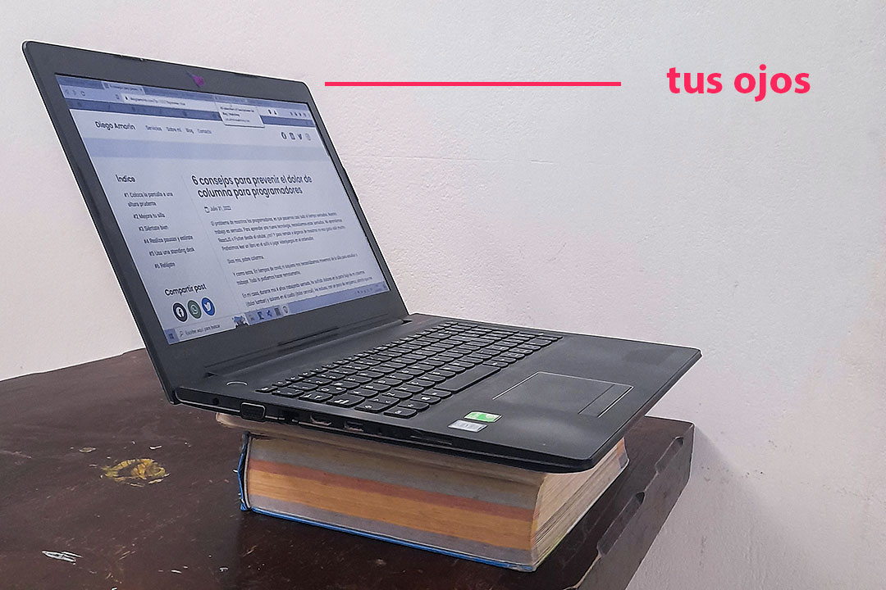
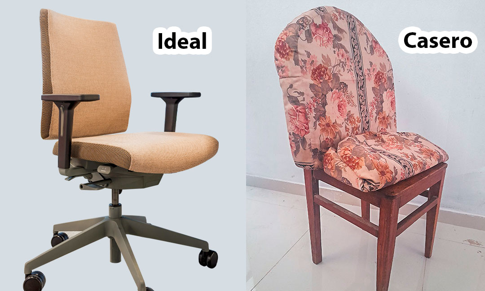
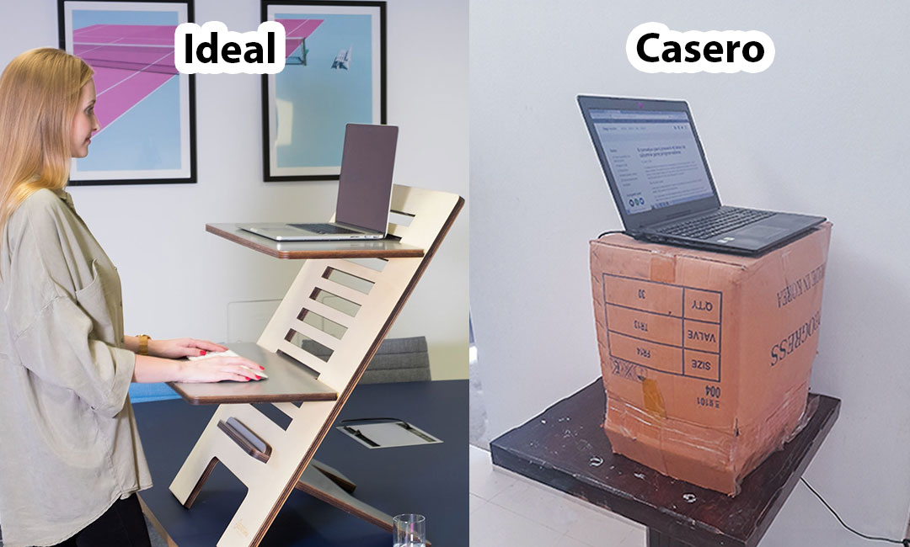
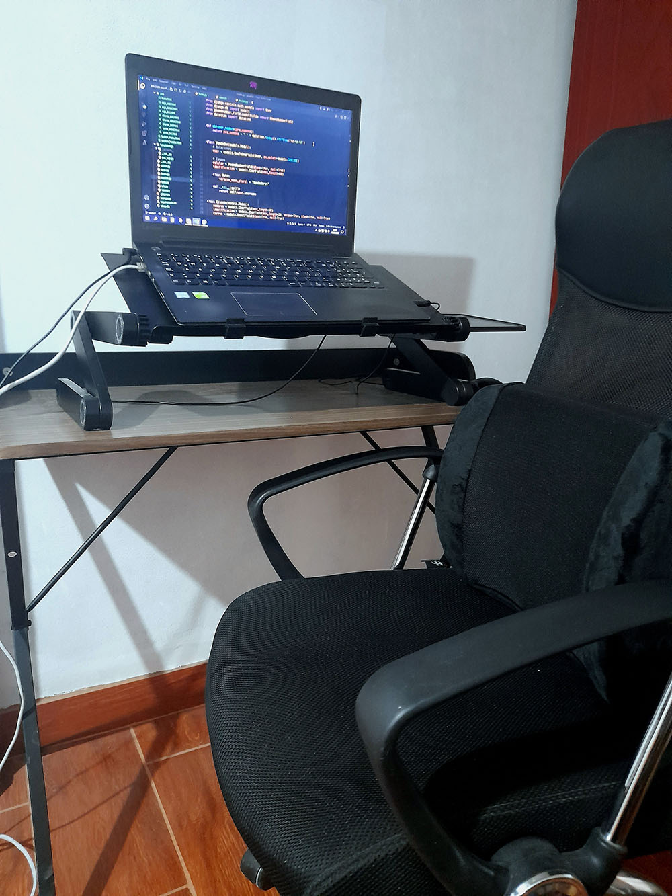

El problema de nosotros los programadores es que pasamos casi todo el tiempo sentados. Nuestro trabajo es sentado. Para aprender una nueva tecnología, necesitamos estar sentados. No aprendemos [React](https://es.reactjs.org) o [Flutter](https://flutter.dev) desde el celular, ¿no? Y para remate a algunos de nosotros no nos gusta salir a la calle. Preferimos leer un libro en el sofá o jugar videojuegos en el ordenador.

Dios mío, pobre columna.

Y si nos vamos mas allá. En tiempos de covid, ni siquiera necesitábamos movernos de la silla, podíamos estudiar y trabajar remotamente.

En mi caso, durante mis 4 años trabajando sentado, he sufrido dolores en la parte baja de mi columna (dolor lumbar) y dolores en el cuello (dolor cervical). ¡Son jodidamente dolorosos!

En este artículo, aprenderás a **prevenir** estos dolores de columna. Te ofreceré soluciones creativas que me ayudaron a eliminar estos dolores y que tú puedes implementar hoy mismo. Cabe mencionar que si ya estas sufriendo de estos dolores, es preferible que vayas con un fisioterapeuta. Este profesional te ofrecerá una solución mas personalizada. Aquí nos enfocaremos en la prevención.

Pasemos a la primera recomendación:

## 1\. Eleva la pantalla

Para evitar los dolores en el cuello, te recomiendo elevar tu pantalla hasta que la parte superior de esta llegue a la altura de tus ojos.

Si tienes una laptop y un poco de dinero, te recomiendo invertir en un *cooler* para elevar la pantalla. En caso de que uses monitor de PC o no tienes dinero, puedes usar libros para elevar tu monitor o tu laptop.

Los dolores cervicales se generan por el estrés que surge al inclinar tu cuello por ver una pantalla que se encuentra demasiado abajo. Después de elevar tu pantalla con la ayuda de los libros o el *cooler*, notarás en los siguientes días como se reducirá el dolor en el cuello y en algunos casos desaparecerá. Como me sucedió a mí.

## 2\. Mejora tu silla

Por mucho tiempo usé una silla de madera que poco a poco me hizo heridas en el trasero. Literal, no podía ni sentarme (y no seas malpensado).

Para evitar este problema, la mejor opción es comprar una [silla *gamer*](https://www.google.com/search?q=silla+gamer), o también, una [silla de ejecutivo](https://www.google.com/search?q=silla+de+ejecutivo). Estas sillas están diseñadas ergonómicamente y tienen una superficie acolchonada para apoyar el trasero.

<AdInArticle />

Si no tienes la oportunidad de obtener una de estas joyitas, es recomendable que uses la silla mas acolchonada que tengas. Y si tampoco, tienes una silla así. Puedes colocar los cojines de un sofá o frazadas en la silla que usarás para trabajar, como lo hago yo algunas veces.

*A la izquierda silla rodante de [SCOPIC LTD](https://unsplash.com/@scopicltd?utm_source=unsplash&utm_medium=referral&utm_content=creditCopyText) en [Unsplash](https://unsplash.com/es?utm_source=unsplash&utm_medium=referral&utm_content=creditCopyText)*

Recuerda que colocar cojines a tu silla es una solución temporal, mas adelante tendrás que invertir en una buena silla.

Ahora, en el caso de que quieras comprarte una silla *gamer*, asegúrate que venga con su [cojín lumbar](https://www.google.com/search?q=cojin+lumbar). Muchos de ellos lo tienen. Y si optas por una silla de ejecutivo o ya posees una, considera comprarte un cojín lumbar para que tu espalda baja pueda descansar y no cargue con todo el peso de tu cuerpo superior.

Al final de este post, te mostraré mi *setup* actual. Por ahora me estoy enfocando en soluciones económicas al alcance de todos. Sigamos…

## 3\. Siéntate bien

Una silla bonita no servirá de nada si te sientas de manera incorrecta.

Para mi es complicado explicarte como deberías sentarte a través de este post. Por esta razón, te dejo 2 videos donde te explican como sentarte correctamente.

-   [Como sentarse correctamente](https://www.youtube.com/watch?v=e9_9lNfA7mo) por Fisioterapia a tu Alcance.
-   [¿Cómo sentarse bien en el trabajo?](https://www.youtube.com/watch?v=x5BI-dPT8GI) por FisioOnline.

Ambos videos usan una buena silla y uno de ellos te enseña como usar el cojín lumbar.

## 4\. Realiza pausas y estírate

Como era de esperarse, tomar descansos puede ayudar a prevenir los dolores en la espalda.

Existen muchas formas de determinar cuando y por cuanto tiempo deberías tomar un descanso en el trabajo. Una técnica muy popular es: [pomodoro](https://es.wikipedia.org/wiki/T%C3%A9cnica_Pomodoro). Si no sabes que demonios es, no te preocupes. Esta técnica básicamente fragmenta tu tiempo entre minutos de trabajo y minutos de descanso. Algo bueno para tu espalda, pero, perjudicial para tu concentración… Lo ideal es trabajar por tiempos mas prolongados (por horas), porque de esta forma, puedes obtener una concentración absoluta y rendir mejor. Esto incluye tiempos de descanso mas largos.

Si te gustaría profundizar más en este tema, te recomiendo un videazo de Pablo Sánchez donde explica cuando es necesario usar pomodoro y cuando no lo es:

-   [¡Pomodoro es un asco!](https://www.youtube.com/watch?v=UZoInEHRB0U) por Pablo Sánchez

Recuerda no usar demasiado el celular cuando te encuentres descansando (así tu mente también podrá relajarse). En cambio puedes realizar estiramientos para soltar tu cuerpo y eliminar la tensión.

## 5\. Usa una standing desk

Existen momentos donde la vida te obligará a mantenerte pegado a la silla y no habrá oportunidad de descansar. Tu espalda empezará a tensarse y luego te empezará a doler, aún si usas los 3 primeros consejos. Porque al final eres un humano, ¡no una máquina!

Para los momentos donde no te queda de otra que seguir trabajando, tu mejor aliada será una escritorio de pie o [standing desk](https://www.google.com/search?q=standing+desk). Esta herramienta te ayudará a elevar tu laptop o PC para que puedas trabajar de pie y así tu lumbar descanse un poco.

<AdInArticle />

Como recomendación compra un escritorio de pie regulable. Para que puedas alternar entre trabajo sentado y de pie, y así, evites comprar el *cooler* o usar los libros para regular la altura de tu pantalla.

El precio de la standing desk es relativamente alto, y, si no tienes la oportunidad de conseguir una, tengo una idea para ti (esto funcionará solo si tienes laptop). Busca una caja grande y apóyala en tu mesa, luego coloca tu laptop encima. La caja debe ser lo suficientemente ancha para elevar tu laptop y mouse, y lo suficientemente alta para poder trabajar parado.

*En la izquierda foto de [Standsome Worklifestyle](https://unsplash.com/@standsome?utm_source=unsplash&utm_medium=referral&utm_content=creditCopyText) en [Unsplash](https://unsplash.com/es?utm_source=unsplash&utm_medium=referral&utm_content=creditCopyText)*

## 6\. Relájate

Por si no lo sabías, las dolencias en la espalda también son generadas por el estrés. Hace que tus músculos se contraigan y te duelan.

Te recomiendo que empieces a realizar algún deporte o saliendo a bailar, algo que sea al aire libre o que se encuentre fuera de tu baticueva. El objetivo es relajarse. No recomiendo que juegues videojuegos en tu ordenador porque tendrás que seguir sentado, y, algunos juegos, provocan el estrés que tratamos de evitar.

Yo no soy de salir mucho, pero decidí que cada fin de semana o cada quincena tenía que salir a jugar fútbol. Y así lo hice.

## Mi setup

Tengo una laptop apoyada en un híbrido de *standing desk* y *cooler*. Esta herramienta me sirve para regular la altura superior de mi pantalla a la altura de mis ojos. Cuando estoy cansado de estar sentado lo elevo y me pongo a trabajar de pie. Además, tengo una silla acolchonada (de tipo ejecutiva) para evitar heridas en las nalgas y un cojín lumbar que me ayuda a descansar mi espalda baja.

Todas estas herramientas las conseguí poco a poco, anteriormente usaba los métodos caseros que te mostré en el post. Puedes usar cualquiera. No hay excusas para no cuidar tu columna.

Espero este artículo te mostré formas de evitar los dolores de espalda, que a veces, no nos permiten trabajar tranquilos. Considera suscribirte para obtener consejos por correo de un programador en python.
