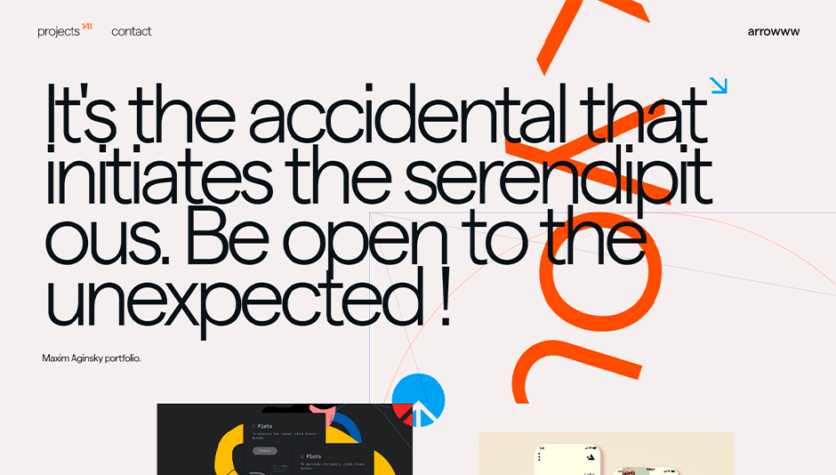
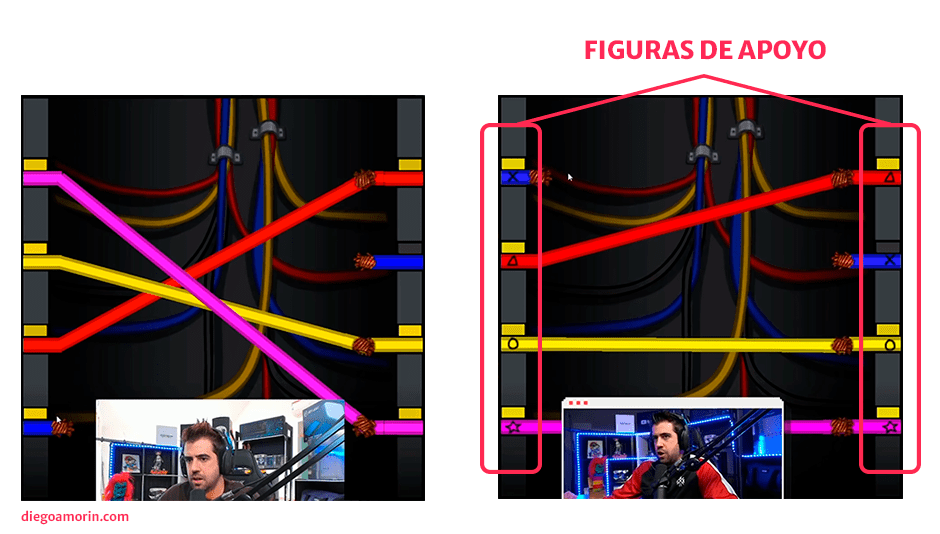
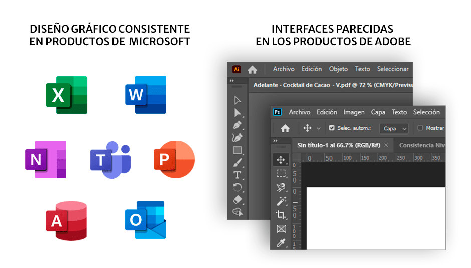
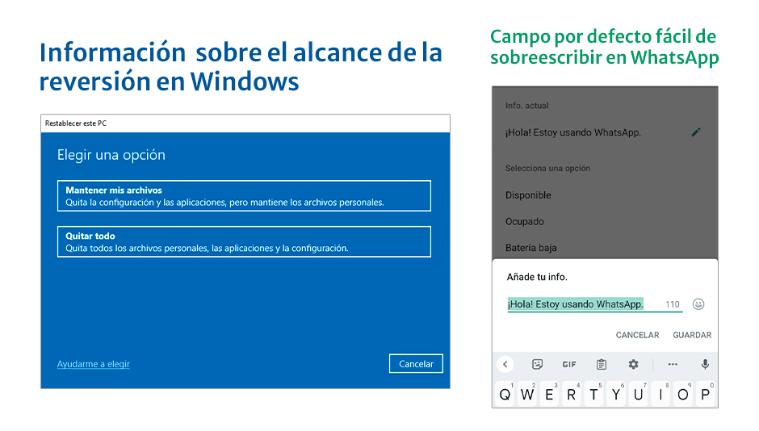
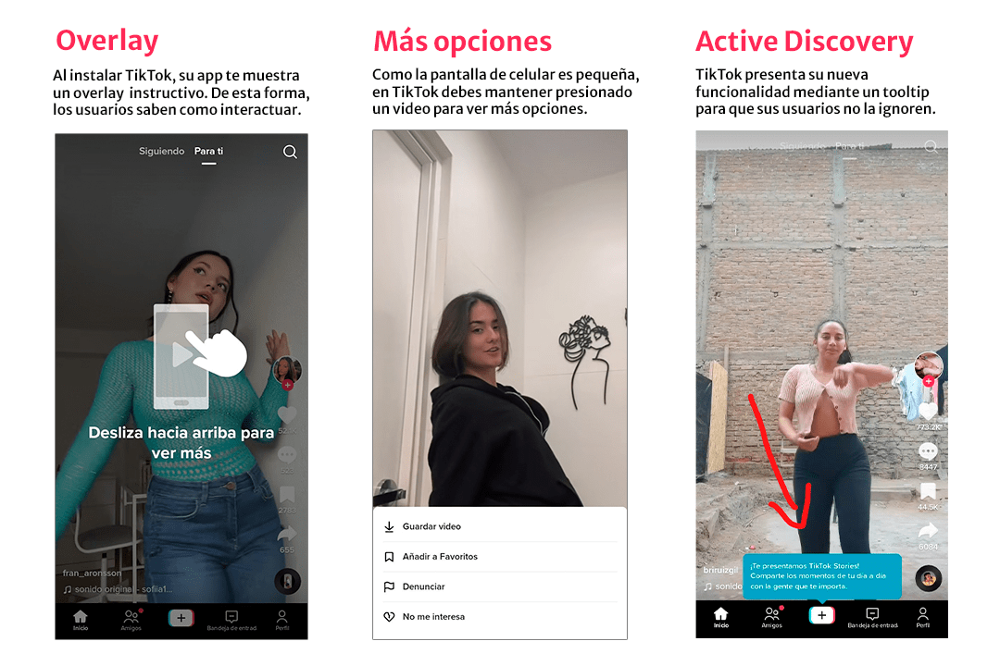
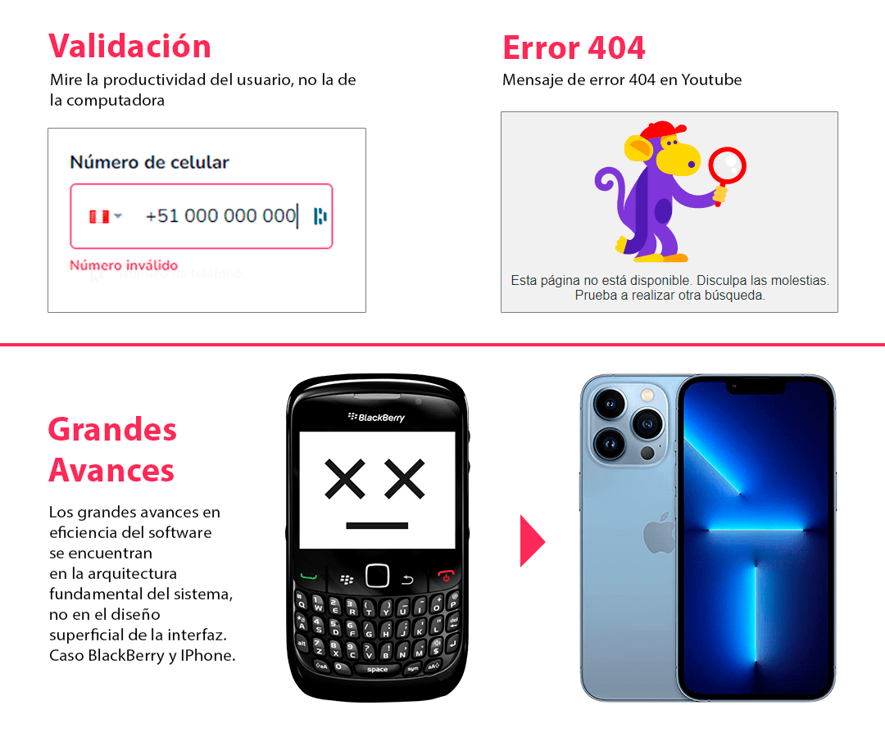
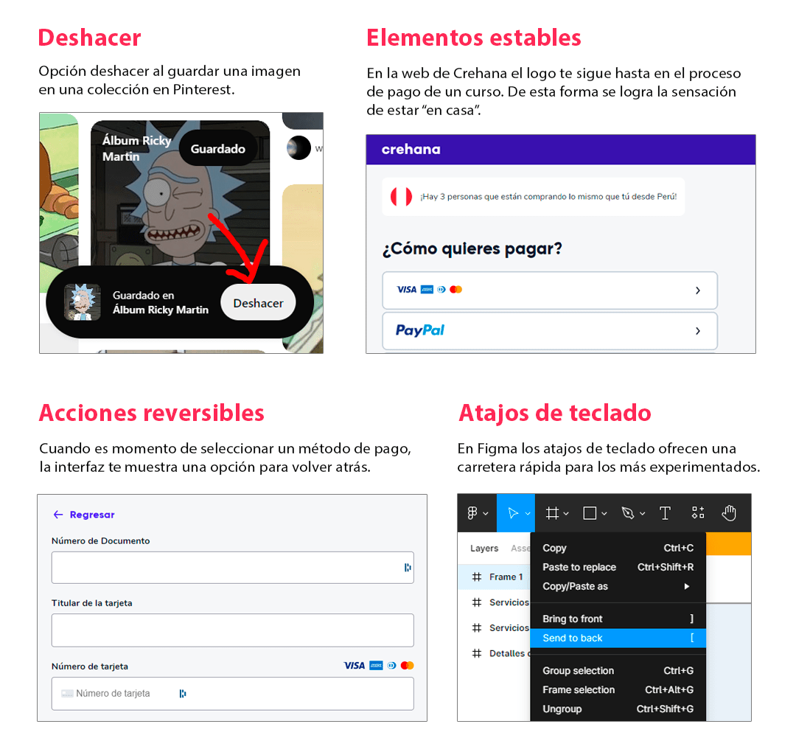
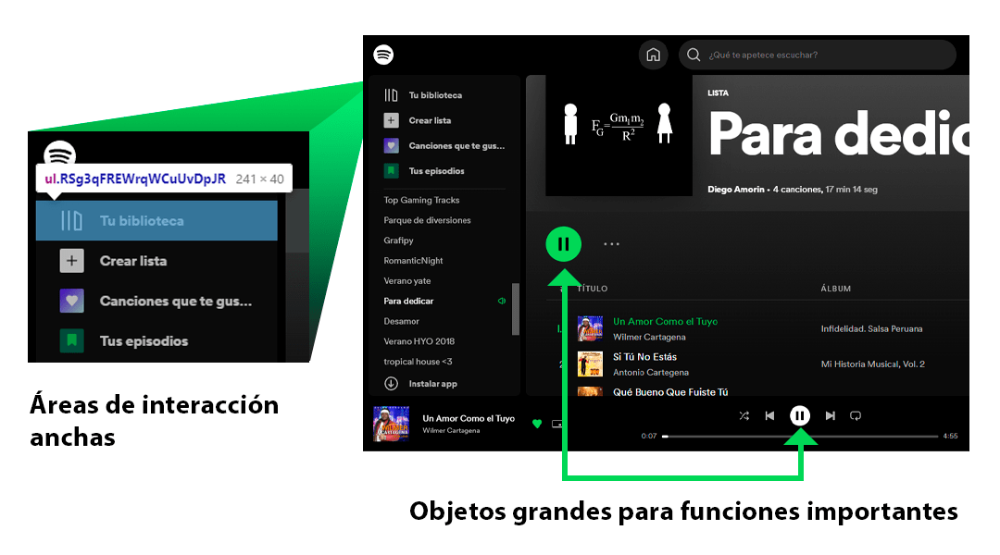
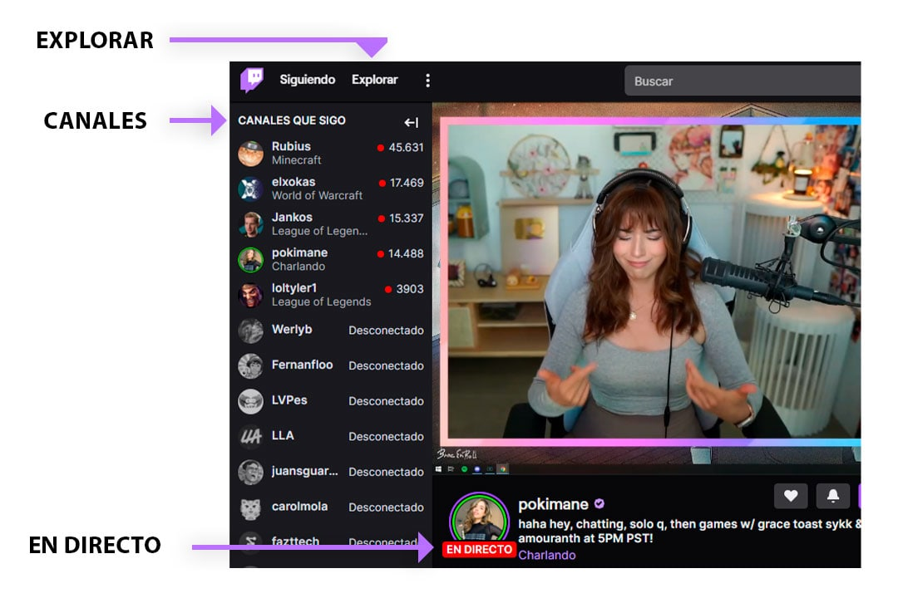
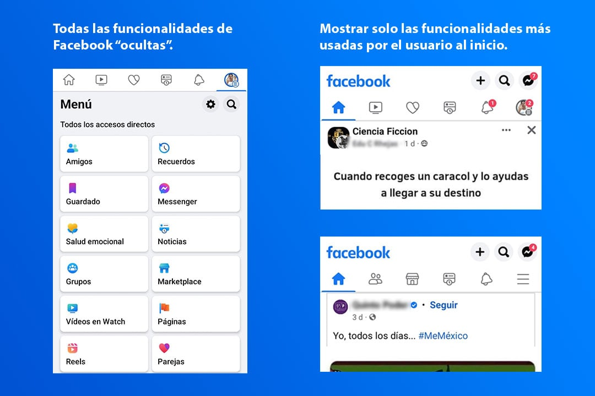

Los siguientes principios te ayudarán a implementar interfaces efectivas, y mejorarás la UI/UX de tus aplicaciones de escritorio, web, celular y cualquier otro dispositivo de Internet.

Anteriormente las heurísticas de Tognazzini contaban con 16 principios pero hace un tiempo se actualizaron y ahora cuenta con 19 principios. El principio llamado «Daltonismo» ahora se llama «Color» e incluye más que solo daltonismo. Los 3 principios nuevos son la Estética, el Descubrimiento y la Simplicidad y por si esto no fuera poco, tenemos subprincipios en cada principio.

> Si estas interesado en más principios para mejorar la usabilidad de tus interfaces, también te recomiendo las «[10 heurísticas de Jakob Nielsen](/10-principios-usabilidad/)«

## Sobre Tognazzini

[Bruce Tognazzini](https://en.wikipedia.org/wiki/Bruce_Tognazzini) (apodado «Tog») es un consultor y diseñador de usabilidad estadounidense. Es socio en la firma Nielsen Norman Group, empresa que ofrece consultoría especializada en UX/UI, y donde se encuentran trabajando otros capos de la usabilidad como Jakob Nielsen y Donald Norman.

En 1978 fue contratado por Steve Jobs para diseñar la primera interfaz humana de Apple. Con este antecedente podemos darnos una idea de que no hablamos de cualquier persona. Un dato más. También trabajó en Sun Microsystems, la empresa que desarrolla y comercializa el lenguaje de programación Java.

Lo que estás a punto de leer son los principios de Bruce Tognazzini basado en la publicación original: [First Principles of Interaction Design](https://asktog.com/atc/principles-of-interaction-design/). Los principios fueron traducidos del original, mientras que la descripción de cada uno de ellos, es una interpretación propia, adaptada al contexto de los productos modernos.

## 1\. Estética

**Principio: El diseño estético debe dejarse en manos de los que están capacitados y son expertos en su aplicación: Diseñadores gráficos/visuales**

Básicamente te dice que si no conoces de diseño gráfico, es mejor que busques a alguien que si sepa.

**Principio: La moda nunca debe triunfar sobre la usabilidad**

Podemos sentirnos tentados por implementar la última tendencia de diseño o de moda en nuestra interfaz, pero que sea nuevo no significa que sea bueno. Recuerda que la nueva moda a veces puede generar obsolescencia artificial y hacernos pensar que estamos anticuados. Esto no significa que no puedas hacer grandes cambios estéticos y de comportamiento, solo recuerda que los cambios deben mejorar la productividad del usuario y no perjudicarla.

Existen muchos sitios web diseñados a base de tendencias, aquí puedes ver [una lista](https://elementor.com/blog/web-design-trends/). Pero si a alguien le funciona, no necesariamente te funcionará a ti también, recuerda que tus objetivos y los de tus usuarios, son diferentes.

Ejemplo. Arrowww tiene un sitio web basado en la tendencia «Off the grid». Un estilo que puede ayudar a alcanzar sus objetivos, pero, ¿este estilo te ayudará a alcanzar los tuyos?

*Captura extraída de [arrowww.space](https://arrowww.space/)*

**Principio: El usuario prueba el diseño visual tan minuciosamente como el diseño de comportamiento**

Es recomendable realizar una prueba de usuario tras realizar cambios estéticos, comparando si el nuevo diseño resulta mejor que el anterior. Se debe verificar que la capacidad de aprendizaje, la satisfacción y la productividad hayan mejorado o al menos se hayan mantenido igual.

## 2\. Anticipación

**Principio: Poner a disposición del usuario toda la información y las herramientas necesarias para cada paso del proceso**

El sistema debe anticiparse a las necesidades del usuario. Muestra la información y elementos esenciales de forma visible. De esta forma evitarás que el usuario deje de usar la pantalla actual para completar su tarea.

La mejor forma de anticiparse a las necesidades del usuario es conociendo la tarea que va a realizar. Realiza pruebas que te permitan saber si tus usuarios están cumpliendo sus objetivos; además, sabrás si los elementos y la información que has proporcionado fueron realmente útiles.

Si un usuario no logra encontrar lo que busca o completar una tarea, tal vez nunca más vuelva.

Aquí un ejemplo de la plataforma de educación online, Crehana. Lo primero que yo haría es ingresar a la plataforma y retomar un curso. Los diseñadores se anticiparon y me muestran el último curso que estuve llevando:

*Captura extraída de [crehana.com](https://www.crehana.com/)*

## 3\. Autonomía

**Principio: El ordenador, la interfaz y el entorno de la tarea «pertenecen» al usuario, pero la autonomía del usuario no significa que abandonemos las reglas.**

A las personas les gusta tener cierta libertad en el sistema, pero también le gusta los límites (los límites ofrecen seguridad). Recuerda encontrar un buen punto medio.

**Principio: Permitir a los usuarios tomar sus propias decisiones, incluso aquellas estéticamente pobres o conductualmente menos eficientes.**

A las personas nos gusta personalizar nuestras cosas, elegimos como se comportarán nuestros teclados y como verán nuestras interfaces (incluso si para ti son bonitas, pero para tus amigos les parezca una aberración). Privar de esta autonomía a los usuarios puede ocasionar frustración o enojo.

**Principio: Ejercer un control responsable**

Ofrecer libertad al usuario no significa que debas dejarle todo a su suerte. Es necesario que los desarrolladores tomen el control y ayuden a encaminarlos a sus tareas habituales.

**Principio: Utilizar mecanismos de estado para mantener a los usuarios conscientes e informados**

Los mecanismos de estado son vitales para ofrecer información necesaria que los usuarios usarán para responder adecuadamente a situaciones cambiantes.

Puedes aplicar estos mecanismos mostrando la «información de carga» en una tarea, resaltando la navegación cuando se encuentran en una página específica; y en interfaces con información jerárquica, será una buena idea considerar los [breadrumbs](https://es.wikipedia.org/wiki/Miga_de_pan_\(inform%C3%A1tica\)).

**Principio: Mantenga la información de estado actualizada y fácil de ver**

Coloca al alcance de la vista los mecanismos de estado para que el usuario sepa en donde y en que situación se encuentra.

**Principio: Asegúrese de que la información de estado sea precisa**

Talvez te habrá ocurrido que tu navegador te muestra «Quedan 10min para la descarga» y en realidad falta como media hora. En mi caso mi celular me muestra «Tiempo de batería estimado 1 día» y solo dura como 2 horas, usándolo para leer, nada de videojuegos.

Trata de ser lo más exacto posible a la hora de informar algo, sino el usuario se sentirá engañado. Y si te preguntas porque Bruce nos pide esto, si ni el mismo Google o Apple no pueden ser exactos a la hora de informar. Pues porque existen alternativas mejores, como el Windows al actualizarse: «Este proceso podría demorar varios minutos»; o como mi actual Samsung que muestra la barra de actualización y evita mostrar mensajes que resulten inexactos.

<AdInArticle />

## 4\. Color

### 4.1. Daltonismo

**Principio: Cada vez que use colores para transmitir información en la interfaz, también debe usar señales secundarias claras para transmitir la información a aquellos que no pueden ver los colores presentados.**

El 10% de los hombres y menos del 1% de las mujeres sufren de algún tipo de daltonismo. Adapta la interfaz para evitar que surjan problemas de usabilidad.

Muchos videojuegos poseen la opción de «modo para daltónicos» que ayuda a distinguir los colores en la interfaz. Por ejemplo, en el videojuego Among Us, hay un reto de conectar cables con sus respectivos colores, y con el tiempo agregaron algunas formas geométricas como apoyo visual para daltónicos.

*Antes y después de actualización de Among Us | Capturas extraídas del canal [Auron](https://www.youtube.com/playlist?list=PL2gzS7m52Ib4kTqqCicQl_pUmxJO-yWed) en YouTube*

**Principio: Pruebe su sitio web para ver lo que ven las personas daltónicas**

Existen algunas herramientas online que lo pueden apoyar en el testeo de su sitio web para daltónicos.

### 4.2. El color como elemento vital de la interfaz

**Principio: No evite el color en la interfaz solo porque no todos los usuarios pueden ver todos los colores.**

Los colores transmiten mensajes, y no será necesario retirar el color solamente porque las personas daltónicas no la pueden visualizar; simplemente puedes aplicar los principios mencionados anteriormente.

**Principio: No elimine ni abrume las señales de color en la interfaz debido a una moda pasajera de diseño gráfico.**

Este sub-principio realza el primer principio de «Estética».

## 5\. Consistencia

### 5.1. Niveles de Consistencia

**Principio: La importancia de mantener una coherencia estricta varía según el nivel.**

A continuación, verás una lista ordenada de niveles de consistencia. Esta lista va desde las normas más flexibles y sencillas, a las más «religiosas» o que si o si deben cumplirse.

1.  Consistencia de alto nivel
    -   Consistencia de la plataforma: Ser consistentes con las directrices o normas escritas, y también, con las que no están escritas, es decir, las que adhiere la comunidad.
    -   Coherencia interna: Mantenga una apariencia general en todos sus productos y servicios. Comunica la marca y permite que la adopción de todos sus productos y servicios sean familiares y fáciles de reconocer.
2.  Coherencia en un conjunto de productos
    -   Todos tus productos deben mantener cierta familiaridad, tanto en sus aspectos gráficos y como en su funcionalidad. Existen muchas familias de productos que aplican este principio, por ejemplo, esta Adobe con las herramientas de diseño, Google con sus servicios online y Microsoft con Office.
3.  El aspecto general de una sola aplicación o servicio: splash screen, elementos de diseño, etc.
    -   El diseñador visual debe establecer un lenguaje visual bien pensado. Los comportamientos de los usuarios deben ser transferibles en todo el producto.
4.  Pequeñas estructuras visibles, como iconos, símbolos, botones, barras de desplazamiento, etc.
    -   La apariencia de estos elementos debe diseñarse a base de estándares o inspirado en el mundo real; de esta forma, los usuarios no se romperán la cabeza intentando entender para que sirve un cada elemento: corazón para like, equis para cerrar, tacho para eliminar, etc.
5.  Estructuras invisibles
    -   Existen algunos controles que son invisibles en las interfaces, por ejemplo, los cursores para agrandar o achicar una ventana de Windows. Si abusas de estas estructuras invisibles puedes obligar a tus usuarios a pedir auxilio a Google, o talvez, ni sepan que tu herramienta existe. Para que te des una idea de este problema, algunos sitios hacen invisibles los scrolls horizontales y verticales, algunos usuarios tendrán problemas al desplazarse y otros pensarán que el sitio tiene poco contenido; para remediarlo alternativamente se usan los botones direccionales (de izquierda y derecha) y otras técnicas. Pero si insistes en ocultar algo, permite que el usuario halle la herramienta por intuición propia. Esto lo puedes lograr cuando muchos productos, ya sea propios o externos, usan el mismo control oculto, sino es el caso, trata de agregarlo a la vista.
6.  Interpretación del comportamiento del usuario
    -   Cambiar la interpretación de una acción habitual de un usuario puede ocasionarle problemas. Por ejemplo: si la opción cerrar «X» esta en la parte superior derecha en Windows, evita que tus interfaces tengan esta opción en otra parte. Pero, ¿por qué las aplicaciones de Apple tienen esta opción arriba a la izquierda? La interfaz de Apple lleva mucho tiempo usando la opción cerrar en la izquierda, pero no sucede a menudo que un usuario de Windows salta a Apple rápidamente, lo que si sucede a menudo, es que las interfaces de las aplicaciones que forman parte de Windows o Mac, respetan su convención: cerrar a la derecha en Windows y cerrar a la izquierda en Mac. Lo peor que puedes hacer es colocar el botón «cerrar» en un lugar donde los usuarios menos se lo esperan; arriba en el medio por ejemplo. Los cambios que obligan que un usuario desaprenda una acción subconsciente y aprenda algo nuevo resultan muy molestos.

Ejemplos que repasan algunos de los niveles mencionados:

### 5.2. Inconsistencia Inducida

**Principio: Es tan importante ser visualmente incoherente cuando las cosas actúan de forma diferente como lo es ser visualmente coherente cuando las cosas actúan igual.**

Bruce nos explica que los elementos que funcionan diferente pueden tener un aspecto diferente. Por ejemplo, un tacho de basura es un objeto donde el usuario puede colocar la basura y luego retirarla. Si quieres omitir la función «y luego retirarla», no hay problema, simplemente haz que parezca una incineradora o una trituradora o cualquier otra cosa que no sea un cubo de basura.

<AdInArticle />

### 5.3. Continuidad

**Principio: A lo largo del tiempo, hay que buscar la continuidad, no la consistencia**

Si realiza un cambio importante en su producto o si crea un producto totalmente nuevo, es necesario que las personas detecten que se han realizado grandes cambios. De lo contrario intentarán usar el producto de la misma forma que lo hicieron siempre.

El objetivo es la continuidad: se crean nuevas versiones del producto, a la par que se va guiando a los usuarios, y de esta forma evitamos atarnos al pasado.

### 5.4. Coherencia con las expectativas del usuario

**Principio: «La consistencia más importante es la consistencia con las expectativas del usuario»—William Buxton**

Si su camino no ofrece una ventaja clara, vaya con lo que esperan sus usuarios.

## 6\. Valores por defecto

**Principio: Los valores por defecto dentro de los campos deben ser fáciles de «eliminar»**

Cuando el usuario activa un campo que posee un valor predeterminado, los datos del campo deben seleccionarse automáticamente para poder eliminarlo con el botón delete o cuando se comience a escribir. Por ejemplo, cuando instalas WhatsApp tendrás un estado predeterminado: «¡Hola! Estoy usando WhatsApp», cuando intentas cambiar tu estado automáticamente se selecciona el valor predeterminado.

**Principio: Los valores por defecto deben ser «inteligentes» y receptivos**

No todo debe poseer un valor predeterminado. Si no existe una buena opción, es mejor no ofrecer ningún valor predeterminado.

**Principio: Sustituir la palabra «por defecto» por un término más significativo y receptivo**

Muchos usuarios desconocen el término «*default*» o «predeterminado» en un determinado contexto. Puedes reemplazarlo con mensajes mas amigables: «Restaurar la configuración inicial», «Usar la configuración habitual» o algún otro mensaje que explique de manera concisa lo que sucederá.

**Principio: Tanto el vocabulario como el diseño visual deben comunicar el alcance de una reversión**

Asegúrate de que los usuarios comprendan el alcance de una restauración. Puedes probar las opciones de restauración con tus usuarios para saber si les generar la sensación de perder algo. En caso de que sus usuarios se rehúsen a usar la opción, usa mensajes informativos como: «Se eliminarán todos los archivos de la carpeta Notitas, ¿desea continuar?». También puedes usar pestañas o encerrar elementos para dar a entender que una «acción» afectará solo a esa área.

Ejemplos de «Valores por defecto»:

*Capturas extraídas del software Windows y del aplicativo WhatsApp*

## 7\. Visibilidad

**Principio: Cualquier intento de ocultar la complejidad servirá para aumentarla**

No trates de ofrecer una «ilusión de simplicidad» eliminando los controles más básicos. Algunos compradores potenciales puede que te compren viendo tu diseño impecable, sin necesidad de usarlo. Esto puede traer ganancias a corto plazo, pero a largo plazo tus usuarios tendrán que enfrentarse a la complejidad de todas formas.

Ejemplo. Creas una aplicación de tareas y decides eliminar la opción «eliminar tarea» y lo reemplazas por un atajo de teclado: Ctrl + X. La interfaz puede ser aparentemente sencilla, pero la usabilidad se vuelve más compleja, el usuario estará condicionado a usar si o sí la combinación de teclas.

**Principio: Si elige ocultar la complejidad, hágalo solo en la «sala de exposición»**

Debe cuidar tanto a sus usuarios potenciales como a los que se aparecen de vez en cuando. Puede crear un diseño muy sencillo para presentarlo al usuario y en sus ventas, pero que sea lo suficientemente capaz para dotar de más accesibilidad y funciones cuando el usuario lo necesite.

**Principio: Si el usuario no lo encuentra, no existe**

Los compradores que poseen un software «que oculta la complejidad», al fin y al cabo se toparán con la dificultad y no dudarán en irse con la competencia porque sencillamente no hallaron lo que buscaban.

**Use Active Discovery para guiar a las personas a funciones más avanzadas**

Active Discovery consiste en dejar de esperar a que el usuario encuentre algo, en cambio, se le ofrece. De forma ideal podemos crear un sistema que «se de cuenta» que el usuario necesita algo y este le ofrezca ese algo. Pero como no es el caso para la mayoría, podemos aproximarnos de esta forma:

1.  Mencione al usuario que existe una característica lo más pronto posible que la necesite.
2.  Repita el mensaje a intervalos inteligentemente espaciados. No una y otra vez.
3.  Deja de mencionarlo cuando la funcionalidad haya sido explorada o adoptada.

¿Por qué esto es útil?

Por ejemplo, si tienes una app tipo Uber y tu funcionalidad de «Ver mis lugares favoritos» esta oculto dentro de una larga lista al presionar el botón «Ver más opciones». Y luego aparece una nueva app que al inicio te recomienda ir a tus «lugares favoritos». Entonces, la competencia esta realzando una funcionalidad que tu ocultas, y que algunos de tus usuarios no saben que existe, entonces, te dejan por la competencia, porque la compe sí les deja ir a sus lugares favoritos.

**Principio: Los controles y otros objetos necesarios para el uso exitoso del software deben estar visiblemente accesibles en todo momento**.

El objeto debe visualizarse o encerrarse dentro de un objeto o serie de objetos (por ejemplo, documentos dentro de carpetas, elementos de menú dentro de un menú) que, a su vez, sean accesibles en todo momento.

Aunque se pueden hacer excepciones en dispositivos de pantalla reducida, por ejemplo, en los celulares y tablets.

**Principio: No existe una excepción de «elegancia» a la descubribilidad**

Los diseñadores deben evitar replicar el mismo diseño limpio de los smartphones al de los computadores (con pantalla grande), porque se puede dar una «ilusión de simplicidad» que puede volverse un blanco fácil para los competidores. Si tienes más espacio, haz visible los elementos ocultos.

**Principio: Con la excepción de los dispositivos móviles pequeños, los controles no pertenecen al centro del área de contenido**

<AdInArticle />

En las computadoras y laptops, los controles y, en particular, los controles ocultos no deben estar dentro del área de contenido.

En las tablets y smartphones se ven forzados a usar el área de contenido porque sus pantallas son muy pequeñas. A pesar de ello, se debe ofrecer una funcionalidad, como por ejemplo, un toque en el medio del área de contenido que mostrará todos los controles ocultos.

**Principio: Comunica tu vocabulario gestual con diagramas visuales**

Incluya una página de ayuda con todos los gestos que su aplicación pueda entender.

**Principio: Luchar por el equilibrio**

Hasta el momento se ha tratado de mostrar ciertos elementos esenciales en la pantalla de los usuarios, esto no significa que coloques todo deliberadamente, recuerda buscar un buen punto medio. Además puedes «mostrar» las funcionalidades ocultas (como los gestos) con overlays interactivos.

**Principio: prueba de usuario para la detección**

Realice pruebas de usabilidad que ayuden a tus usuarios a descubrir y aprender las funciones de su producto.

Ejemplos de «Visibilidad»:

*Capturas extraídas de TikTok*

## 8\. Eficiencia del usuario

**Principio: Mire la productividad del usuario, no la de la computadora**

A veces, buscar la eficiencia del computador puede hacer que la eficiencia del usuario y de la empresa bajen. Por ejemplo: Si quieres ahorrarte el proceso computacional de una validación de número de celular en un campo, entonces, puedes instruir al usuario para que verifique, por el mismo, si su número fue escrito correctamente; como resultado puedes lograr que la máquina se ahorre una validación, pero pasarás el trabajo al usuario, y si en caso el número no fue colocado correctamente, también puedes perder un dato importante para contacto y ventas.

**Principio: Mantener al usuario ocupado**

El costo principal de las empresas es la mano de obra. Si un empleado tiene que esperar que el sistema responda, se esta perdiendo dinero. Evita que tu sistema tenga tales percances.

**Principio: Para maximizar la eficiencia de una empresa u otra organización, debe maximizar la eficiencia de todos, no solo la eficiencia del departamento de TI o un grupo similar.**

Recuerda que al crear o adoptar un nuevo sistema, debes asegurarte que no solo el departamento de tecnología resulte beneficiado, sino todos en su conjunto.

Los beneficios de uno, pueden ser un tormento para otros.

**Principio: Los grandes avances en eficiencia del software se encuentran en la arquitectura fundamental del sistema, no en el diseño superficial de la interfaz.**

Todos los involucrados en un proyecto de software deben trabajar en conjunto para mejorar la productividad del usuario. Tanto ingenieros como diseñadores deben trabajar para lograr este objetivo.

No todo esta en la interfaz, recuerda como el IPhone aplastó al BlackBerry. El asunto no era de que teclas había que presionar. El asunto era que no debía de presionarse ninguna.

**Principio: Los mensajes de error realmente deberían ayudar**

Los mensajes de error debes ser redactados por un escritor experto para:

1.  Explicar lo que está mal.
2.  Dile al usuario específicamente qué hacer al respecto.
3.  Deje abierta la posibilidad de que el mensaje se esté generando incorrectamente debido a un mal funcionamiento más profundo del sistema.

Un «Error 404» no explica nada. A menos que ya lo hayas googleado.

Existen otros principios que afectan la «Eficiencia del usuario», poco a poco iremos descubriendo más. Veamos algunos ejemplos de los principios mencionados en esta sección:

## 9\. Interfaces explorables

**Principio: Proporcione a los usuarios carreteras y puntos de referencia bien marcados, luego déjelos cambiar a la [tracción en las cuatro ruedas](https://es.wikipedia.org/wiki/Tracci%C3%B3n_en_las_cuatro_ruedas)**

No crees una sola ruta para que el usuario pueda realizar una tarea, los usuarios más experimentados querrán ir más rápido y tomar atajos.

**Principio: A veces es necesario proporcionar surcos profundos**

Cuando sus usuarios recién estén aprendiendo, mas necesitará guiarlos.

**Principio: Ofrecer a los usuarios señales perceptivas estables para que se sientan «en casa»**

Tognazzini dice: Los elementos visuales estables no solo permiten que las personas naveguen rápido, sino que también actúan como puntos de referencia confiables y les brindan una sensación de «hogar». Un logotipo de la empresa en cada página de un sitio web, incluidas todas las páginas de pago, que permite al usuario volver a la página de inicio, hace que los usuarios se sientan seguros y protegidos. Paradójicamente, estas señales hacen que sea más probable que las personas no regresen a la página de inicio, con la certeza de que pueden hacerlo fácilmente.

**Principio: Hacer que las acciones sean reversibles**

A los usuarios les gusta explorar, y a veces, su curiosidad puede desencadenar una acción no deseada. Por este motivo es necesario que las acciones sean reversibles, así las personas navegarán con mayor confianza y permitirse «descuidar» su trabajo.

**Principio: Permitir siempre “Deshacer”**

Tog explica este principio de la mejor forma:

El resultado inevitable de no admitir la función de deshacer es que debe admitir una serie de cuadros de diálogo de confirmación que dicen el equivalente a «¿Está realmente seguro?» No hace falta decir que esto ralentiza a la gente.

Si no proporciona dichos cuadros de diálogo, en ausencia de deshacer, las personas se ralentizarán aún más. Un estudio de hace unos años mostró que las personas en un entorno peligroso no cometen más errores que las personas en un entorno de apoyo y visualmente más obvio, pero trabajan mucho más lento y tienen mucho cuidado de no cometer errores. El resultado fue un gran éxito en la productividad.

<AdInArticle />

Por lo general, pensamos que la ausencia de Deshacer es un signo de programación perezosa, pero a veces la gente lo hace a propósito. Por ejemplo, algunos sitios de comercio electrónico quieren que le resulte difícil retirar cosas de su carrito de compras una vez que las ha puesto allí. Esto resulta ser una estrategia al revés: un estudio de comercio electrónico que hicimos en Nielsen Norman Group analizó lo que sucede cuando los comerciantes hacen que sea muy fácil sacar cosas de los carritos de compras. Como era de esperar, las personas que visitaban a estos comerciantes estaban mucho más dispuestas a arrojar cosas, pensando: «Oh, bueno, siempre puedo sacarlas más tarde». Excepto que no los sacaron, porque la tasa de eliminación no fue diferente. Estos usuarios acaban de comprar más cosas.

**Principio: Permitir siempre una salida**

Los usuarios nunca deben sentirse atrapados. Deben tener un camino de salida.

En los [Wizards](https://en.wikipedia.org/wiki/Wizard_\(software\)) o asistentes es importante una opción cancelar. Permite que los usuarios se vayan, pero asegúrate de decirles que pueden retomar la tarea cuando lo deseen.

**Principio: Hacer que sea fácil y atractivo permanecer en**

Un flujo de trabajo que permita a las personas comprender dónde se encuentran y retroceder o avanzar en un proceso motivará a las personas a seguir con una tarea. Por ejemplo, existen tiendas online que poseen un flujo ilustrativo del proceso de compra; gracias a el puedes saber en que paso te encuentras y que pasos te faltan, además, puedes volver atrás para corregir algunos campos: como la dirección de envío o datos del cliente.

*En la imagen se encuentran capturas extraídas de los sitios web de Pinterest, Crehana y Figma.*

## 10\. Ley de Fitts

La ley de Fitts nos dice que un elemento será mas fácil de seleccionar si es grande y no necesita desplazar demasiado el cursor. Y de forma contraria, un elemento será difícil de seleccionar si es pequeño y requiere que el usuario desplace el cursor por largos trayectos.

**Principio: El tiempo para adquirir un objetivo es una función de la distancia y el tamaño del objetivo.**

Use objetos grandes para las funciones más importantes y utilice objetos pequeños para retrasar funciones que no deseas que el usuario realice.

Si no es probable hacer mas grande un elemento, prueba hacer mas grande el área de interacción (esto lo puedes lograr en CSS con etiquetas «a» y la propiedad «padding» en un cierto elemento).

**Multiple Fitts: El tiempo para adquirir múltiples objetivos es la suma del tiempo para adquirir cada uno de ellos**

Al intentar «Adaptar o Fittsize» un diseño, no solo se debe reducir las distancias y aumentar el tamaño de los objetivos, sino, también debemos reducir el número total de objetivos que deben adquirirse para llevar a cabo una tarea determinada.

Recuerde que hay dos clases de objetivos: los que se encuentran en el mundo virtual como los botones, diapositivas, menús, puntos de arrastre, etc., y, los que se encuentran en el mundo físico como los teclados, teclas, ratones, ubicaciones físicas en pantallas táctiles.

Puedes ver aplicada esta ley en la interfaz de Spotify:

*Las capturas de esta imagen fueron extraídas de [Spotify](https://open.spotify.com/)*

**Principio: La ley de Fitts está vigente independientemente del tipo del [dispositivo apuntador](https://es.wikipedia.org/wiki/Dispositivo_apuntador) o la naturaleza del objetivo.**

La ley de Fitts fue postulada en 1940. Paul Fitts, quien postuló esta ley, se encontraba trabajando en el diseño de cabinas de aviones con controles físicos, y aunque parezca increíble, su ley ahora es aplicada a los smartphones y demás dispositivos nuevos.

**Principio: La Ley de Fitts requiere una prueba de cronómetro**

Este principio te recuerda realizar pruebas cronometradas para analizar la eficiencia de la ley de Fitts. Tognazzini escribió sobre este tema: [Un cuestionario diseñado para darle Fitts](https://www.asktog.com/columns/022DesignedToGiveFitts.html).

## 11\. Objetos de interfaz humana

**Principio: Los objetos de la interfaz humana pueden verse, oírse, sentirse o percibirse de otro modo**

Los objetos de interfaz humana son los elementos que percibimos en el mundo real. Es preferible usar elementos que percibimos con nuestra vista: como el tacho para eliminar, la manita para arriba o corazón para ofrecer nuestra aprobación, las estrellas para calificar elementos, etc.

**Principio: Los objetos de la interfaz humana tienen una forma estándar de ser manipulados**

Se presionan los botones, se arrastran los controles deslizantes, etc.

**Principio: Los objetos de interfaz humana tienen comportamientos estándar resultantes**

Llevar un documento a la papelera, no lo elimina, lo almacena en la papelera. Es necesario seleccionar «Vaciar la papelera» para eliminarlo.

**Principio: Los objetos de la interfaz humana deben ser comprensibles, auto-consistentes y estables**

**Principio: Use un nuevo objeto cuando desee que un usuario interactúe con él de una manera diferente o cuando resulte en un comportamiento diferente**

Este sub-principio lo analizamos en el sub-principio de «Consistencia»: consistencia inducida.

## 12\. Reducción de latencia

**Siempre que sea posible, use subprocesos múltiples para empujar la latencia a un segundo plano**

Oculta la latencia y permite que los usuarios sigan realizando sus tareas. En los navegadores puedes descargar alguna película o videojuego, y mientras esta descargando, puedes seguir viendo videos en YouTube o buscar otras cosillas.

En programación puedes hacer uso de asincronía para lograr un efecto similar.

**Principio: Reducir la experiencia de latencia del usuario**

Las personas tienden a presionar el mismo botón repetidamente, lo que hace que las cosas sean aún más lentas. Busca la forma de atrapar múltiples clics del mismo botón u objeto.

**Principio: Mantener informados a los usuarios cuando se enfrenten a un retraso**

Algunos sitios webs o aplicaciones te muestran una barra de carga u otro elemento que te explican que debes esperar un momento. Recuerda mostrar algo que comunique el estado de carga, no dejes a los usuarios con la duda.

**Principio: Hacerlo más rápido para empezar**

Elimina los elementos que hacen lento tu producto o servicio. No tengas piedad. Por ejemplo: los relojes inteligentes deben ser veloces… porque nadie espera para ver la hora.

<AdInArticle />

## 13\. Capacidad de Aprendizaje

Todo producto o servicio tiene inherentemente una curva de aprendizaje, incluso si es muy sencillo. Lo ideal es reducir la curva de aprendizaje para que los usuarios logren un dominio instantáneo.

**Principio: Limite las compensaciones**

Bruce nos explica este principio:

La capacidad de aprendizaje y la usabilidad no son mutuamente excluyentes. Primero, decide cuál es el más importante; luego ataca a ambos con fuerza.  La facilidad de aprendizaje que viene automáticamente a expensas de la facilidad de uso es un mito.

¿Cómo decide si la capacidad de aprendizaje o la usabilidad es más importante? Lo primero que debes hacer es identificar **la frecuencia de uso** : ¿Estás trabajando en un producto o servicio que se usará una sola vez o con poca frecuencia, o es uno que se usará habitualmente? Si es de un solo uso, la respuesta es clara: capacidad de aprendizaje. Si alguien usará esto todos los días, ocho horas al día por el resto de su vida, la respuesta es igualmente clara: usabilidad.

**Principio: Evite solo probar la capacidad de aprendizaje**

Realice pruebas tanto de capacidad de aprendizaje como de productividad (facilidad para realizar tareas).

## 14\. Metáforas

**Principio: Elija metáforas que permitan a los usuarios captar instantáneamente los detalles más finos del modelo conceptual**

Las metáforas permiten a los usuarios extrapolar conocimientos de la vida real u otros productos digitales al uso de un determinado producto. De esta forma, se pueden dar una idea de su funcionamiento y de sus limitaciones.

Cuando uno se inicia en Twitch o YouTube puede darse una idea de como funciona la interfaz. Estas plataformas usan términos de la TV convencional y por cable: como canales, suscripción, explorar, en directo, etc.

*La captura para este ejemplo fue extraída del canal de Twitch de la streamer Pokimane.*

**Principio: Dar vida a las metáforas apelando a las percepciones de las personas (vista, sonido, tacto y [propiocepción/cinestesia](http://en.wikipedia.org/wiki/Proprioception#Proprioception_and_kinesthesia)) y activando sus recuerdos**

Intente hacer que sus conceptos sean visualmente evidentes en el propio software. Si eso resulta poco práctico, hágalo visualmente evidente a través de una ilustración. Pruébelo para saber si funciona.

**Principio: Expandirse más allá de la interpretación literal de las contrapartes del mundo real**

Las metáforas ayudan a entender las interfaces, pero eso no significa que debas hacer un diseño que imite a la forma real (como el [esqueumorfismo](https://es.wikipedia.org/wiki/Esqueumorfismo)); hacerlo puede limitar innecesariamente la funcionalidad solo por la mera idea de «perfeccionar» una imitación.

Lo contrario al esqueumorfismo es la abstracción, una característica del diseño [fl](https://es.wikipedia.org/wiki/Dise%C3%B1o_plano)[a](https://es.wikipedia.org/wiki/Dise%C3%B1o_plano)[t](https://es.wikipedia.org/wiki/Dise%C3%B1o_plano).

Toma solo los elementos y términos metafóricos necesarios. Los tiempos cambian, y talvez, tus metáforas ya no se basarán en elementos reales sino en otros elementos abstractos que consideramos como nuestra nueva «realidad».

**Principio: Si una metáfora te detiene, abandónala**

La metáfora sirve para ayudar a los usuarios a comprender rápidamente una interfaz. Sin embargo, integrar una metáfora a la fuerza puede resultar contraproducente.

Si encuentras una metáfora, poténciala, sino, olvídalo y no intentes forzarlo.

## 15\. Proteger el trabajo de los usuarios

**Principio: Garantizar que los usuarios nunca pierdan su trabajo**

Los usuarios no deben perder datos por un error de nuestra parte o un error que podemos manejar. Por ejemplo, te habrá pasado que rellenas un formulario y luego cometes un error, el sitio web se recarga, y tus datos ya no están, debes rellenar todo otra vez. Que malísima experiencia te llevas ¿no? Por ello, es necesario guardar los datos de los usuarios cuando se recarga una página, se interrumpe la conexión a internet o se va la corriente eléctrica.

Existen softwares que realizan guardados automáticos, hacen backups, o guardan datos para luego enviarlos al servidor cuando se reestablezca la conexión a internet. Hacen lo posible para no perder los datos del usuario.

## 16\. Legibilidad

**Principio: El texto que se debe leer debe tener alto [contraste](https://elementor.com/blog/contrast-web-design/)**

Favorece el texto negro sobre fondos blancos o amarillo pálido. Evite los fondos grises.

**Principio: Use tamaños de fuente que sean lo suficientemente grandes para que se puedan leer en pantallas estándar**

Adapte las fuentes de texto a los diferentes tamaños de pantalla. Trabaja conjuntamente con los diseñadores e ingenieros.

**Principio: Favorezca los caracteres particularmente grandes para los datos reales que pretende mostrar, en lugar de etiquetas e instrucciones**

Por ejemplo, en los formularios las etiquetas de correo o apellido, pueden ser pequeños porque el usuario puede deducirlas, mientras que, el tamaño de los datos de entrada deben ser más grandes, porque permitirán al usuario saber que esta escribiendo y poder corregirlo al instante.

**Principio: Las etiquetas de los menús y los botones deben tener la(s) palabra(s) clave primero, formando etiquetas únicas.**

Los usuarios experimentados sólo leen el nombre de un elemento para diferenciarlo. Los usuarios más experimentados se basan en la diferencia de las formas externas de las primeras palabras sin llegar a leer nada.

**Principio: Pruebe todos los diseños en su población de usuarios esperada más antigua**

**Principio: A menudo existe una relación inversa entre la «preciosidad» de una fuente y su legibilidad**

Bruce explica este sub-principio de la siguiente forma:

En concreto, el suavizado suaviza los bordes de una fuente, dándole una apariencia mucho más suave en la página digital. El problema es que el sistema de visión humana responde a los bordes afilados, por lo que, en tamaños de fuente más pequeños, una fuente suavizada, aunque a menudo parece más atractiva, puede ser bastante difícil de comprender. Existen técnicas de suavizado que aumentan específicamente la nitidez de los bordes que busca el ojo, por lo que no se trata estrictamente de una cuestión de blanco y negro (por así decirlo), pero definitivamente es algo que debe tener en cuenta y no algo en lo que todos los diseñadores gráficos hayan sido instruidos. Deberá realizar algunas pruebas de comprensión y velocidad de lectura sobre los cambios de fuente propuestos.

<AdInArticle />

## 17\. Sencillez

**Principio: Equilibrar la facilidad de instalación frente a la facilidad de uso**

Se necesita mantener un equilibrio entre nuestro esfuerzo por facilitar la instalación de un producto y hacer que el uso de ese producto nos haga la vida mas sencilla.

Por ejemplo, el administrador de contraseñas que viene integrado en el navegador Chrome es fácil de configurar o «instalar» y nos hace la vida más fácil porque ya no tenemos que recordar un montón de contraseñas.

Como soy programador, uso el editor de código [VSCode](https://code.visualstudio.com/) para programar mis proyectos, este editor posee una herramienta extra que ayuda a completar y predecir código. La herramienta se llama Tabnine y simplemente tengo que instalarlo con un simple click, y ya, no hay mas configuración, mi código se empezará a autocompletar automáticamente.

**Principio: Evitar la «Ilusión de Simplicidad»**

> La simplicidad real se logra simplificando las cosas, no ocultando la complejidad.
>
> Bruce Tognazzini

Para repasar este sub-principio volver a ver «Visibilidad».

**Principio: Utilice la revelación progresiva para aplanar la curva de aprendizaje**

Bruce explica este sub-principio de la siguiente forma:

Está bien simplificar el entorno del usuario cuando está aprendiendo ocultando vías y capacidades más avanzadas, revelándolas cuando los usuarios las necesiten y sepan cómo manejarlas. Esto es distinto de la ilusión de simplicidad, donde los controles necesarios se hacen invisibles o se ocultan en lugares oscuros e inusuales para que los usuarios tengan que ir a la caza del tesoro para encontrar las herramientas que necesitan usar en este momento.

La revelación progresiva puede reducir los costos de soporte al eliminar las llamadas de los usuarios que intentan comprender las capacidades avanzadas antes de que hayan aprendido lo suficiente sobre el dominio de tareas para necesitarlas. También puede aumentar los costos si no se introducen funciones avanzadas cuando se necesitan o si se ocultan demasiado.

En la aplicación de Facebook por ejemplo, se ocultan todas las secciones que no uso (grupos, noticias, marketplace, etc.) colocando «un paso extra» para acceder a ellas, y solo las funciones que más uso son colocadas en la barra superior. Esto quiere decir que sus secciones se muestran dinámicamente según los intereses del usuario y evitan mostrar una interfaz compleja:

*Las capturas de este ejemplo fueron extraídas de la app de Facebook.*

**Principio: No simplificar eliminando capacidades necesarias**

## 18\. Registro del estado

**Principio: Debido a que muchos de nuestros productos basados ​​en navegador existen en un entorno sin estado, tenemos la responsabilidad de realizar un seguimiento del estado según sea necesario.**

Los sistemas deben conocer:

-   Si es la primera vez que el usuario ha estado en el sistema.
-   Donde se quedo el usuario en la última sesión.
-   Por donde se «movía» en usuario mientras estaba en la sesión.
-   Lo que el usuario ha encontrado de interés en función del tiempo analizando que señala con el mouse, los objetos que se tocan, etc., en las diferentes áreas.
-   El estado actual del usuario y muchas cosas más.

El estado te servirá para conocer a tus usuarios y ofrecerle una experiencia personalizada. Por ejemplo, muchas plataformas te ofrecen recomendaciones de contenido, de productos, de servicios en base a los datos que recolectan de tu interacción con sus sistemas.

**Principio: La información del estado debe almacenarse en forma cifrada en el servidor cuando cierran la sesión.**

Los usuarios deben tener la posibilidad de dejar una tarea sin terminar, cerrar sesión, volver y continuar en donde lo dejaron.

**Principio: Aclara lo que almacenarás y protege la información del usuario**

Los datos pueden usarse para hacer el bien y para hacer el mal. Deja claro a los usuarios por qué estas almacenando sus datos (junto con los datos del estado) en la política de privacidad. Recuerda cuidar y cifrar los datos, sino la mala experiencia se llevarán ambos, tanto usuarios como desarrolladores.

## 19\. Interfaces Visibles

**Principio: Hacer visible la navegación**

Evitar que los usuarios realicen mapas mentales sobre su sitio.

Una vez que los usuarios llegan a nuestros sitios o aplicaciones web, debemos tener cuidado de reducir al mínimo la navegación y asegurarnos de que la navegación restante sea clara y natural. Lo ideal es presentar la ilusión de que los usuarios están siempre en el mismo lugar, esto no solo elimina la necesidad de mapas y otras ayudas de navegación, sino que ofrece a los usuarios una mayor sensación de dominio y autonomía.

Aunque tu sitio web tenga miles de páginas, con solo colocar una cabecera fija, la ilusión de que esta en el mismo lugar se mantiene. Puedes reforzar la navegabilidad con [breadcrums](https://es.wikipedia.org/wiki/Miga_de_pan_\(inform%C3%A1tica\)).

**Principio: Limite el número de pantallas mediante el uso de superposiciones**

Dejemos que Tog lo explique:

Al diseñar aplicaciones complejas, esfuércese por tener un número mínimo de pantallas, cada una representando una tarea separada y distinta que el usuario realizará. Cuando un usuario necesite realizar una subtarea, muestre una superposición que sea más pequeña que la pantalla completa, para que los usuarios puedan ver una imagen oscura de la pantalla principal aún presente en el fondo. No es necesario memorizar lo que se ve, por lo que los usuarios no necesitan recordar cómo esa superposición se mapea en la pantalla detrás de ella.

## Conclusión

Y así es mi querido amigo o amiga, hemos terminado. Te mostré los principios de Bruce Tognazzini, también llamados heurísticas de Tognazzini.

Quiero dar las gracias a Bruce Tognazzini que me autorizó a distribuir sus principios a español *edition*. Transcribí de la forma más fiel sus principios, pero la interpretación de cada principio lo hice de forma personal basándome en el [artículo original](https://asktog.com/atc/principles-of-interaction-design) por lo que si encuentra algún error de interpretación puede dejar un comentario.

Espero te haya gustado este post. Si fue así, te recomiendo guardar esta guía para mejorar la usabilidad de tus próximos proyectos. Además, puedes compensar los días que me tomó redactarlo, dejando un comentario o compartiendo el artículo con un colega. Ayuda a que el conocimiento de Tog se expanda en habla hispana…
