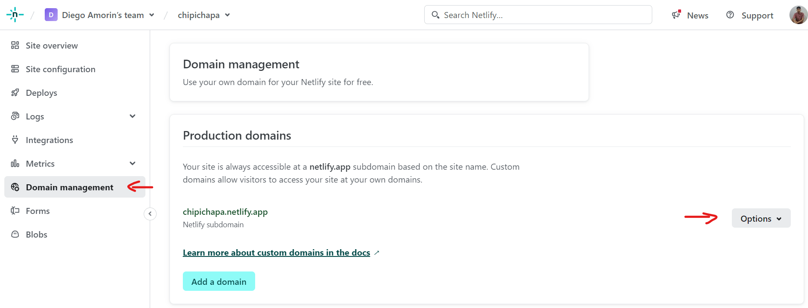
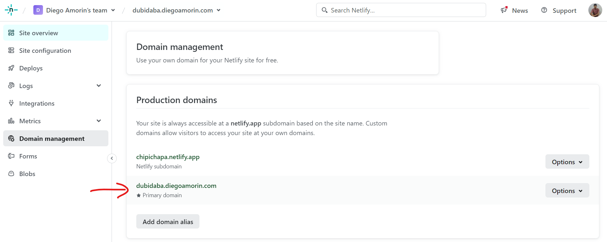

Netlify te provee un subdominio gratuito (`<algo-random>.netlify.app`), pero puedes cambiar esto con tu propio subdominio (`miapp.midominio.com`).

Esta guía te ayudará si tu dominio lo compraste en un servicio externo a Netlify.

## Subdominio de Netlify

En este punto supongo que ya tienes tu proyecto subido en Netlify. Lo primero que haremos es cambiar el subdominio que te provee Netlify a algo más chévere.

Ve a **Domain management** > **Options** > **Edit site name**

En mi caso le cambié a [chipichapa.netlify.app](https://youtu.be/PwL29YCgavo?si=Yhdxaji0gnWy9hvj&t=18).

## Crear subdominio que apunte a proyecto de Netlify

Antes que seguir, necesito que encuentres los **«registros DNS»** de tu proveedor de dominios, porque los paneles de administración son un poco diferentes para cada servicio.

Si ya sabes, olvídalo, y agrega lo que te pido abajo. En caso de que no sepas te recomiendo ver un tutorial. Si usas CPANEL te recomiendo este video: «[Como editar los registros DNS en CPanel](https://www.youtube.com/watch?v=mQmvgWi00pM)«.

Una vez que hayas encontrado los registros DNS en tu panel de administración, debes agregar un registro CNAME con esta estructura:

<table><tbody><tr><td>Name</td><td>TTL</td><td>Type</td><td>Record</td></tr><tr><td>&lt;subdominio-a-crear&gt;</td><td>14400</td><td>CNAME</td><td>&lt;subdominio-de-proyecto-Netlify&gt;</td></tr></tbody></table>

*Estas columnas puedes cambiar de orden dependiendo del servicio.*

<AdInArticle />

En mi caso quiero crear un subdominio llamado `dubidaba.diegoamorin.com` que apunte a `chipichapa.netlify.app`, entonces tengo que agregar el siguiente registro:

<table><tbody><tr><td>Name</td><td>TTL</td><td>Type</td><td>Record</td></tr><tr><td>dubidaba.diegoamorin.com</td><td>14400</td><td>CNAME</td><td>chipichapa.netlify.app</td></tr></tbody></table>

**Nota:** Recuerda no agregar nada de http:// o https:// antes de los dominios porque puede haber problemas. En mi caso, esto ocasionaba que Netlify tenga problemas al generar un SSL para mi subdominio.

**Nota 2:** Puede que te hayas encontrado con la opción «crear subdominio» en tu panel de administración, esto también crea un registro DNS, pero este suele apuntar a tu mismo servicio de hosting y no a Netlify. Por ello, no es recomendable para este caso.

**Nota 3:** Si te gustaría aprender un poco más sobre como funciona este registro te recomiendo el tutorial «[Registro DNS CNAME – Crea subdominios de manera correcta](https://www.youtube.com/watch?v=vmLYl9KKo24)«.

## Agregar el subdominio personalizado a Netlify

Para terminar, dale click a «**Add a domain**«, ahí pondrás el subdominio que creaste en el registro DNS. En mi caso era `dubidaba.diegoamorin.com`

Luego dale a **Verify**, y luego a **Add subdomain**, y listo.

*Verificar si el subdominio esta en «Production Domains»*

Antes de que te vayas corriendo a ver si funciona, primero espera a que Netlify procese estos cambios y genere un SSL para tu subdominio gratuitamente.

**Paciencia.**

Luego de unos minutos ya lo tendrás listo. Espero este artículo te haya gustado, no ví información en español sobre esto, por eso decidí escribirlo.
