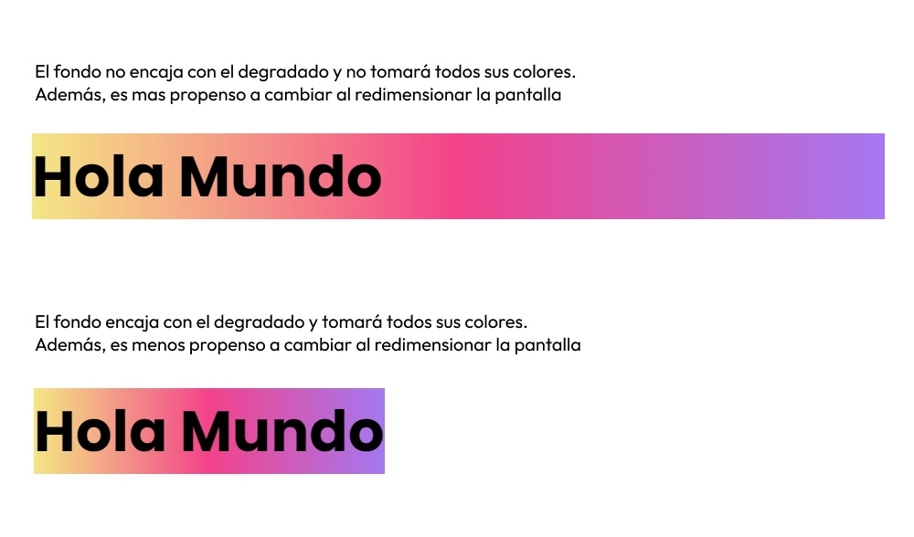

## Paso 1: Agregar un degradado de fondo

Selecciona tu elemento de texto (en mi caso es un H1), y agrégale un fondo degradado de esta forma:

```css
h1 {
  font-size: 100px;
  background-image: linear-gradient(to right, #f4e784, #f24389, #a478f1);
}
```


Si quieres personalizar estos degradados ve a la [documentación de mozilla sobre degradados](https://developer.mozilla.org/es/docs/Web/CSS/CSS_images/Using_CSS_gradients).

### **Problemas con degradados horizontales**

Los colores que tomará el texto son los colores que cubre el texto (léelo de nuevo).

Ocurre 2 problemas cuando un degradado va de forma horizontal y el fondo abarca el 100% de ancho. Primero que el texto es muy pequeño y no esta cubriendo los los 3 colores del degradado. Segundo, si redimensionas la pantalla, el degradado se moverá y cambiarán los colores que cubre el texto. Por ello, es necesario agregar `inline-block`, para que el fondo encaje con el texto. Esto no será necesario en etiquetas que no abarcan el ancho completo como el `span` y degradados que son verticales.

```css
h1 {
  font-size: 100px;
  background-image: linear-gradient(to right, #f4e784, #f24389, #a478f1);
  display: inline-block;
}
```



## Paso 2: Recortar el fondo con el área del texto

Agrega la siguiente línea de código:

```css
h1 {
  font-size: 100px;
  background-image: linear-gradient(to right, #f4e784, #f24389, #a478f1);
  display: inline-block;
  background-clip: text;
}
```

Esta propiedad indica que el fondo solo se muestra donde el texto está presente. Es decir, el fondo se recorta para que solo sea visible detrás del texto y no se extienda más allá de los límites del texto.


## Paso 3: Hacer que el texto sea transparente

Parece como si el gradiente desapareció, pero esta ahí, detrás del texto, agrega una transparencia al texto para poder apreciar el fondo degradado.

```css
h1 {
  font-size: 100px;
  background-image: linear-gradient(to right, #f4e784, #f24389, #a478f1);
  display: inline-block;
  background-clip: text;
  color: transparent;
}
```


¡Gracias por leer!.
