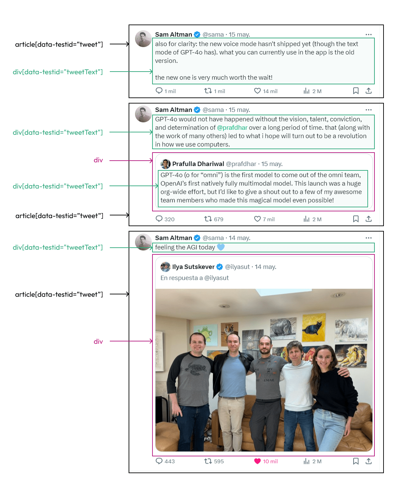
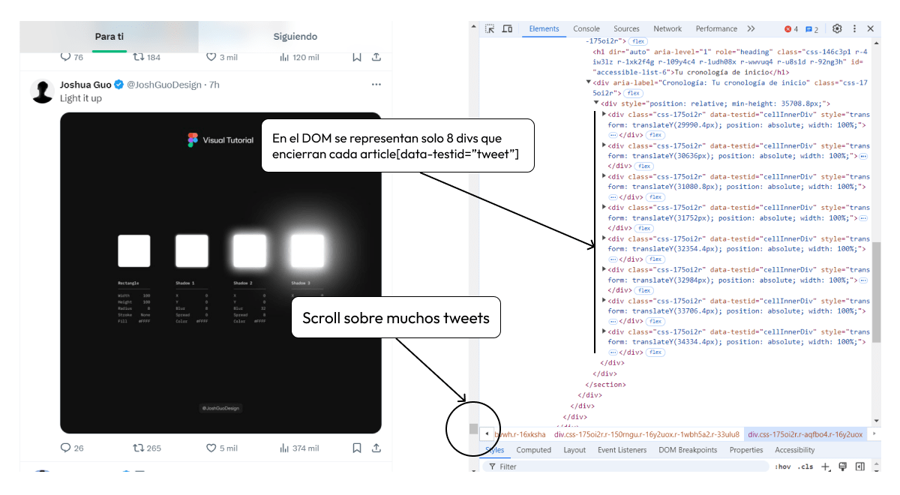

Iniciaremos sesión en X, guardaremos las cookies de inicio de sesión, veremos que hacer si nos saltan captchas, realizaremos búsquedas y extraeremos los tweets usando NodeJS con la librería [Playwright](https://playwright.dev/).

**Nota:** Para realizar web scraping es necesario ayudarse de las clases o ids para acceder a elementos del DOM. Por ello debes considerar que X (Twitter) puede cambiar ciertas clases o ids a lo largo del tiempo, y será necesario que estés atento si alguna clase o id ha cambiado para modificarlo en el código.

## Crear proyecto de NodeJS

Crea una carpeta `webscraping-x/` e inicia un proyecto de NodeJS con el siguiente comando.

```
npm init --yes
```

Ahora tenemos que instalar Playwright. Toma en cuenta este párrafo extraído de su [documentación](https://playwright.dev/docs/library):

*«Playwright Library proporciona API unificadas para lanzar navegadores e interactuar con ellos, mientras que Playwright Test proporciona todo esto además de un ejecutor de pruebas y una experiencia de extremo a extremo totalmente gestionados.»*

Nosotros nos conformamos con Playwright Library. Dentro de `webscraping-x/` ejecuta:

```
npm install playwright
```

Esto solo instala Library. Como último paso accede a tu `package.json` y agrega:

```json
{
  "type": "module"
}
```

Esto nos sirve para usar el `import` y `export` de ECMAScript en nuestros archivos «.js». Ya que por defecto, NodeJS usa CommonJS con la sintaxis `require` y `module.exports` para el manejo de módulos.

## Ubicar elementos con Playwright

Las funciones que nos permiten ubicar elementos en el DOM son llamados [Locators](http://playwright.dev/docs/locators). Veamos algunos de ellos (solo obsérvalos, en la siguiente sección las usaremos):

**Locate by text**

```xml
<span>Welcome, John</span>
```

```javascript
await page.getByText('Welcome, John');
```

**Locate by role**

```xml
<a role="button">Siguiente</a>
```

```javascript
await page.getByRole('button', { name: 'Siguiente' }).click();
```

**Locate by placeholder**

```xml
<input type="email" placeholder="name@example.com" />
```

```javascript
await page.getByPlaceholder('name@example.com').fill('micorreo@correo.com');
```

**Locate by test id**

```xml
<button data-testid="directions">Itinerary</button>
```

```javascript
await page.getByTestId('directions').click();
```

**Localiza todo**

Puedes usar `page.locator()` para seleccionar elementos con selectores CSS.

```javascript
// Selecciona un botón con el ID 'myButton'
await page.locator('button#myButton').click();

// Selecciona un enlace con el atributo 'role="button"'
await page.locator('a[role="button"]').click();

// Rellena el campo de entrada con el valor 'nuevo_usuario'
await page.locator('input[name="username"]').fill('nuevo_usuario');

// Realiza un doble clic en el botón con el ID 'edit'
await page.locator('button#edit').dblclick();
```

Este será tu kick de herramientas en caso de que alguna clase, elemento o proceso haya cambiado en X. Mira más sobre esto en la [documentación de Locators](https://playwright.dev/docs/locators).

## Extraer tweets de un usuario

Este es el proceso más fácil. Ya que al momento de redactar esta guía, X permite acceder a los tweets de un usuario sin necesidad de iniciar sesión.

Extraeremos los datos del usuario @sama, la url es [https://x.com/sama](https://x.com/sama). Pero primero veamos la estructura del timeline de este perfil.



Te recomiendo buscar estos elementos en el timeline para que puedas familiarizarte más, esto solo es una muestra superficial del DOM. Ahora pasemos a recuperar estos tweets.

Crea un archivo `index.js` y creemos una función que permita extraer los tweets del usuario:

```javascript
import {chromium} from 'playwright';

async function getTweetsByUsername(username) {
  // Lanzar navegador
  const browser = await chromium.launch({ headless: false });
  // Crear una nueva página
  const page = await browser.newPage();
  // Navegar al perfil de un usuario
  await page.goto(`https://x.com/${username}`);

  // Esperar hasta que al menos un tweet del usuario este disponible
  const tweetsLocator = page.locator('[data-testid="tweet"]');
  await tweetsLocator.first().waitFor();

  // Ejecutar el código JavaScript en el contexto de la página web cargada
  // que permitirá extraer los tweets
  let tweets = await page.evaluate(() => {
    const tweetList = document.querySelectorAll('[data-testid="tweet"]');

    const tweetTextList = [...tweetList].map(tweet => {
      try {
        // Extraer solo el primer "tweetText" dentro de un "tweet"
        const tweetText = tweet.querySelector('[data-testid="tweetText"]').innerText;
        return tweetText;
      } catch(e) {
        // En caso de no encontrar un "tweetText" en un "tweet" se infiere que es una imagen o video
        return "<multimedia>";
      }
    });

    return tweetTextList;
  });

  browser.close();
  console.log(tweets);
}

getTweetsByUsername('sama');
```

Cuando lo ejecutes, tal vez te pida unos permisos para lanzar el navegador. Y verás que te imprime como mucho de 2 a 5 tweets. Vamos a entender por qué puede ocurriendo esto.

Los timelines de X por más scroll que le hagas, no carga todos los tweets en el DOM, solo muestra unos cuantos. El flujo en el DOM: mostrar un grupo de tweets, haces scroll, reemplaza ese grupo por los nuevos, haces scroll, reemplaza nuevamente.



Actualicemos nuestro código para simular este proceso con Playwright, recuperando tweets a la par que hacemos scroll:

```javascript
import {chromium} from 'playwright';

async function getTweetsByUsername(username) {
  // Lanzar navegador
  const browser = await chromium.launch({ headless: false });
  // Crear una nueva página
  const page = await browser.newPage();
  // Navegar al perfil de un usuario
  await page.goto(`https://x.com/${username}`);

  let min15tweets = [];
  let tweets = [];

  // Esperar hasta que al menos un tweet del usuario este disponible
  const tweetsLocator = page.locator('[data-testid="tweet"]');
  await tweetsLocator.first().waitFor();

  while (min15tweets.length < 15) {
    // Ejecutar código JavaScript en el contexto de la página web cargada
    tweets = await page.evaluate(() => {
      const tweetList = document.querySelectorAll('[data-testid="tweet"]');

      const tweetTextList = [...tweetList].map(tweet => {
        try {
          // Extraer solo el primer "tweetText" dentro de un "tweet"
          const tweetText = tweet.querySelector('[data-testid="tweetText"]').innerText;
          return tweetText;
        } catch(e) {
          // En caso de no encontrar un tweetText se infiere que es una imagen o video
          return "<multimedia>";
        }
      });

      return tweetTextList;
    });

    // Unimos los tweets almacenados con los tweets recuperados
    // y con Set() quitamos los duplicados ya que el scrolling no es estimado
    min15tweets = [...new Set([...min15tweets, ...tweets])];

    // Hacer scroll
    await page.mouse.wheel(0, 4000);
  }

  browser.close();
  console.log("Resultados: ", min15tweets);
  console.log("Número de Tweets: ", min15tweets.length);
}

getTweetsByUsername('sama');
```

Estamos recuperando como mínimo 15 tweets por ejecución, anímate a cambiar el usuario de la función.

Ahora, si queremos recuperar tweets de una búsqueda en X (Twitter), necesitamos iniciar sesión. Vamos a por ello.

## Iniciar sesión en X

Para realizar búsquedas y obtener sus resultadoss necesitamos iniciar sesión. Te recomiendo que quites todas autenticaciones o verificaciones extras de tu cuenta para que el proceso no se vuelva complicado, y todo se reduzca a rellenar el nombre de usuario, contraseña y algún captcha si es que hay.

Comenta la función anterior, ahora nos concentraremos en iniciar sesión de forma automática. Cambia tus datos de inicio de sesión y algún Locator si es necesario.

```javascript
// ...
// getTweetsByUsername('sama');

async function loginInX() {
  // Iniciar un navegador y crea una pestaña
  const browser = await chromium.launch({ headless: false });
  const page = await browser.newPage();

  // Dirigirse a la página de login de X
  await page.goto('https://x.com/i/flow/login');

  // Busca el input username y rellena tu username
  await page.locator('input[autocomplete="username"]').fill('tunombredeusuario');
  // Busca el boton "Siguiente" y dale click
  await page.getByRole('button', { name: 'Siguiente' }).click();

  // Buscar el input de tipo password y rellena tu contraseña
  await page.locator('input[name="password"]').fill('tupassword');
  // Busca el botón de login y le da click
  await page.getByTestId('LoginForm_Login_Button').click();

  // Espera que cargue la página principal de X o Twitter
  await page.waitForURL('https://x.com/home');
  // Espera 5s en la página principal
  await page.waitForTimeout(5000);

  await browser.close();
}

loginInX();
```

Ejecutando esta función podrás apreciar como se realiza el login de forma automática. ¿Genial verdad? El único problema es que una vez se cierra el navegador, también se pierde el contexto del *browser*, y con ello nuestro *login*. En la siguiente sección lo resolveremos.

**Recomendación:** Esta función `loginInX()` evita ejecutarla demasiadas veces, ya que tu cuenta de X puede prohibirte los intentos de *login* hasta que pasen un par de horas, o agregarte *captchas*. Con que lo ejecutes de 2 a 3 veces no pasa nada.

**Solución para los catpchas**

Si te salta alguna prueba, entonces debes agregar esta línea en el script, tomando en cuenta flujo donde aparece el captcha.

```javascript
await page.waitForTimeout(120000);
```

Esta línea detiene la ejecución por 120 segundos (puedes cambiarlo), es el tiempo suficiente para que resuelvas el captcha y puedas continuar con el flujo de automatización.

## Guardar inicio de sesión

Para no parecer bots iniciando sesión a cada rato, debemos guardar el contexto de nuestro navegador. Y de esta forma, reutilizar el *browser* con la cuenta de X ya iniciada.

Para ello solo agregamos **2 líneas de código**:

```javascript
const authFile = 'playwright/.auth/user.json';

async function loginInX() {
  // Iniciar un navegador y crea una pestaña
  const browser = await chromium.launch({ headless: false });
  const page = await browser.newPage();

  // Dirigirse a la página de login de X
  await page.goto('https://x.com/i/flow/login');

  // Busca el input username y rellena tu username
  await page.locator('input[autocomplete="username"]').fill('diegoamse');
  // Busca el boton "Siguiente" y dale click
  await page.getByRole('button', { name: 'Siguiente' }).click();

  // Buscar el input de tipo password y rellena tu contraseña
  await page.locator('input[name="password"]').fill('xprueba1');
  // Busca el botón de login y le da click
  await page.getByTestId('LoginForm_Login_Button').click();

  // Espera que cargue la página principal de X o Twitter
  await page.waitForURL('https://x.com/home');

  // Guardar el contexto del navegador
  await page.context().storageState({path: authFile});

  // Espera 5s en la página principal
  await page.waitForTimeout(5000);

  await browser.close();
}

loginInX();
```

Iniciaremos sesión nuevamente, pero esta vez guardaremos el contexto del navegador en la ruta `playwright/.auth/user.json`, en tu proyecto verás el nuevo archivo.

No abuses de esta función, suficiente con que haya guardado los datos en el archivo. Ahora, nuestros los siguientes scripts podrán interactuar con X sin límites de autenticación.

## Extraer tweets de una búsqueda

Para realizar la búsqueda debes arrancar nuestro navegador con el contexto que tenemos en el archivo `user.json`, el resto del código es lo mismo a `getTweetsByUsername()`, solo que aquí trae tweets de una determinada búsqueda.

Comenta `loginInX()` y agrega la siguiente función `getTweetsFromASearch()` que busca «inteligencia artificial» y retornar los tweets:

```javascript
// ...
// loginInX();

async function getTweetsFromASearch(busqueda) {
  // Procesar la búsqueda para ser admitida en la url
  const termURI = encodeURIComponent(busqueda);

  const browser = await chromium.launch({ headless: false });
  // Crear un contexto para el navegador con los datos de authFile
  const context = await browser.newContext({ storageState: authFile });

  const page = await context.newPage();
  await page.goto(`https://x.com/search?q=${termURI}`);

  // De aquí en adelante es lo mismo
  let min15tweets = [];
  let tweets = [];

  const tweetsLocator = page.locator('[data-testid="tweet"]');
  await tweetsLocator.first().waitFor();

  while (min15tweets.length < 15) {
    tweets = await page.evaluate(() => {
      const tweetList = document.querySelectorAll('[data-testid="tweet"]');

      const tweetTextList = [...tweetList].map(tweet => {
        try {
          const tweetText = tweet.querySelector('[data-testid="tweetText"]').innerText;
          return tweetText;
        } catch(e) {
          return "<multimedia>";
        }
      });

      return tweetTextList;
    });

    min15tweets = [...new Set([...min15tweets, ...tweets])];

    await page.mouse.wheel(0, 4000);
  }

  browser.close();
  console.log("Resultados: ", min15tweets);
  console.log("Número de Tweets: ", min15tweets.length);
}

getTweetsFromASearch('inteligencia artificial');
```

Genial, reutilizaste el contexto del navegador donde habías iniciado sesión, y extrajiste los tweets de un término de búsqueda. Otra manera de hacer lo mismo es, abrir X, localizar su barra de búsqueda, digitar el término, darle «enter» y obtener los tweets del resultado.

Espero este artículo te haya gustado. Para cualquier duda, aporte o apreciación déjame un comentario, los leo todos. Y… recuerda reactivar los métodos de seguridad de tu cuenta de X.
