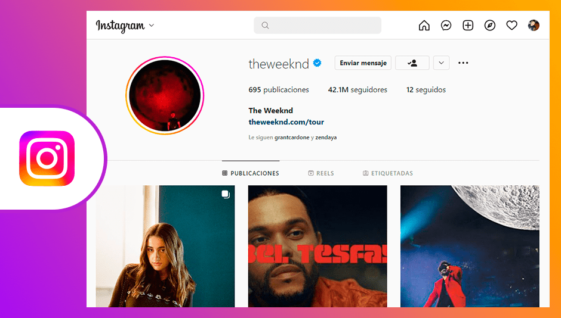
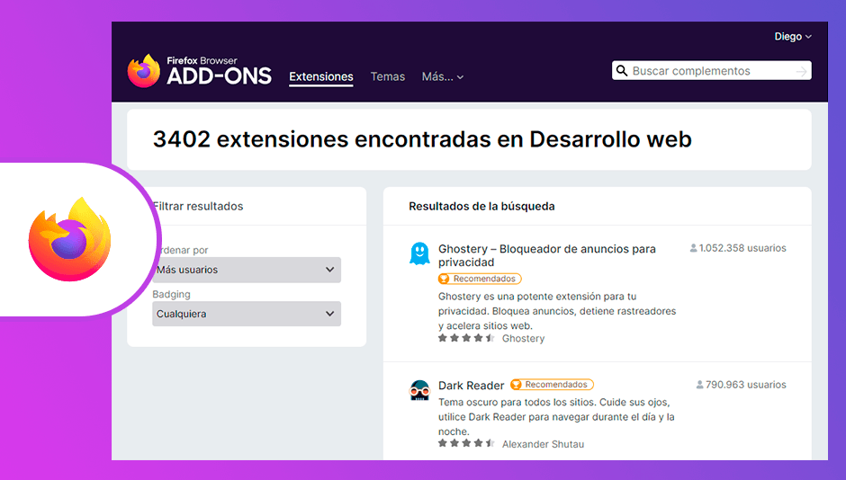
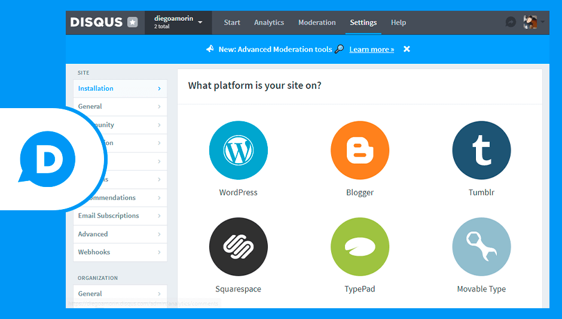
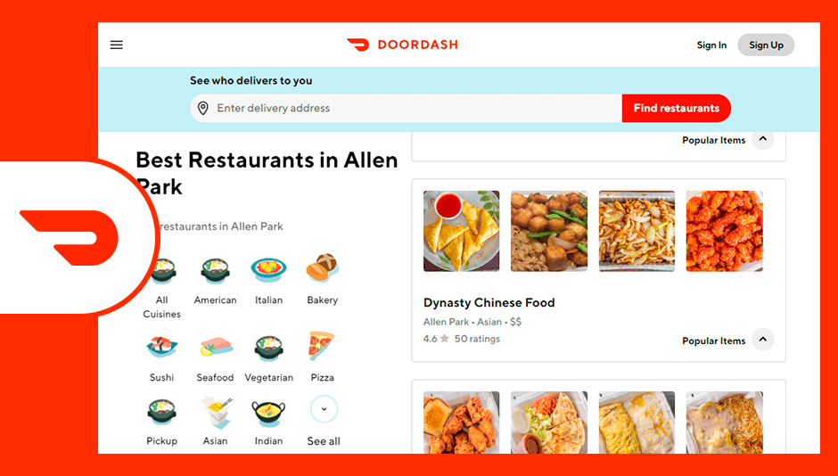
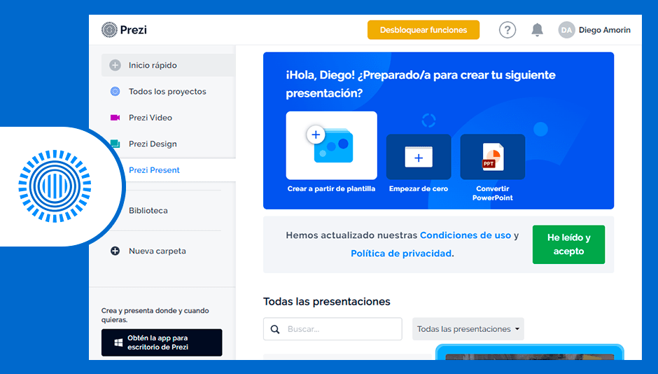
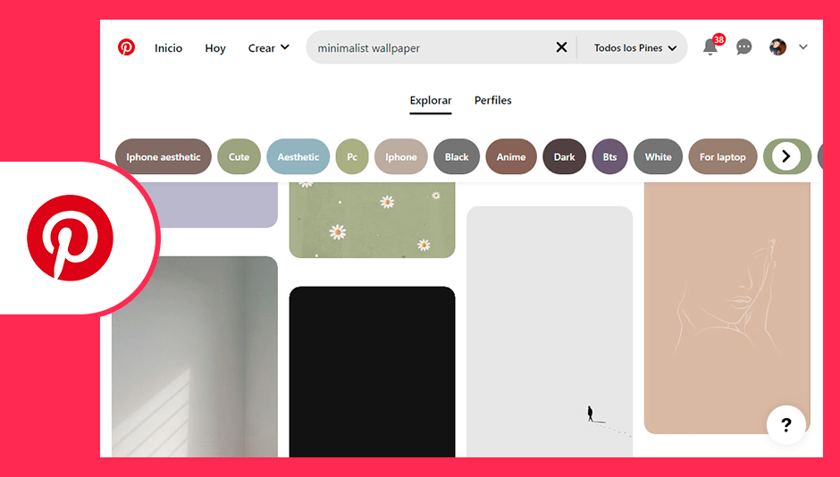
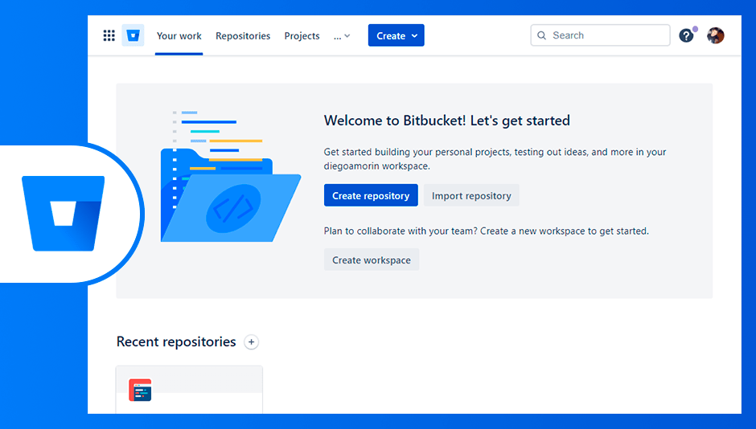

En este artículo te mostraré las aplicaciones web más populares creadas con el framework Django.

Para asegurarme de que estas aplicaciones estén usando Django en la actualidad, tuve que leer los artículos del equipo de ingeniería de estas webs, y también, seguí las instrucciones de [Herman Schaaf](https://stackoverflow.com/a/10574529) (respuesta de StackOverflow) que me permitieron testear un sitio web y detectar si esta usando Django. La denominaré el «test de Herman» solo para hacerlo más didáctico.

## 1\. Instagram

Instagram siempre es la primera opción al momento de mostrar las capacidades de Django. La red social se inició con Django y sigue usándolo en la actualidad.

Fuentes:

-   [Instagration Pt. 2: Scaling our infrastructure to multiple data centers](https://instagram-engineering.com/instagration-pt-2-scaling-our-infrastructure-to-multiple-data-centers-5745cbad7834)
-   [Django Overview](https://www.djangoproject.com/start/overview/) (ver al final de la web)

*Cuenta de Instagram de The Weekend | Fuente: [Instagram.com](https://www.instagram.com/theweeknd/)*

## 2\. Udemy

Es muy extraño saber que Udemy use este framework, pero la duda se aclara al realizar el «test de Herman». De esta manera logré afirmar que si usan Django.

Aunque, desconozco en que medida lo usan. Ya que para sitios web tan grandes como Udemy, pueden llegar a usar diferentes tecnologías backend para muchos de sus servicios.

Fuentes:

-   [Udemy Tech Stack – Stachshare](https://stackshare.io/udemy/udemy)
-   [Udemy Tech Stack – Himalayas](https://himalayas.app/companies/udemy/tech-stack)

*Página principal de alumno registrado | Fuente: [udemy.com](https://www.udemy.com/)*

## 3\. Platzi

Platzi es una de las plataformas de educación más conocidas en Latinoamérica. El backend de Platzi se creó con Django desde sus inicios y lo siguen usando hasta el momento.

Fuentes:

-   [Django el framework para desarrollo web](https://platzi.com/blog/django-el-framework-para-desarrollo-web/)
-   [Platzi.com: Technology Profile](https://www.similartech.com/websites/platzi.com)
-   [Platzi: 5 razones para usar Django](https://youtu.be/kQ8QA1jxg7E)

*Landing Page de Platzi | Fuente: [Platzi.com](https://platzi.com/)*

## 4\. Mozilla

La organización Mozilla también usa este framework para algunos de sus servicios, por ejemplo la página de add-ons y de support de Firefox usan Django. Lo sé porque en la página de Django afirman que Mozilla lo usa, y además, hice el test de Herman a los servicios que mencioné.

Fuente:

-   [Django Overview](https://www.djangoproject.com/start/overview/) (ver al final de la web)

*Sitio web de Firefox Add-Ons | Fuente: [addons.mozilla.org](https://addons.mozilla.org/es/firefox/)*

## 5\. Crehana

Tomé algunos cursos en Crehana y me dio la curiosidad de saber que tecnología usan para el backend. [Hay un artículo](https://www.getonbrd.com/blog/awesomecompanies-episodio-8-crehana) donde le preguntan a algunos trabajadores de Crehana: ¿Cuál es su stack tecnológico actual? Y como respuesta para el backend fue «Django».

Además, busqué a trabajadores backend de Crehana y ver los requisitos de puestos backend en LinkedIn. Las skills que buscan y que tiene sus programadores son Python y Django, y para confirmar mi hipótesis aplique el test de Herman, y dio positivo.

Fuentes:

-   [AwesomeCompanies, episodio 8: Crehana](https://www.getonbrd.com/blog/awesomecompanies-episodio-8-crehana)
-   [Crehana.com Technology Profile](https://www.similartech.com/websites/crehana.com)
-   [Crehana Tech Stack](https://stackshare.io/crehana/crehana)

*Página principal de alumno | Fuente: [Crehana.com](https://www.crehana.com/home/)*

## 6\. Disqus

El servicio que administra los comentarios de muchos sitios web, Disqus, usa Django desde que nació.

Fuentes:

-   [Scaling Django to 8 Billion Page Views](https://blog.disqus.com/scaling-django-to-8-billion-page-views)
-   [Django Overview](https://www.djangoproject.com/start/overview/) (ver al final de la web)

*Sección settings del panel de administración | Fuente: [disqus.com](https://disqus.com/admin/)*

## 7\. Doordash

Tal vez Doordash no sea tan conocida en Latinoamérica, pero en Estados Unidos es una de las plataformas más populares de entrega de comida a domicilio. Su plataforma esta creada con Django.

Fuentes:

-   [Tips for Building High-Quality Django Apps at Scale](https://doordash.engineering/2017/05/15/tips-for-building-high-quality-django-apps-at-scale/) – Doordash Engineering
-   [DoorDash Tech Stack](https://stackshare.io/doordash/doordash)

*Restaurantes en Allen Park | Fuente [doordash.com](https://www.doordash.com/food-delivery/allen-park-mi-restaurants/)*

## 8\. Prezi

Prezi es la aplicación para crear presentaciones online. Y como ya te lo esperas… usa Django.

Fuente: [Prezi.com Technology Profile](https://www.similartech.com/websites/prezi.com)

Y obviamente le aplique el test.

*Sección inicial de la herramienta de presentaciones | Fuente: [prezi.com](https://prezi.com/dashboard/)*

## 9\. ¿Pinterest?

Pinterest al igual que Instagram es conocido por usar Django desde sus inicios, pero en los últimos años Pinterest fue migrando a [Flask](https://flask.palletsprojects.com/) por algunos problemas de flexibilidad.

Aunque en la actualidad siguen usando Django, desconozco en que medida lo utilizan. Si eres ingeniero en Pinterest déjame un comentario.

Fuentes:

-   [Would Pinterest consider Flask in place of Django if it were starting today?](https://www.quora.com/Would-Pinterest-consider-Flask-in-place-of-Django-if-it-were-starting-today)
-   [Which programming languages were used to develop Pinterest’s backend?](https://www.quora.com/Which-programming-languages-were-used-to-develop-Pinterests-backend)
-   [Why did Pinterest move from Django to Flask?](https://www.quora.com/Why-did-Pinterest-move-from-Django-to-Flask)
-   [What is it like to use Django at Pinterest?](https://www.quora.com/What-is-it-like-to-use-Django-at-Pinterest)
-   [Django Overview](https://www.djangoproject.com/start/overview/) (ver al final de la web)

*Imágenes de Minimalist Wallpapers | Fuente: [pinterest.com](https://www.pinterest.com/)*

## 10\. Bitbucked

Bitbucked es un servicio de alojamiento que funciona como Github y Gitlab. Uno de sus ingenieros admite el uso de Django como *core* en su servicio web. Incluso me creé una cuenta para hacerle el test y confirmar si usa el framework, y es verdad, si lo usa.

Fuente: [What is the technology stack behind Bitbucket?](https://www.quora.com/What-is-the-technology-stack-behind-Bitbucket)

*Área de trabajo de Bitbucket | Fuente: [bitbucket.org](https://bitbucket.org/)*

## 11\. Robinhood

Robinhood es una plataforma de inversión, y tal vez, no hayas oído de el porque su popularidad se encuentra en Estados Unidos.

Esta empresa fue creada por 2 graduados de Stanford. La plataforma usa Django pero desconozco si lo usaron desde sus inicios. Lo más probable es que sí, porque todos sus recursos apuntan a Python, Django y DjangoRestFramework. No he encontrado que mencionen a otro framework en el backend.

Fuentes:

-   [Robinhood is hiring backend engineers (Palo Alto, CA)](https://www.reddit.com/r/django/comments/2namnd/robinhood_is_hiring_backend_engineers_palo_alto_ca/)
-   [Multifactor Authentication on Django Rest | Robinhood | Medium](https://medium.com/robinhood-engineering/multifactor-authentication-on-django-rest-9e885ea471d4)

*Landing Page de Robinhood | Fuente: [robinhood.com](https://robinhood.com)*

## 12\. Coursera

Al igual que Udemy, esta plataforma usa un grupo de tecnologías backend, y entre ellas se encuentra Python/Django.

Fuentes:

-   [What is Coursera’s stack?](https://www.quora.com/What-is-Courseras-stack/answer/Frank-Chen-3)
-   [Coursera Tech Stack](https://stackshare.io/coursera/coursera)

*Sección Community de Coursera | Fuente: [coursera.support](https://www.coursera.support/s/community)*

## Descubre más sitios

Existen un montón de aplicaciones hechas con Django, te acabo de mostrar las más populares.

Si deseas ver más sitios hechos con Django, visita [Django Sites](https://www.djangosites.org/), y si tienes una plataforma en Django y piensas que merece estar en la lista, deja un comentario.

Espero que este post te haya gustado y tengas más razones para usar Django en tu próximo proyecto.
