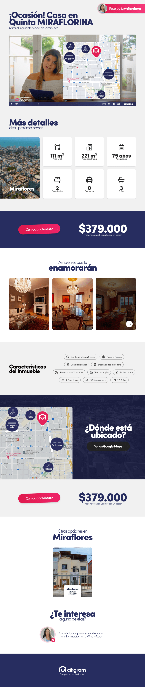
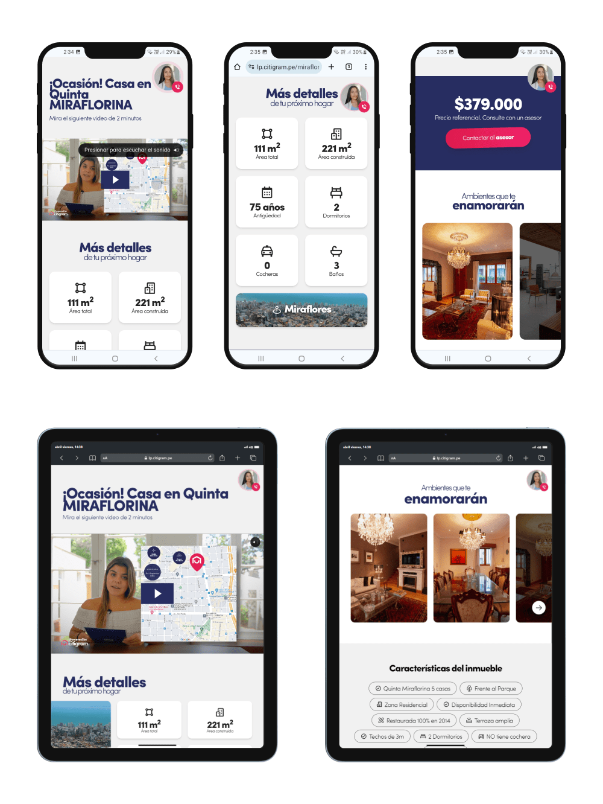

El equipo de Citigram tenía una propuesta de diseño para crear Landing Pages de venta de propiedades. En este caso, solo me encargué de la programación de estas.

## Programación

El diseño sirve de base para diversas propiedades. Al momento de programar se tuvo en cuenta ello, y me encargué de que se generen Landing Pages en automático, solo agregando nuevos datos.

## Responsive

