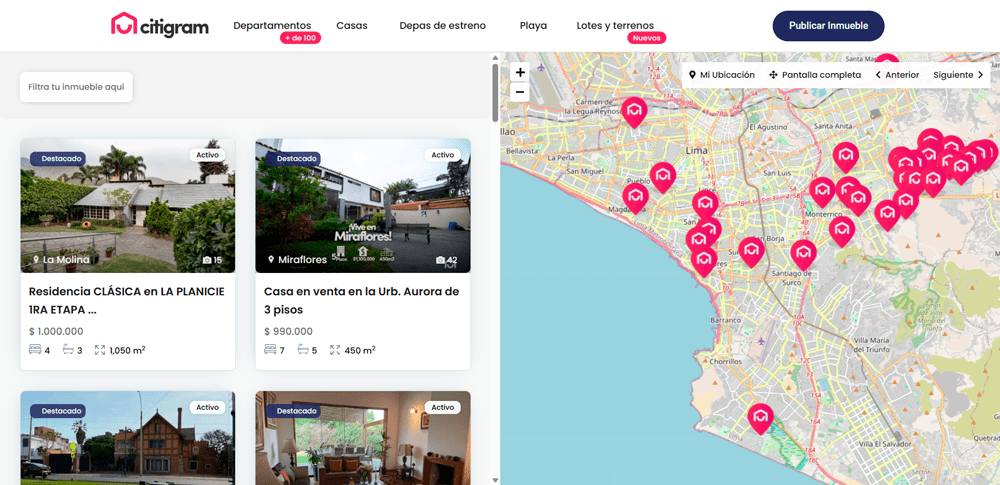
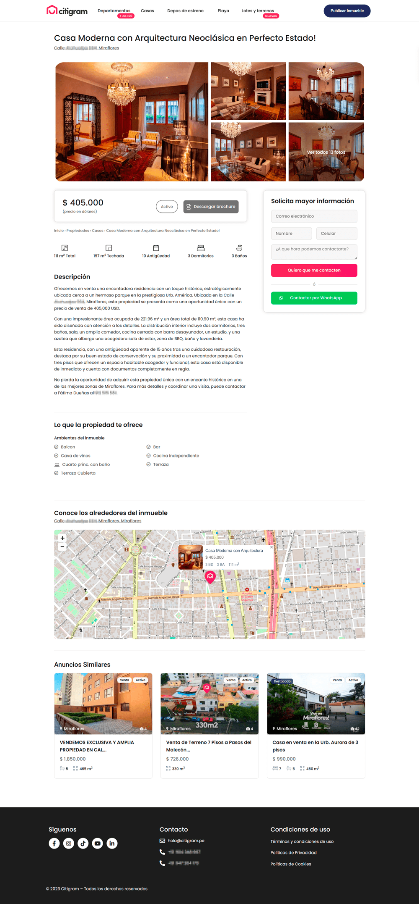
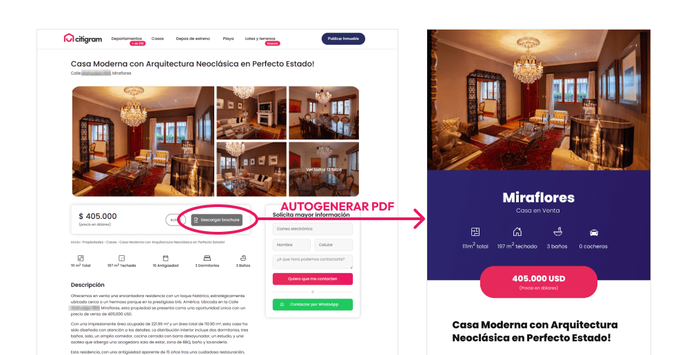

## Página de inicio

En esta página se destaca el filtro de inmuebles para las personas que buscan tipo de propiedad específica, y más abajo, se muestra el apartado de «Propiedades destacadas» para los que están en busca de opciones.

Luego se hace un breve resumen de los servicios, y, para mejorar la credibilidad del negocio, se agregan reseñas de anteriores clientes.

## Landing page de servicios

Esta es una landing page para 1 de los 3 servicios principales de citigram.pe

## Página de resultados de búsqueda

## Página de detalle de una propiedad

La página de cada propiedad tiene lo que un futuro cliente necesita, imágenes del inmueble, información esencial (ubicación, número de dormitorios, baños y cocheras) y un formulario o botón de contacto.

Si le gusto, entonces puede seguir leyendo lo demás: descripción, características, etc.

## Generador de PDF

EL generador fue un desafío, ya que el equipo de Citigram quería que se genere dinámicamente un PDF a partir de cada propiedad subida. Nunca había hecho algo así, pero sorpresivamente en un par de días se logro lo deseado.

## Responsive

