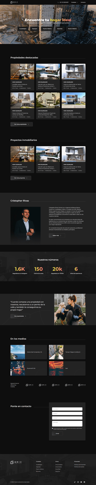
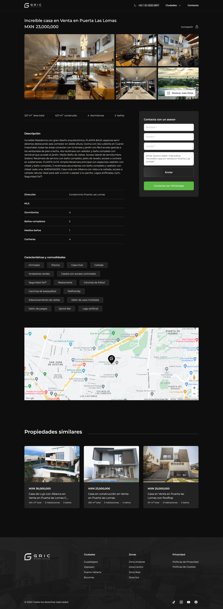
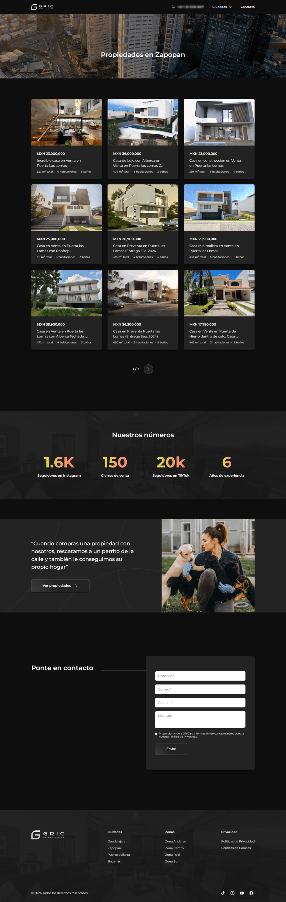
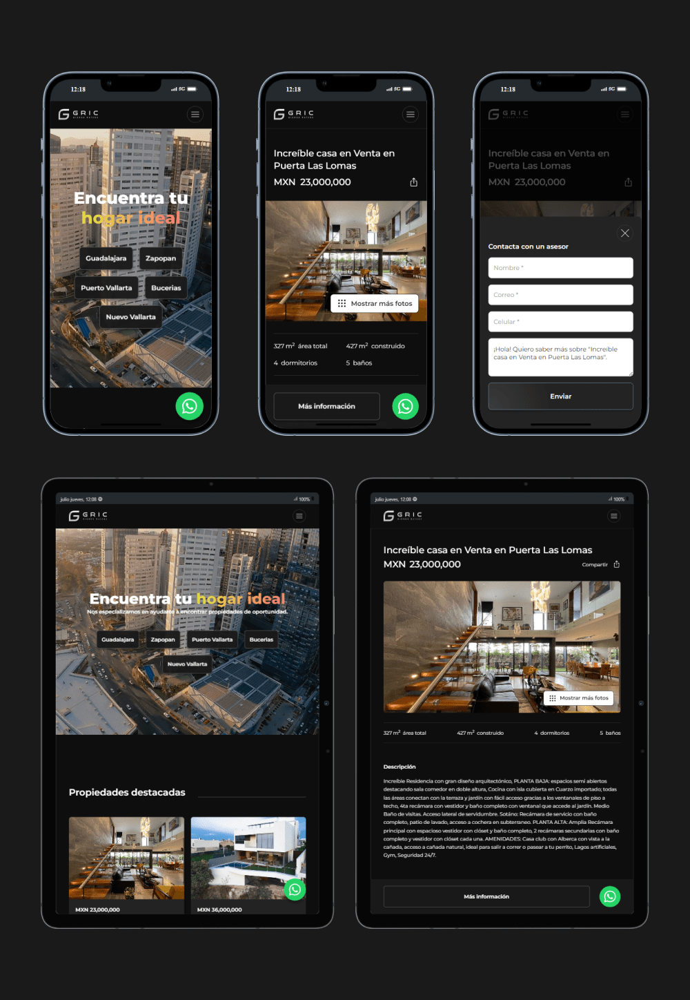

GRIC es una agencia especializada en propiedades de lujo en Guadalajara y Riviera Nayarit. Su fundador me dio la oportunidad de construir su plataforma inmobiliaria.

## Página de Inicio

## Detalles de una propiedad

## Página de resultados

## Diseño Responsive

