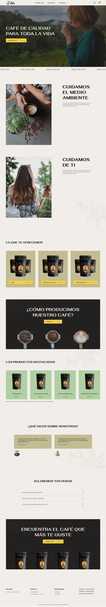
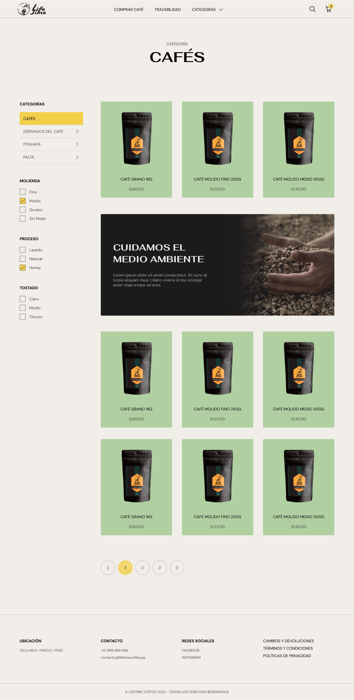
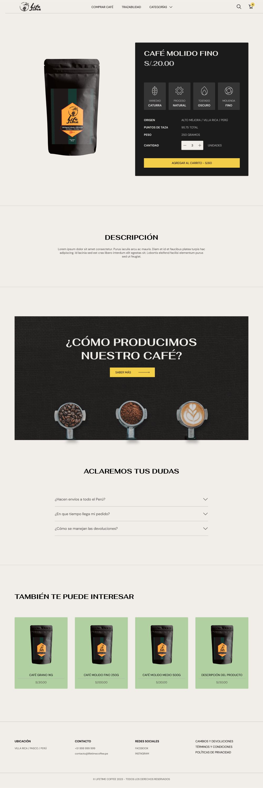
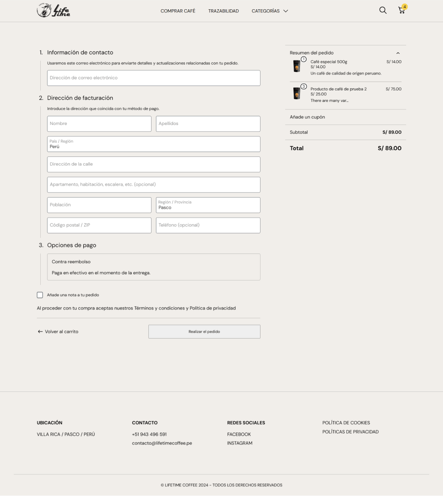
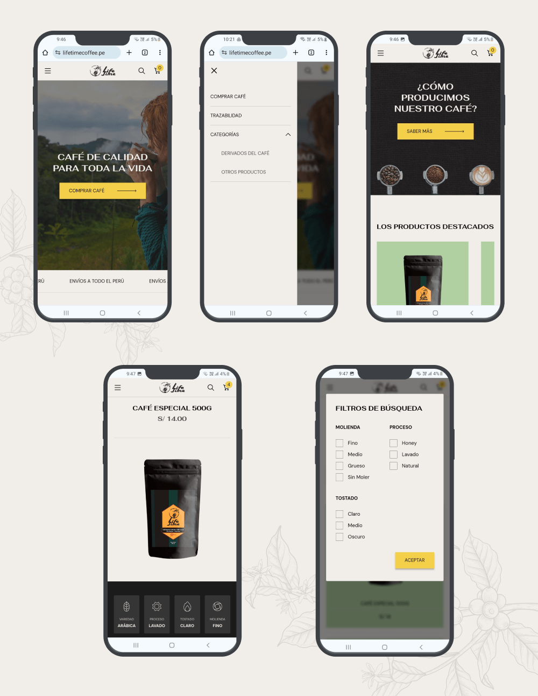

El dueño de LifeTime Coffee quería que su negocio de café no se limite a un solo lugar, entonces me contacto para construirle un e-commerce, y de esta forma, exponer sus productos en Internet.

## Página de inicio

En la página principal de la tienda se destaca la propuesta de valor de la tienda.

## Página de productos

En la categoría principal (cafés) se creo unos filtros personalizados para la tienda, donde se pueden filtrar los cafés por su tipo de «Molienda», «Proceso» y «Tostado».

## Página de producto

En cada página de un producto de café se muestran sus detalles esenciales: variedad, proceso, tostado, molienda, origen, puntos de taza, peso y descripción.

## Pasarela de pago

## Responsive

