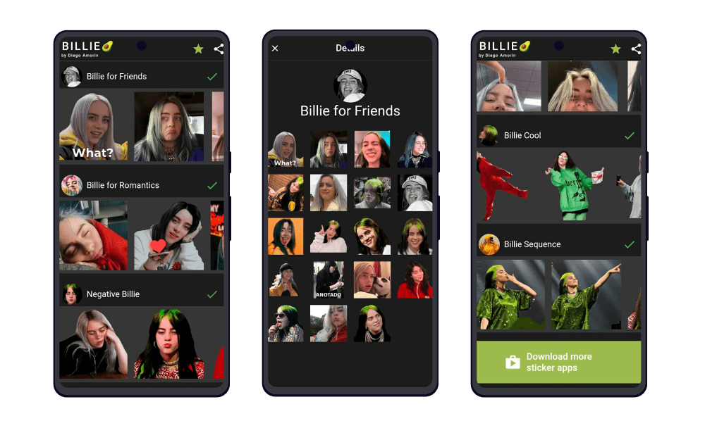
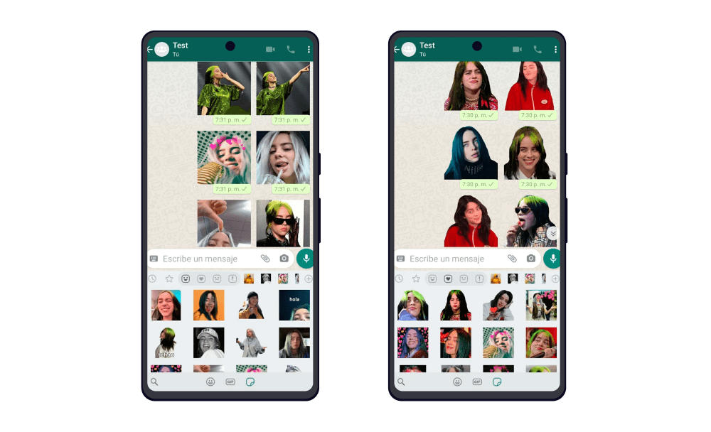

Este proyecto fue un emprendimiento personal, desarrollé una app similar a esta anteriormente y repliqué lo mismo pero para la artista Billie Eilish.

## Interfaz

La interfaz se basó en la [primera aplicación de stickers](/proyecto/stickers-de-millie-bobby/) que hice, solo cambió la temática a Billie Eilish.

Cada sección de la app esta dividida por diferentes expresiones de Billie Eilish. Cada sección representa un paquete de stickers. Y, si accedes a un paquete, podrás ver los stickers que contiene.

Una vez los agregues a tu WhatsApp verás una flechita verde que te notifica que ya lo tienes instalado.

## En WhatsApp

En la aplicación de WhatsApp ya podrás ver todos los paquetes de stickers que instalaste. Además automáticamente WhatsApp agrupa tus stickers en secciones especiales (al lado de la sección de la «estrella»).

## ¿Por qué Billie Eilish?

Porque no encontré aplicación de stickers de esta cantante y vi una oportunidad. Además que tenia un estilo de música diferente que me gustaba.
