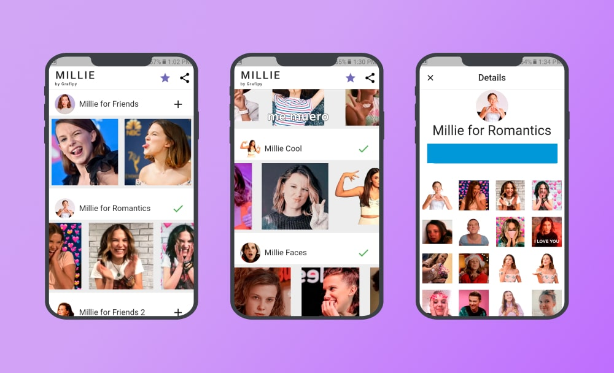
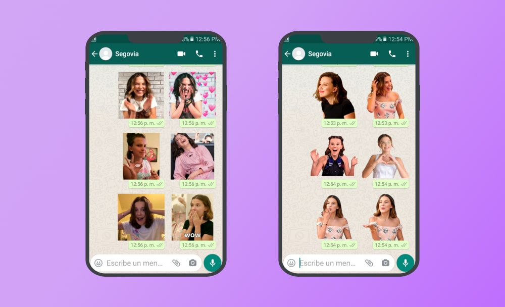

## Interfaz

La interfaz fue previamente diseñada con la herramienta Figma. Cada sección, es lo que llama WhatsApp un paquete de stickers. Cada paquete representa un estado o sentimiento de la actriz Millie Bobby Brown.

Para añadir el paquete de stickers a tu WhatsApp solo le das al botón de «+».



## En WhatsApp

Ya en WhatsApp tendrás disponibles los nuevos stickers para enviarlo a tus amigos.



## ¿Por qué Millie?

Porque soy fanático de Stranger Things.

## ¿Por qué fue descontinuado?

Mi primer emprendimiento «ambicioso» se llamaba Grafipy que era como un TikTok para textos (verá una frase «by Grafipy» en las capturas de la app).

Al fracasar este supuesto «TikTok de Textos», Grafipy pivotó a ser más una empresa de desarrollo de apps general, ahí salió la idea de crear una app de stickers, porque no requería pagar hosting mensual.

Esta primera app, se llamo al inicio «Stix». El problema es que era complicado hacer conocido una nueva marca. Leyendo artículos descubrí que la mejor de destacar en la Play Store era anichar el producto, así nació «Stickers de Millie Bobby Brown» y empezó a subir como la espuma.

Las cicatrices de estas decisiones quedaron plasmadas. Si usted visita el link de la app, es probable que aun en la url perciba el nombre de «Grafipy» y «Stix»

```bash
https://play.google.com/store/apps/details?id=com.grafipy.stix
```

Gané dinero los 2 primeros meses, pero luego el proyecto fue descontinuado por mi inexperiencia al interactuar con los temas legales de Google Play Store, y no pude seguir monetizando mi app. Ya no tenía sentido seguir actualizándola sino no podía obtener algo de ello.
